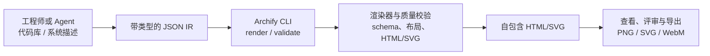

## 导语

`tt-a1i/archify` 是 GitHub 2026 年 8 月 30 日日榜项目。抓取时页面显示它当天新增 3,902 Star；仓库 API 同一轮快照显示总 Star 为 32,584、Fork 为 2,052，主语言为 JavaScript，采用 MIT 许可证。它把代码库或系统描述转换为交互式系统图，并把 Agent 的输出约束在结构化输入与校验流程中。

这篇文章的数据抓取时间为 2026-08-30 18:17（北京时间；下文图表的时间序列统一用 UTC）。Trending 的“今日新增 Star”反映的是榜单快照，不是项目的完整增长历史。

## 产品介绍

Archify 是面向 Cursor、Claude Code、Codex CLI 和 OpenCode 的 Node.js 渲染与校验系统。根据仓库 README，Agent 先产出带类型的 JSON 中间表示（IR），工具再以确定性方式编译成自包含 HTML/SVG，并可导出 PNG、SVG、WebM 和分享卡片。

项目覆盖架构、工作流、时序、数据流和生命周期五类图。它的亮点不是让模型随意绘图，而是提供 schema、布局、HTML/SVG、路径与标签净空等检查；仓库命令还明确暴露 `render`、`validate`、`deliver` 和 `compare` 等阶段。对设计评审或代码评审来说，这让“图看起来对”多了一层可重跑的验证边界。

## 目标人群

从 README 与产品说明看，它主要适合需要解释代码库、系统设计、请求路径或数据管线的软件工程师、架构师、技术负责人、评审者和 AI 编码 Agent。这些用户的共同诉求是：快速把复杂关系讲清楚，同时保留可检查、可分享的技术事实。

它试图缓解三个常见痛点：图和实现脱节、多人评审时很难确认变化、以及图形工具的编辑状态难以复现。这里的“适合”是基于仓库文档的产品定位，不代表它已经在所有规模或所有团队中得到验证。

## 技术架构

仓库的入口脚本为 `archify/bin/archify.mjs`；README 说明 Agent 生成 JSON IR，随后由渲染器和验证器处理。下面只呈现仓库文档与命令可支持的主路径，不把交互展示功能误写成运行时系统事实。

工程上的启发是，把生成式步骤限制在“提出结构化候选”，再把正确性与交付放到可重复运行的确定性阶段。这样即使 Agent 需要重试，也不应直接覆盖上一次已通过的工件。

## 数据分析

### Star 事件样本折线图

| UTC 小时 | WatchEvent 条数 |
| --- | ---: |
| 2026-08-30 09:00 | 41 |
| 2026-08-30 10:00 | 51 |

数据来自 GitHub 仓库事件接口在抓取时返回的最近 100 条公开事件。它只覆盖很短的最新事件窗口，不能推断全天、周度或历史累计 Star 增长；因此这里展示的是可核验的事件样本，而非虚构的长期 Star 曲线。

### Commit 情况柱状图

| UTC 日期 | Commit 数 |
| --- | ---: |
| 2026-08-25 | 3 |
| 2026-08-26 | 13 |
| 2026-08-27 | 9 |
| 2026-08-28 | 5 |
| 2026-08-29 | 1 |
| 2026-08-30（截至 10:30） | 8 |

GitHub commits 接口在 2026-08-23 00:00 至 2026-08-30 10:30 UTC 的窗口中返回 39 条记录。图表按 commit author date 汇总；为保持口径可复查，未剔除合并提交或可能的自动化账号提交，所以它描述的是仓库提交活动，不等同于人工开发工时。

### 社区反馈饼图

| 近期更新条目类型 | 数量 | 占样本比例 |
| --- | ---: | ---: |
| Issue | 30 | 30% |
| Pull request | 70 | 70% |

数据来自 GitHub issues 接口：以 2026-08-23 00:00 UTC 为下限、按最近更新时间排序的首 100 个返回条目；GitHub 的 issues 接口会同时返回 PR，是否含有 `pull_request` 字段用于区分。这是公开协作条目的构成，不是对社区情绪、支持质量或用户满意度的情感判断，且不能代表超过 API 首页范围的全部历史讨论。

## 来源链接

- [GitHub Trending 日榜：Repositories](https://github.com/trending?since=daily)
- [tt-a1i/archify 仓库与 README](https://github.com/tt-a1i/archify)
- [Archify 产品说明](https://github.com/tt-a1i/archify/blob/main/PRODUCT.md)
- [仓库元数据 API 快照](https://api.github.com/repos/tt-a1i/archify)
- [公开仓库事件 API](https://api.github.com/repos/tt-a1i/archify/events?per_page=100&page=1)
- [Commit 列表 API](https://api.github.com/repos/tt-a1i/archify/commits?since=2026-08-23T00%3A00%3A00Z&until=2026-08-30T10%3A30%3A00Z&per_page=100)
- [近期 issue / PR 条目 API](https://api.github.com/repos/tt-a1i/archify/issues?state=all&since=2026-08-23T00%3A00%3A00Z&per_page=100&sort=updated&direction=desc)
