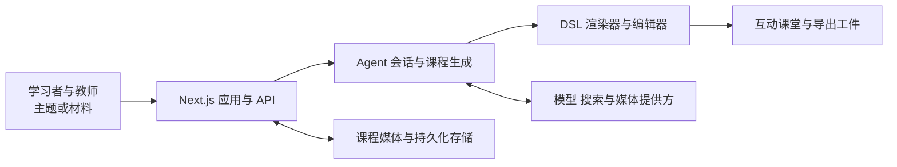

## 导语

`THU-MAIC/OpenMAIC` 是 GitHub 2026 年 8 月 31 日日榜项目。2026-08-31 17:01（北京时间）抓取的 Trending 页面显示：它在日榜快照中有 25,313 Star、4,599 Fork，并标注“今日新增 1,370 Star”。两分钟后获取的仓库 API 快照为 25,316 Star、4,599 Fork；这些数值是不同时间点的快照，并不矛盾。

仓库 README 将 OpenMAIC 定义为“Open Multi-Agent Interactive Classroom”：把主题或用户提供的材料转换为包含幻灯片、测验、互动内容和项目式学习活动的课堂体验。仓库采用 TypeScript 为主的代码库与 MIT 许可证；最新正式版为 2026-08-27 发布的 v1.0.0。本文数据抓取时间为 2026-08-31 17:03（北京时间，UTC+8）；图表中所有时间统一为 UTC。

## 产品介绍

OpenMAIC 的公开文档描述了两种使用方式：经典的一键式课程生成，以及 v1.0.0 引入的 Agent 工作台。用户可输入主题、上传文档／音频／视频材料，或在项目声明支持时接入网页搜索；系统据此规划、生成并修订课程页面。课堂输出可包含幻灯片、测验、交互式 HTML、项目式学习（PBL）活动、白板讲解和语音内容；README 也说明可导出可编辑的 `.pptx` 幻灯片或交互式 `.html` 页面。

仓库还明确提供可恢复的服务端会话、课程工具与可选的模型、媒体、搜索及存储后端。这里应把“支持”理解为仓库提供的能力或集成边界，而不是对生成质量、课堂效果或任意第三方服务可用性的保证。

## 目标人群

从 README 的课堂、课程材料、工作台和导出功能判断，OpenMAIC 适合希望把教学主题或已有资料变成可交互课程的教师、课程设计者、培训团队与自学者；也面向需要把课程生成能力嵌入自己工作流的开发者。

这类用户的核心诉求通常是减少从大纲、素材到互动页面的重复组织工作，并保留对生成过程的修订空间。对具备部署条件的团队，服务端会话与可插拔后端有助于将工作流放入自己的基础设施。上述“适合”是基于仓库文档、目录和接口组织作出的有限分析，不表示项目已验证适用于每一种教育场景。

## 技术架构

仓库根目录是 Next.js 应用，`app/api/` 下可见课程生成、Agent 会话、材料、课堂媒体与持久化等路由；`packages/@openmaic/generation` 负责生成相关模块，`dsl`、`renderer` 和 `editor` 分别承载课堂描述、渲染和编辑能力。根 `package.json` 列出 LangGraph、多个 AI SDK 适配器；`docker-compose.yml` 则提供可选 PostgreSQL 持久化服务。下图只描绘这些可从仓库结构和文档确认的主路径。

这个结构把“生成”与“呈现／编辑”拆成不同模块，并把外部模型与存储留为可配置边界；实际启用哪些提供方和服务端能力，仍取决于部署配置与密钥。

## 数据分析

### Star 事件样本折线图

| UTC 时间窗口 | WatchEvent（Star）数 |
| --- | ---: |
| 08:30–08:34 | 12 |
| 08:35–08:39 | 10 |
| 08:40–08:44 | 16 |
| 08:45–08:49 | 21 |
| 08:50–08:54 | 19 |
| 08:55–08:59 | 8 |
| 09:00–09:04 | 8 |

数据来自抓取时的 GitHub [公开仓库事件 API](https://api.github.com/repos/THU-MAIC/OpenMAIC/events?per_page=100&page=1)：第一页 100 条事件中有 94 条 `WatchEvent`，时间范围为 2026-08-31 08:31:49–09:03:13 UTC，按五分钟窗口汇总。该 API 是滚动的近期事件样本，不是完整 Stargazer 历史；图中只能说明这个短窗口内的公开 Star 事件密度，不能推断全天或长期增长曲线，也不能把日榜“新增 1,370 Star”当作历史点位。

### Commit 情况柱状图

| UTC 日期 | Commit 数 |
| --- | ---: |
| 2026-08-24 | 8 |
| 2026-08-25 | 2 |
| 2026-08-26 | 4 |
| 2026-08-27 | 7 |
| 2026-08-28 | 4 |
| 2026-08-29 | 4 |
| 2026-08-30 | 0 |
| 2026-08-31（截至 09:05） | 1 |

数据来自 GitHub [commit 列表 API](https://api.github.com/repos/THU-MAIC/OpenMAIC/commits?since=2026-08-24T00%3A00%3A00Z&until=2026-08-31T09%3A05%3A00Z&per_page=100)：窗口内返回 30 条提交。图表按 `commit.author.date` 的 UTC 日期汇总；筛选后没有多父提交（merge commit）或用户名以 `[bot]` 结尾的提交。这个口径描述可复核的仓库变更活动，不能等同于人工投入时长或功能交付量。

### 社区反馈饼图

| 近期更新条目类型 | 数量 | 样本占比 |
| --- | ---: | ---: |
| Pull request | 73 | 73% |
| Issue | 27 | 27% |

数据来自 GitHub [issues API](https://api.github.com/repos/THU-MAIC/OpenMAIC/issues?state=all&since=2026-08-24T00%3A00%3A00Z&per_page=100&sort=updated&direction=desc)：抓取时按最近更新时间排序的第一页共 100 条，实际更新时间范围为 2026-08-26 18:57:32–08-31 08:47:21 UTC。GitHub 的该接口同时返回 issue 与 pull request，本文以是否含 `pull_request` 字段区分。这是近期公开协作条目的类型构成，不是情感分析、满意度统计，也不能代表超过 API 首页范围的全部社区讨论。

## 来源链接

- [GitHub Trending 日榜：Repositories](https://github.com/trending?since=daily)
- [THU-MAIC/OpenMAIC 仓库与 README](https://github.com/THU-MAIC/OpenMAIC)
- [仓库元数据 API 快照](https://api.github.com/repos/THU-MAIC/OpenMAIC)
- [v1.0.0 Release](https://github.com/THU-MAIC/OpenMAIC/releases/tag/v1.0.0)
- [仓库目录树 API](https://api.github.com/repos/THU-MAIC/OpenMAIC/git/trees/main?recursive=1)
- [根 package.json](https://github.com/THU-MAIC/OpenMAIC/blob/main/package.json)
- [Docker Compose 配置](https://github.com/THU-MAIC/OpenMAIC/blob/main/docker-compose.yml)
