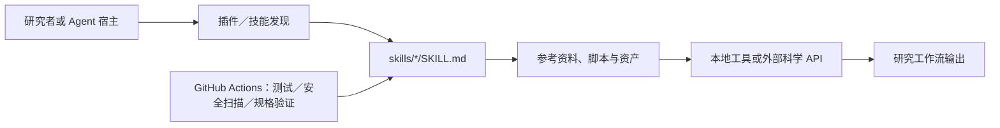

## 导语

`K-Dense-AI/scientific-agent-skills` 是 GitHub 2026 年 9 月 1 日日榜项目。2026-09-01 17:05（北京时间，UTC+8）抓取的日榜快照显示：项目有 41,133 Star、3,795 Fork，并标注“今日新增 1,980 Star”。同一轮仓库 API 快照为 41,134 Star；相差一颗是不同请求时刻的快照，不能把它们合并为增长序列。

README 将它定义为面向科学与研究任务的 Agent Skills 集合；仓库使用 MIT 许可证，主语言显示为 Python，最新发布版为 2026-08-29 的 `v2.65.0`。本文的 API 数据抓取在 2026-09-01 17:04–17:05（北京时间）完成；图表时间一律使用 UTC。

## 产品介绍

项目把研究工作流组织为一个个含 `SKILL.md` 的目录。README 当前列出 163 个可直接使用的科学与研究技能，覆盖生物信息学、化学与药物发现、医学研究、机器学习、地理空间、科学写作等方向；每个技能可附带参考资料、示例、资产或脚本。仓库还提供根 `plugin.json`，把整套 `skills/` 目录声明为 Agent Plugins 包。

README 说明兼容支持开放 Agent Skills 标准的宿主，并给出 `npx skills add`、GitHub CLI 与本地插件安装路径。这里的“兼容”是仓库的接入说明；实际宿主是否支持特定字段、是否允许联网、以及外部数据库是否可用，仍取决于所选客户端、配置与凭据。

## 目标人群

从 README 的目录和安装方式看，它适合希望让 AI Agent 执行有文档、示例和边界说明的科研工作流的研究人员、科研软件工程师与实验室数据团队；也面向构建 Agent 平台、需要复用科学领域操作手册的开发者。

这类用户通常希望避免每次从 API 文档、包版本和操作步骤重新拼装提示词。将流程沉淀为技能文件，有助于在团队内复用入口和参考资料。上述“适合”是对公开文档与仓库组织的有限分析，不代表其能取代研究设计、实验、临床判断或对每一项外部服务的验证。

## 技术架构

目录树显示，仓库根部有 `plugin.json`、`pyproject.toml` 和 `.github/workflows/`；核心内容位于 `skills/`，每个主题目录以 `SKILL.md` 为入口，并可带 `references/`、`scripts/` 或 `assets/`。`plugin.json` 声明包名和版本，`pyproject.toml` 定义 Python 3.13 以上及测试依赖；工作流中可见技能测试、安全扫描与规格验证。下面只描述这些已核实的文件关系，不把文档中提到的第三方数据库误写成仓库自带服务。

因此，这个仓库主要交付的是可发现的工作流说明与辅助资源；真正的执行发生在 Agent 宿主及其可访问的本地环境、软件包或外部服务中。

## 数据分析

### Star 事件样本折线图

| UTC 时间窗口 | WatchEvent（Star）数 |
| --- | ---: |
| 07:20–07:29 | 5 |
| 07:30–07:39 | 9 |
| 07:40–07:49 | 11 |
| 07:50–07:59 | 7 |
| 08:00–08:09 | 14 |
| 08:10–08:19 | 10 |
| 08:20–08:29 | 11 |
| 08:30–08:39 | 10 |
| 08:40–08:49 | 11 |
| 08:50–08:59 | 6 |
| 09:00–09:09 | 2 |

数据来自抓取时的 GitHub [公开仓库事件 API](https://api.github.com/repos/K-Dense-AI/scientific-agent-skills/events?per_page=100&page=1)。首页 100 条事件中有 96 条 `WatchEvent`，时间范围为 2026-09-01 07:24:51–09:04:02 UTC，按事件创建时间分桶。该端点是近期滚动样本，不能提供完整 Stargazer 历史；图表只说明该短窗口的公开 Star 事件密度，不能推断全天、周度或长期 Star 趋势，也不能将日榜“新增 1,980 Star”伪装成历史曲线。

### Commit 情况柱状图

| UTC 日期 | Commit 数 |
| --- | ---: |
| 2026-08-24 | 0 |
| 2026-08-25 | 0 |
| 2026-08-26 | 0 |
| 2026-08-27 | 0 |
| 2026-08-28 | 1 |
| 2026-08-29 | 3 |
| 2026-08-30 | 0 |
| 2026-08-31 | 1 |
| 2026-09-01（截至 08:00） | 0 |

数据来自 GitHub [commit 列表 API](https://api.github.com/repos/K-Dense-AI/scientific-agent-skills/commits?since=2026-08-24T00%3A00%3A00Z&until=2026-09-01T08%3A00%3A00Z&per_page=100)。窗口返回 7 条记录；本文按 `commit.author.date` 的 UTC 日期汇总，并排除用户名以 `[bot]` 结尾的提交及多父提交，留下 5 条。这是可复核的仓库变更活动，不等同于人工工时、研究质量或功能交付规模。

### 社区反馈饼图

| 近期更新条目类型 | 数量 | 样本占比 |
| --- | ---: | ---: |
| Pull request | 21 | 84% |
| Issue | 4 | 16% |

数据来自 GitHub [issues API](https://api.github.com/repos/K-Dense-AI/scientific-agent-skills/issues?state=all&since=2026-08-24T00%3A00%3A00Z&per_page=100&sort=updated&direction=desc)。抓取时该查询返回 25 个条目，最近更新时间范围为 2026-08-26 10:40:43–2026-09-01 07:02:10 UTC。GitHub 的该接口同时返回 issue 与 pull request，本文以是否含 `pull_request` 字段区分。这是近期公开协作条目的类型构成，不是情感分析、满意度统计，也不能代表 API 返回范围外的社区讨论。

## 来源链接

- [GitHub Trending 日榜：Repositories](https://github.com/trending?since=daily)
- [K-Dense-AI/scientific-agent-skills 仓库与 README](https://github.com/K-Dense-AI/scientific-agent-skills)
- [仓库元数据 API 快照](https://api.github.com/repos/K-Dense-AI/scientific-agent-skills)
- [v2.65.0 Release](https://github.com/K-Dense-AI/scientific-agent-skills/releases/tag/v2.65.0)
- [仓库目录树 API](https://api.github.com/repos/K-Dense-AI/scientific-agent-skills/git/trees/main?recursive=1)
- [plugin.json](https://github.com/K-Dense-AI/scientific-agent-skills/blob/main/plugin.json)
- [pyproject.toml](https://github.com/K-Dense-AI/scientific-agent-skills/blob/main/pyproject.toml)
- [公开仓库事件 API](https://api.github.com/repos/K-Dense-AI/scientific-agent-skills/events?per_page=100&page=1)
