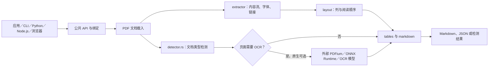

## 导语

`firecrawl/pdf-inspector` 是 GitHub 2026 年 9 月 2 日日榜项目。2026-09-02 17:03（北京时间，UTC+8）抓取的日榜快照标注“今日新增 541 Star”；同一轮 GitHub 仓库 API 快照显示项目有 18,174 Star、1,233 Fork。日榜的新增数与 API 总量来自不同页面和请求时刻，不能将其拼接为历史增长曲线。

仓库将自己定位为 PDF 分类和文本提取库：先识别 PDF 是文本型、扫描型、图像型还是混合型，再提取带位置信息的文本并转换为 Markdown。仓库主语言为 Rust、许可证为 MIT；最新正式发布为 2026-08-17 的 `v1.15.0`。本文的数据抓取在 2026-09-02 17:03–17:04（北京时间）完成；所有图表时间统一为 UTC。

## 产品介绍

README 说明，库默认会对 PDF 内容抽样，识别文本型、扫描型、图像型或混合型文档；对于可直接读取文本的文档，它可提取字体、坐标与阅读顺序信息，并生成 Markdown。文档列出的能力包括多栏排版、表格、链接、CID 字体以及 RTL 文本处理。

项目提供 Rust API 与 `pdf2md`、`detect-pdf` 命令行工具，同时维护 Python、Node.js/Bun 与浏览器 WebAssembly 接入。对于需要 OCR 的页面，README 说明原生 Python、Node.js 和 CLI 路径可选择性地调用外部 PDFium、ONNX Runtime 与 PP-OCRv6 Small；这些运行时和模型并不随默认纯提取流程一同使用。也就是说，它的“智能路由”是项目声明的处理策略，不应被理解为对所有 PDF 都能无误提取或自动识别的承诺。

## 目标人群

从提供的 CLI、语言绑定和页面级 OCR 路由看，这个项目适合需要在本地程序、服务端批处理或浏览器中把 PDF 转成可用文本/Markdown 的开发者；典型场景包括文档检索前处理、报告与票据解析、知识库导入及需要先区分扫描件和文本件的工作流。

这些用户的核心诉求通常是得到结构化文本、避免对原生文本 PDF 不必要地启用 OCR，并能将同一处理核心接入不同运行环境。上述“适合”是根据公开文档、绑定目录与示例作出的有限分析；实际准确率、速度和 OCR 成本仍取决于文档样本、平台和外部运行时配置。

## 技术架构

仓库树和 README 显示核心代码在 `src/`：`lib.rs` 暴露公共 API，`detector.rs` 负责 PDF 类型检测，`extractor/` 处理内容流与文本，`tables/` 处理表格，`markdown/` 负责结构转换；`src/bin/` 提供命令行入口。`napi/` 是 Node.js/Bun 绑定，`wasm/` 是 wasm-bindgen 浏览器绑定，`src/python.rs` 与 `docs/python.md` 对应 Python 接入。仓库还包含发布工作流和 OCR 运行时说明。

图中的外部 OCR 运行时只在相关原生路径被选择时参与；浏览器 WebAssembly 与默认提取流程并不因此自动携带这些外部组件。这一划分来自 README 的依赖说明，而不是对部署方式的额外推断。

## 数据分析

### Star 事件样本折线图

| UTC 时间窗口 | WatchEvent（Star）数 |
| --- | ---: |
| 05:00–05:59（从 05:37 起） | 8 |
| 06:00–06:59 | 26 |
| 07:00–07:59 | 28 |
| 08:00–08:59（至 08:56） | 33 |

数据来自抓取时的 GitHub [公开仓库事件 API](https://api.github.com/repos/firecrawl/pdf-inspector/events?per_page=100&page=1)。首页 100 条事件中有 95 条 `WatchEvent`，时间范围为 2026-09-02 05:37:11–08:56:40 UTC，按事件创建时间分桶。该端点是近期滚动样本，不能提供完整 Stargazer 历史；图表只说明这段公开 Star 事件的密度，不能推断全天、周度或长期 Star 趋势，也不能把日榜“新增 541 Star”伪装成历史曲线。

### Commit 情况柱状图

| UTC 日期 | Commit 数 |
| --- | ---: |
| 2026-08-24 | 0 |
| 2026-08-25 | 0 |
| 2026-08-26 | 0 |
| 2026-08-27 | 0 |
| 2026-08-28 | 0 |
| 2026-08-29 | 0 |
| 2026-08-30 | 0 |
| 2026-08-31 | 0 |
| 2026-09-01 | 1 |
| 2026-09-02（截至 09:00） | 0 |

数据来自 GitHub [commit 列表 API](https://api.github.com/repos/firecrawl/pdf-inspector/commits?since=2026-08-24T00%3A00%3A00Z&until=2026-09-02T09%3A00%3A00Z&per_page=100)。窗口返回 1 条记录；本文按 `commit.author.date` 的 UTC 日期汇总，并排除用户名以 `[bot]` 结尾的提交及多父提交，保留 1 条。该记录的时间为 2026-09-01 17:35:02 UTC；图表描述的是可复核的仓库变更活动，不等同于人工工时、代码规模或版本价值。

### 社区反馈饼图

| 近期更新条目类型 | 数量 | 样本占比 |
| --- | ---: | ---: |
| Pull request | 18 | 56.3% |
| Issue | 14 | 43.8% |

数据来自 GitHub [issues API](https://api.github.com/repos/firecrawl/pdf-inspector/issues?state=all&since=2026-08-24T00%3A00%3A00Z&per_page=100&sort=updated&direction=desc)。抓取时查询返回 32 个条目，最近更新时间范围为 2026-08-24 02:24:42–2026-09-02 06:18:31 UTC。GitHub 的该接口同时返回 issue 与 pull request，本文以是否含 `pull_request` 字段区分。这是近期公开协作条目的类型构成，不是情感分析、满意度统计，也不能代表查询窗口外的讨论。

## 来源链接

- [GitHub Trending 日榜：Repositories](https://github.com/trending?since=daily)
- [firecrawl/pdf-inspector 仓库与 README](https://github.com/firecrawl/pdf-inspector)
- [仓库元数据 API 快照](https://api.github.com/repos/firecrawl/pdf-inspector)
- [v1.15.0 Release](https://github.com/firecrawl/pdf-inspector/releases/tag/v1.15.0)
- [仓库目录树 API](https://api.github.com/repos/firecrawl/pdf-inspector/git/trees/main?recursive=1)
- [README：架构与各语言接入](https://github.com/firecrawl/pdf-inspector/blob/main/README.md)
- [OCR 运行时说明](https://github.com/firecrawl/pdf-inspector/blob/main/docs/ocr-runtime.md)
- [公开仓库事件 API](https://api.github.com/repos/firecrawl/pdf-inspector/events?per_page=100&page=1)
