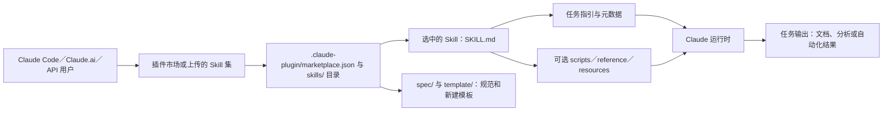

## 导语

`anthropics/skills` 是 GitHub 2026 年 9 月 4 日日榜项目。2026-09-04 20:03（北京时间，UTC+8）抓取的日榜快照标注“今日新增 281 Star”；同一轮仓库 API 快照显示 173,902 Star、20,616 Fork，默认分支为 `main`，仓库主题为 `agent-skills`。日榜新增数和 API 总量来自不同页面与请求时刻，不能将两者连接为历史增长曲线。

仓库 README 将它定义为 Anthropic 的 Claude Skills 实现与示例集合：一个 Skill 是包含说明、脚本和资源的目录，可由 Claude 按需加载以完成专门任务。本文数据抓取于 2026-09-04 20:03–20:04（北京时间）完成；所有图表时间统一采用 UTC。

## 产品介绍

README 列举的内容横跨创意设计、网页测试、MCP 服务生成、企业沟通与文档处理。每个 Skill 自包含在独立目录中，以 `SKILL.md` 保存元数据与操作指引；仓库同时给出基础 Skill 的 frontmatter 模板。`skills/docx`、`skills/pdf`、`skills/pptx` 和 `skills/xlsx` 被 README 标为支撑 Claude 文档能力的实现参考。

仓库并未承诺所有技能在所有环境中都能产生相同效果：README 明确提示，公开实现用于演示与学习，实际 Claude 能力和行为可能不同，关键场景须自行测试。许可也按内容区分：README 说明许多 Skill 使用 Apache 2.0，而前述文档 Skill 是 source-available；因此不应把整个仓库简单视为一种统一许可的软件包。

## 目标人群

从模板、各 Skill 的说明文件和插件市场接入方式看，它适合希望为 AI agent 固化重复工作流的开发者、团队工具维护者，以及需要研究文档生成、网页测试或 MCP 服务技能模式的技术人员。典型诉求是将任务说明、脚本和参考资料随同一个可发现的 Skill 打包，而非每次重新编写长提示词。

这也是一项有限分析：仓库确实提供了示例、模板和 Claude Code 的安装说明，但并没有以公开指标证明任何工作流会提升准确率或节省多少成本。将其用于生产系统前，仍应按 README 的提示在目标环境中测试并核对每个 Skill 的许可。

## 技术架构

目录树显示仓库顶层有 `.claude-plugin/marketplace.json`、`skills/`、`spec/` 与 `template/`。README 给出 Claude Code 的插件市场安装入口；随后运行时可加载某个 Skill 目录中的 `SKILL.md`。目录树中的 `skills/mcp-builder` 包含 `reference/` 与 `scripts/`，`skills/docx`、`skills/pdf` 等包含各自脚本与许可文件，说明仓库把任务指引、可执行辅助代码和参考资料按 Skill 边界放置。仓库元数据的主语言为 Python，但并不表示所有 Skill 都以 Python 实现。

流程图描述的是仓库可核实的目录关系与 README 中的接入方式；外部工具、模型权限和具体输出由用户所在的 Claude 环境及所选 Skill 决定，并非本仓库单独提供的托管服务。

## 数据分析

### Star 事件样本折线图

| UTC 时间窗口 | WatchEvent（Star）数 |
| --- | ---: |
| 07:00–07:59（从 07:35 起） | 12 |
| 08:00–08:59 | 21 |
| 09:00–09:59 | 26 |
| 10:00–10:59 | 17 |
| 11:00–11:59（至 11:55） | 18 |

数据来自抓取时的 GitHub [公开仓库事件 API](https://api.github.com/repos/anthropics/skills/events?per_page=100&page=1)。首页 100 条事件中有 94 条 `WatchEvent`，时间范围为 2026-09-04 07:35:12–11:55:49 UTC，按事件创建时间分桶。该端点只给出近期滚动样本，不能提供完整 Stargazer 历史；图表仅说明这段公开 Star 事件的密度，不能推断全天、周度或长期 Star 趋势，也不能把日榜“新增 281 Star”伪装成历史曲线。

### Commit 情况柱状图

| UTC 日期 | Commit 数 |
| --- | ---: |
| 2026-08-27 | 0 |
| 2026-08-28 | 0 |
| 2026-08-29 | 0 |
| 2026-08-30 | 0 |
| 2026-08-31 | 0 |
| 2026-09-01 | 1 |
| 2026-09-02 | 0 |
| 2026-09-03 | 1 |
| 2026-09-04（截至 10:00） | 0 |

数据来自 GitHub [commit 列表 API](https://api.github.com/repos/anthropics/skills/commits?since=2026-08-27T00%3A00%3A00Z&until=2026-09-04T10%3A00%3A00Z&per_page=100)。查询窗口返回 2 条记录；本文按 `commit.author.date` 的 UTC 日期汇总，并排除用户名以 `[bot]` 结尾的提交及多父提交，保留 2 条。它们的时间分别为 2026-09-01 18:30:38 与 2026-09-03 16:37:13 UTC。图表衡量的是可复核的仓库变更活动，不等同于人工工时、代码规模或版本价值。

### 社区反馈饼图

| 近期更新条目类型 | 数量 | 样本占比 |
| --- | ---: | ---: |
| Pull request | 37 | 64.9% |
| Issue | 20 | 35.1% |

数据来自 GitHub [issues API](https://api.github.com/repos/anthropics/skills/issues?state=all&since=2026-08-27T00%3A00%3A00Z&per_page=100&sort=updated&direction=desc)。抓取时查询返回 57 个条目，最近更新时间范围为 2026-08-27 08:48:53–2026-09-04 06:16:12 UTC。GitHub 的该接口同时返回 issue 与 pull request，本文以是否含 `pull_request` 字段区分。这是近期公开协作条目的类型构成，不是情感分析、满意度统计，也不能代表查询窗口外的讨论。

## 来源链接

- [GitHub Trending 日榜：Repositories](https://github.com/trending?since=daily)
- [anthropics/skills 仓库与 README](https://github.com/anthropics/skills)
- [README 原文](https://raw.githubusercontent.com/anthropics/skills/main/README.md)
- [仓库元数据 API 快照](https://api.github.com/repos/anthropics/skills)
- [仓库目录树 API](https://api.github.com/repos/anthropics/skills/git/trees/main?recursive=1)
- [近期提交 API](https://api.github.com/repos/anthropics/skills/commits?since=2026-08-27T00%3A00%3A00Z&until=2026-09-04T10%3A00%3A00Z&per_page=100)
- [公开仓库事件 API](https://api.github.com/repos/anthropics/skills/events?per_page=100&page=1)
- [近期协作条目 API](https://api.github.com/repos/anthropics/skills/issues?state=all&since=2026-08-27T00%3A00%3A00Z&per_page=100&sort=updated&direction=desc)
