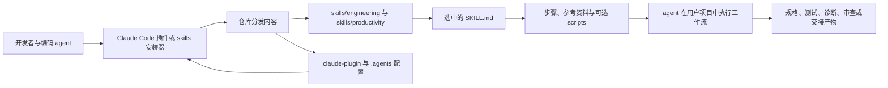

## 导语

`mattpocock/skills` 是 GitHub 2026 年 9 月 5 日日榜项目。2026-09-05 17:03:38（北京时间，UTC+8）抓取的日榜快照标注“今日新增 2,758 Star”；17:04:25 的仓库元数据 API 快照显示 251,141 Star、21,223 Fork，默认分支为 `main`，主语言标记为 Shell，许可证为 MIT。日榜新增数与 API 总量来自不同页面、不同请求时刻，不能据此构造或外推 Star 历史曲线。

仓库 README 将其定位为作者日常使用的工程技能集合，强调“小、可调整、可组合”，并说明可配合多种模型使用。本文的仓库与活动数据抓取于 2026-09-05 17:03–17:05（北京时间）完成；涉及事件和提交的图表统一使用 UTC。

## 产品介绍

README 给出了两条接入路径：Claude Code 可安装 `mattpocock-skills` 插件；Codex 及其他 agent 可使用 `npx skills@latest add mattpocock/skills` 选择并复制技能文件到项目。前者由插件机制作为只读包管理，后者让用户拥有并可编辑复制出的文件；README 明确提醒两种方式同时安装会造成技能重复。

首次配置的 `setup-matt-pocock-skills` 会询问议题跟踪器、分诊标签和文档保存位置。仓库随后提供面向工程的 `grill-with-docs`、`tdd`、`diagnosing-bugs`、`code-review`、`to-spec` 等技能，以及生产力类别的 `grill-me`、`handoff`、`teach` 等技能。它们是说明文档与少量辅助脚本的集合，不是替代代码托管、测试执行或 issue 系统的云服务。MIT 许可证可在仓库的 LICENSE 文件中核实。

README 对这些方法的收益表达为作者的设计主张，而非第三方实验结果。因此，将其用于生产项目时，仍需要由团队结合自身 agent、权限、测试栈和工作流验证效果。

## 目标人群

从安装说明、初始化提问和技能目录看，该项目适合希望把需求澄清、规格、测试驱动开发、调试和审查等重复环节固化为 agent 工作流的开发者与工程团队。典型诉求是让 agent 在一次次任务中遵循同一套可查阅、可修改的过程约束，而不是每次从零编写长提示词。

它也面向愿意在本地编辑技能内容的实践者：README 所述的 `skills` 安装器会将文件写入使用者自己的项目。这里的“适合”是基于文档和目录组织的有限分析，不意味着这些技能会自动解决需求不清、代码质量或协作问题；README 本身也把实际工程反馈循环视为关键前提。

## 技术架构

目录树可核实的顶层内容包括 `.claude-plugin/`、`.agents/`、`skills/`、`scripts/`、`docs/` 和 `LICENSE`。`skills/engineering/` 下可见 `tdd`、`code-review`、`diagnosing-bugs`、`setup-matt-pocock-skills` 等以 `SKILL.md` 为入口的目录；`skills/productivity/` 则包含 `grill-me`、`handoff` 等。部分技能目录带有 `scripts/` 或 `reference/`，例如 `diagnosing-bugs/scripts/hitl-loop.template.sh`，说明技能可以把指引与可选辅助材料一起分发。仓库 API 标记主语言为 Shell，但这不代表每个技能都由 Shell 实现。

该图仅描述 README 中的安装方式和目录树可见的分发关系。agent 的模型、权限、代码库、测试命令以及输出是否被采纳都在用户环境中决定，不由该仓库单独托管。

## 数据分析

### Star 事件样本折线图

| UTC 时间窗口 | WatchEvent（Star）数 |
| --- | ---: |
| 08:28–08:39 | 31 |
| 08:40–08:54 | 36 |
| 08:55–09:04 | 24 |

数据来自 17:04:30（北京时间）抓取的 GitHub [公开仓库事件 API](https://api.github.com/repos/mattpocock/skills/events?per_page=100&page=1)。首页 100 条事件中有 91 条 `WatchEvent`，其时间范围为 2026-09-05 08:28:20–09:04:19 UTC；按事件创建时间分桶。该端点是近期滚动样本，图表只说明样本窗口内公开 Star 事件的密度，不能代表全天、周度或长期 Star 趋势，更不能把日榜“新增 2,758 Star”当作历史点位。

### Commit 情况柱状图

| UTC 日期 | Commit 数 |
| --- | ---: |
| 2026-08-29 | 0 |
| 2026-08-30 | 0 |
| 2026-08-31 | 0 |
| 2026-09-01 | 0 |
| 2026-09-02 | 0 |
| 2026-09-03 | 1 |
| 2026-09-04 | 0 |
| 2026-09-05（截至 09:05） | 0 |

数据来自 GitHub [commit 列表 API](https://api.github.com/repos/mattpocock/skills/commits?since=2026-08-29T00%3A00%3A00Z&until=2026-09-05T09%3A05%3A00Z&per_page=100)，于 17:05:33（北京时间）取得。该查询返回两条提交：一条是 2026-09-04 的合并提交，另一条是 2026-09-03 15:03:24 UTC 的普通提交。本文按 `commit.author.date` 的 UTC 日期汇总，并排除多父提交与登录名以 `[bot]` 结尾的作者，保留一条普通提交。该图衡量的是可复核的仓库变更活动，不等同于人工工时、代码规模或版本价值。

### 社区反馈饼图

| 近期更新条目类型 | 数量 | 样本占比 |
| --- | ---: | ---: |
| Pull request | 4 | 7.1% |
| Issue | 52 | 92.9% |

数据来自 17:04:33（北京时间）抓取的 GitHub [issues API](https://api.github.com/repos/mattpocock/skills/issues?state=all&since=2026-08-29T00%3A00%3A00Z&per_page=100&sort=updated&direction=desc)。查询返回 56 个条目，最近更新时间范围为 2026-08-29 20:09:28–2026-09-05 05:01:05 UTC。GitHub 的该接口同时返回 issue 与 pull request，本文以是否含 `pull_request` 字段分类。这是近期公开协作条目的类型构成，不是情感分析、满意度统计，也不能代表查询窗口外的讨论。

## 来源链接

- [GitHub Trending 日榜：Repositories](https://github.com/trending?since=daily)
- [mattpocock/skills 仓库与 README](https://github.com/mattpocock/skills)
- [README 原文](https://raw.githubusercontent.com/mattpocock/skills/main/README.md)
- [MIT 许可证](https://github.com/mattpocock/skills/blob/main/LICENSE)
- [仓库元数据 API 快照](https://api.github.com/repos/mattpocock/skills)
- [仓库目录树 API](https://api.github.com/repos/mattpocock/skills/git/trees/main?recursive=1)
- [近期提交 API](https://api.github.com/repos/mattpocock/skills/commits?since=2026-08-29T00%3A00%3A00Z&until=2026-09-05T09%3A05%3A00Z&per_page=100)
- [公开仓库事件 API](https://api.github.com/repos/mattpocock/skills/events?per_page=100&page=1)
- [近期协作条目 API](https://api.github.com/repos/mattpocock/skills/issues?state=all&since=2026-08-29T00%3A00%3A00Z&per_page=100&sort=updated&direction=desc)
