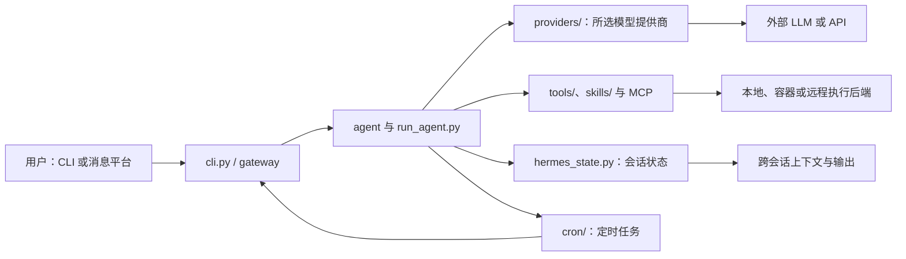

## 导语

`NousResearch/hermes-agent` 是 GitHub 2026 年 9 月 6 日日榜项目。2026-09-06 17:00（北京时间，UTC+8）抓取的日榜快照标注“今日新增 575 Star”；17:02 的仓库元数据 API 快照显示 242,165 Star、49,768 Fork，默认分支为 `main`，主语言标记为 Python，许可证为 MIT。日榜新增数和 API 总量来自不同请求时刻，不能据此推导长期 Star 增长。

本文的仓库与活动数据于 2026-09-06 17:00–17:04（北京时间）取得；事件与协作条目图表统一使用 UTC。README 将产品称为可自我改进的 agent；这一定位是项目方描述，而不是本文对实际效果的验证。

## 产品介绍

根据 README，Hermes Agent 提供终端交互界面，也可通过一个 gateway 接入 Telegram、Discord、Slack、WhatsApp、Signal 和 Email；用户可用 `hermes model` 选择模型提供商。README 还列出技能、跨会话记忆、定时任务、子 agent、MCP 与多种终端后端等功能，并给出 macOS、Linux、WSL2、Termux 与原生 Windows 的安装方式。

仓库可核实的最新正式 Release 是 `v2026.8.31`（发布于 2026-08-31），README 与 `pyproject.toml` 标记的软件版本为 0.21.0。项目使用 MIT 许可证。功能清单说明了作者的目标和实现范围；生产环境的可靠性、成本、权限边界及第三方服务可用性仍需由使用者自行验证。

## 目标人群

从 CLI、网关和 provider 配置说明看，它适合希望在本地、容器、远程主机或云端运行 agent 的开发者、自动化实践者和小型团队。典型诉求是把同一 agent 会话延伸到终端与消息平台，并按需接入不同 LLM 与工具。

它也面向需要保留任务上下文、复用技能或安排周期性工作的用户；这是基于 README 的功能与目录组织作出的有限分析。“适合”不意味着应把高权限凭据或无人工审核的生产操作直接交给 agent：README 的安全与工具文档应在接入前逐项评估。

## 技术架构

仓库根目录可见 `cli.py`、`run_agent.py`、`mcp_serve.py`、`hermes_state.py`，以及 `agent/`、`gateway/`、`providers/`、`skills/`、`tools/`、`cron/`、`web/` 和 `tests/`。`pyproject.toml` 要求 Python 3.11–3.13，并把 OpenAI SDK、HTTP 客户端、终端 UI、定时调度与 Web 服务等列为依赖；可选依赖分别覆盖 provider、消息平台、语音与远程执行后端。目录与配置支持下图描述的调用关系，但图中不把外部 LLM 或消息服务视为由仓库运营的服务。

这张图依据 README、根目录与 `pyproject.toml` 的公开内容绘制；具体数据存储位置、已启用工具、模型账号和消息平台凭据均由部署者配置。

## 数据分析

### Star 事件样本折线图

| UTC 时间窗口 | WatchEvent（Star）数 |
| --- | ---: |
| 08:25–08:33 | 4 |
| 08:34–08:43 | 3 |
| 08:44–08:50 | 5 |

数据来自 17:03（北京时间）抓取的 GitHub [公开仓库事件 API](https://api.github.com/repos/NousResearch/hermes-agent/events?per_page=100&page=1)。最近 100 条事件中有 12 条 `WatchEvent`，时间范围为 2026-09-06 08:25:25–08:50:36 UTC；按事件创建时间分桶。该端点是近期滚动样本，只反映该样本中的公开 Star 事件密度，不能代表全天、周度或长期 Star 趋势，也不能把日榜“575 stars today”当成历史点位。

### Commit 情况柱状图

| 数据项 | 本次结果 |
| --- | --- |
| 统计窗口 | 2026-08-30 09:00 至 2026-09-06 09:00 UTC |
| 请求端点 | `GET /repos/NousResearch/hermes-agent/commits`，带 `since`、`until`、`per_page=100` |
| 结果 | HTTP 500；数据不足，未绘制 |
| 可访问替代指标 | [GitHub 提交历史页面](https://github.com/NousResearch/hermes-agent/commits/main/) |

本次在 17:03（北京时间）两次调用 GitHub REST commit 列表（一次带时间窗口、一次仅请求最近 100 条）均收到 HTTP 500。因此无法按 UTC 日期汇总，也无法按原定口径排除 merge 或 `[bot]` 提交。上方占位图明确表示没有柱状数据；不能从它得出提交频率、贡献者数量或版本价值的结论。

### 社区反馈饼图

| 近期更新条目类型 | 数量 | 样本占比 |
| --- | ---: | ---: |
| Pull request | 82 | 82% |
| Issue | 18 | 18% |

数据来自 17:03（北京时间）抓取的 GitHub [issues API](https://api.github.com/repos/NousResearch/hermes-agent/issues?state=all&since=2026-08-30T09%3A00%3A00Z&per_page=100&sort=updated&direction=desc)。查询在 `per_page=100` 的第一页返回 100 个条目，最近更新时间范围为 2026-09-06 07:49:47–09:02:48 UTC；接口同时返回 issue 与 pull request，本文以是否含 `pull_request` 字段分类。这是最近公开协作条目的类型构成，不是情感分析、满意度统计，也不代表分页外或更长窗口的讨论。

## 来源链接

- [GitHub Trending 日榜：Repositories](https://github.com/trending?since=daily)
- [NousResearch/hermes-agent 仓库与 README](https://github.com/NousResearch/hermes-agent)
- [README 原文](https://raw.githubusercontent.com/NousResearch/hermes-agent/main/README.md)
- [MIT 许可证](https://github.com/NousResearch/hermes-agent/blob/main/LICENSE)
- [仓库元数据 API 快照](https://api.github.com/repos/NousResearch/hermes-agent)
- [仓库根目录 API](https://api.github.com/repos/NousResearch/hermes-agent/contents/)
- [Release API](https://api.github.com/repos/NousResearch/hermes-agent/releases?per_page=5)
- [公开仓库事件 API](https://api.github.com/repos/NousResearch/hermes-agent/events?per_page=100&page=1)
- [近期协作条目 API](https://api.github.com/repos/NousResearch/hermes-agent/issues?state=all&since=2026-08-30T09%3A00%3A00Z&per_page=100&sort=updated&direction=desc)
- [提交历史页面（commit API 本次不可用时的替代入口）](https://github.com/NousResearch/hermes-agent/commits/main/)
