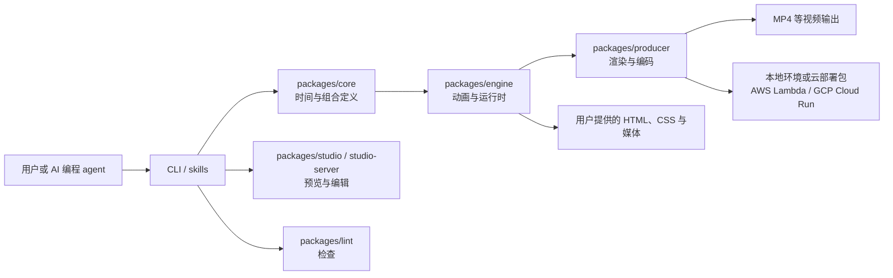

## 导语

`heygen-com/hyperframes` 是 GitHub 2026 年 9 月 9 日日榜项目。2026-09-09 09:31（北京时间，UTC+8）抓取的日榜页面标注“今日新增 2,628 Star”；同一时段的仓库元数据 API 快照显示 47,547 Star、4,383 Fork，默认分支为 `main`，主语言标记为 TypeScript，许可证为 Apache-2.0。日榜新增数与 API 总量来自不同请求时刻，不能据此推导长期 Star 增长。

本文的仓库与活动数据于 2026-09-09 09:31–09:33（北京时间）获取；三个图表的事件时间和统计窗口均以 UTC 标注。README 所说的“可确定性 MP4”是项目方对框架能力的描述，实际媒体、浏览器运行时和部署条件仍由使用者验证。

## 产品介绍

根据 README，HyperFrames 是一个把 HTML、CSS、媒体和可定位动画转换成 MP4 的开源框架。它可在本地通过 CLI 使用，也可借由 skills 让 AI 编程 agent 创建、检查、预览和渲染视频；README 列出的用途包括产品宣传、PR 讲解、数据可视化、字幕视频和可复用动效。

仓库 README 给出 `npx hyperframes init`、`preview` 和 `render` 的本地工作流，并明确要求 Node.js 22+ 与 FFmpeg。目录中还提供了 Codex、Claude、Cursor 的插件/技能目录。最新公开 Release 是 `v0.8.31`，发布于 2026-09-07。上述功能来自文档与代码结构；没有把 README 的目标表述等同为所有场景都已验证的渲染质量或性能。

## 目标人群

从 CLI、skills、示例和多包目录判断，它适合需要用代码或 agent 批量产出视频的开发者、设计工程师、内容自动化团队，以及希望把网页式设计资产转为视频的产品团队。核心诉求是将熟悉的 HTML/CSS 与时间轴、媒体和渲染流程组合起来，而不是为每个视频手写底层编码逻辑。

项目也面向希望让 Codex、Claude Code、Cursor 等 agent 参与视频制作的人；这是依据 README 的 skills 安装说明作出的有限分析。涉及字体、素材版权、外部媒体访问和云端渲染时，仍应在自己的构建与发布流程中审核输入、成本和权限。

## 技术架构

根目录的 `package.json` 表明仓库以 Bun 脚本组织开发、构建、lint 与单元测试。`packages/` 下可见 `core`、`engine`、`producer`、`player`、`cli`、`studio`、`studio-server`、`lint`、`sdk` 以及 AWS Lambda、GCP Cloud Run 包；README 说明使用 HTML 的 `data-*` 时间属性、轨道与可定位动画，并可接入 GSAP、CSS、Lottie、Three.js、Anime.js 或 WAAPI。下图据此展示实际目录所对应的关系，不把用户自带媒体或部署平台误认为该仓库运营的服务。

这张图以 README、根目录 `package.json` 与 `packages/` 目录为依据。实际适配器、媒体来源、FFmpeg 配置和云账号都由使用者或部署环境提供。

## 数据分析

### Star 事件样本折线图

| UTC 时间窗口 | WatchEvent（Star）数 |
| --- | ---: |
| 15:15–15:29 | 10 |
| 15:30–15:44 | 12 |
| 15:45–15:59 | 7 |
| 16:00–16:14 | 8 |
| 16:15–16:30 | 15 |

数据来自 09:32（北京时间）抓取的 GitHub [公开仓库事件 API](https://api.github.com/repos/heygen-com/hyperframes/events?per_page=100&page=1)。最近 100 条事件有 85 条 `WatchEvent`，整体时间范围为 2026-09-08 15:15:20–17:30:43 UTC；图表只汇总其中连续的前 76 分钟样本。这是近期滚动事件样本中的公开 Star 密度，不能表示全天、周度或长期 Star 趋势，更不能把日榜“2,628 stars today”当作历史曲线点位。

### Commit 情况柱状图

| UTC 日期 | 非机器人、非合并提交数 |
| --- | ---: |
| 2026-09-01 | 0 |
| 2026-09-02 | 9 |
| 2026-09-03 | 8 |
| 2026-09-04 | 39 |
| 2026-09-05 | 19 |
| 2026-09-06 | 11 |
| 2026-09-07 | 11 |
| 2026-09-08 | 1 |

数据来自 09:32（北京时间）抓取的 [commits API](https://api.github.com/repos/heygen-com/hyperframes/commits?sha=main&since=2026-09-01T00%3A00%3A00Z&until=2026-09-09T00%3A00%3A00Z&per_page=100)。统计窗口为 2026-09-01 00:00 至 2026-09-09 00:00 UTC；端点第一页返回 100 条提交，其中排除 2 条作者名或账号以 `[bot]` 结尾的提交，未发现提交信息以 `Merge ` 开头的条目。图表按提交作者时间的 UTC 日期汇总；它描述该 API 返回样本的提交节奏，不代表代码量、发布质量或全部分支活动。

### 社区反馈饼图

| 近期更新条目类型 | 数量 | 样本占比 |
| --- | ---: | ---: |
| Pull request | 91 | 91% |
| Issue | 9 | 9% |

数据来自 09:32（北京时间）抓取的 GitHub [issues API](https://api.github.com/repos/heygen-com/hyperframes/issues?state=all&sort=updated&direction=desc&per_page=100)。第一页返回 100 个近期更新的公开协作条目，更新时间范围为 2026-09-05 01:50:48–2026-09-08 17:05:56 UTC；接口同时包含 issue 和 pull request，本文按是否包含 `pull_request` 字段分类。它衡量的是公开协作条目的类型构成，不是情感分析、满意度统计，也不能外推到分页外或更长窗口。

## 来源链接

- [GitHub Trending 日榜：Repositories](https://github.com/trending?since=daily)
- [heygen-com/hyperframes 仓库与 README](https://github.com/heygen-com/hyperframes)
- [README 原文](https://raw.githubusercontent.com/heygen-com/hyperframes/main/README.md)
- [Apache-2.0 许可证](https://github.com/heygen-com/hyperframes/blob/main/LICENSE)
- [仓库元数据 API 快照](https://api.github.com/repos/heygen-com/hyperframes)
- [仓库根目录 API](https://api.github.com/repos/heygen-com/hyperframes/contents/)
- [packages 目录 API](https://api.github.com/repos/heygen-com/hyperframes/contents/packages)
- [Release API](https://api.github.com/repos/heygen-com/hyperframes/releases?per_page=5)
- [公开仓库事件 API](https://api.github.com/repos/heygen-com/hyperframes/events?per_page=100&page=1)
- [提交 API](https://api.github.com/repos/heygen-com/hyperframes/commits?sha=main&since=2026-09-01T00%3A00%3A00Z&until=2026-09-09T00%3A00%3A00Z&per_page=100)
- [近期协作条目 API](https://api.github.com/repos/heygen-com/hyperframes/issues?state=all&sort=updated&direction=desc&per_page=100)
