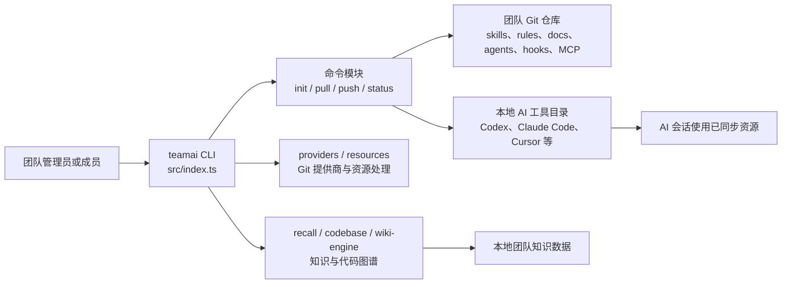

## 导语

`Tencent/teamai-cli` 是 GitHub 2026 年 9 月 10 日日榜项目。2026-09-10 17:02–17:05（北京时间，UTC+8）抓取的日榜页面标注“今日新增 556 Star”；同一时段的仓库元数据 API 快照显示 3,379 Star、213 Fork，默认分支为 `main`，主语言为 TypeScript。仓库在当天 13:18（北京时间）发布了 `v0.24.0-beta.4`。日榜新增数、事件样本和仓库总量取自不同请求，不能据此推出长期增长率。

本文所有数据均在上述时间段取得；事件与提交图的时间口径以 UTC 标示。README 所述能力是项目方的文档声明，本文不把它等同为在所有团队、模型或本地工具组合中都已得到验证的效果。

## 产品介绍

根据 README，TeamAI 用共享 Git 仓库管理团队的 skills、rules、MCP、知识与相关配置，并把这些资源分发给 Claude Code、Codex、Cursor、CodeBuddy、WorkBuddy、OpenCode 等 AI 工具。它提供 `teamai init`、`pull`、`push` 等命令：管理员或个人可以先指定团队仓库，成员在项目范围或用户范围初始化，后续会话可拉取最新资源。

项目的核心定位是“Team Execution × Team Context（beta）× Team Improvement（beta）”。README 把资源分为 skills、rules、docs、env、agents、hooks、MCP 等；代码库另有 `recall`、`codebase`、`digest`、`dashboard` 等命令入口。根目录的 `LICENSE` 声明 MIT 许可，最新 Release 为 `v0.24.0-beta.4`。这些是仓库可核实的内容；对“让团队 AI Native”的产品宣言不应解读为已测量的效率结论。

## 目标人群

从安装、团队仓库、角色与项目参数的说明看，它适合需要为多个开发者和多个 AI 编程工具统一分发工作约定的工程团队，也适合希望把个人项目内资源集中管理的独立开发者。典型诉求是减少技能、规则和 MCP 配置在成员与工具之间的手工复制与漂移。

README 同时列出 knowledge recall、代码库图谱、维护和会话摘要等功能，因此也面向想把团队经验保存在可检索资源中的团队；这是基于文档和命令入口作出的有限分析。由于资源可包含 hooks、环境变量和第三方服务配置，使用者仍应自行审查权限、密钥处理和变更发布流程。

## 技术架构

仓库的 `package.json` 显示它是 ESM TypeScript CLI：`commander` 负责命令解析，`tsup` 用于构建，产物入口为 `dist/index.js`，`teamai` 命令指向该入口。`src/index.ts` 注册 `init`、`pull`、`push`、`status`、`skill`、`members` 等命令；目录中还可见 `providers/`、`resources/`、`wiki-engine/`、`maintenance/`、`agents/`、`skills/` 与 `docs/`。依赖中包含 `simple-git`、`yaml`、`zod`、`web-tree-sitter` 和 `tree-sitter-wasms`，与文档所述 Git 资源、配置校验和代码库图谱能力相符。

图中的 CLI、Git 资源、本地工具和知识模块均对应 README、`package.json` 与仓库目录。具体 Git 服务、安装位置、模型与本地权限由使用者配置；项目并未在文档中声称托管这些外部服务。

## 数据分析

### Star 趋势折线图

| UTC 时间窗口 | WatchEvent（Star）样本数 |
| --- | ---: |
| 2026-09-10 07:00–07:59 | 15 |
| 2026-09-10 08:00–08:59 | 52 |
| 2026-09-10 09:00–09:59 | 4 |

数据来自 17:04（北京时间）抓取的 GitHub [公开仓库事件 API](https://api.github.com/repos/Tencent/teamai-cli/events?per_page=100&page=1)。最近 100 条事件中有 71 条 `WatchEvent`，时间范围为 2026-09-10 07:35:18–09:04:21 UTC；图表按事件创建时间的 UTC 小时汇总，09 时只有截至抓取时的样本。它是一个公开事件滚动样本，可能截断早期事件，不能代表全天、周度或长期 Star 趋势；尤其不能把日榜“556 stars today”填作历史曲线点位。

### Commit 情况柱状图

| UTC 日期 | 非合并提交数 |
| --- | ---: |
| 2026-09-03 | 12 |
| 2026-09-04 | 20 |
| 2026-09-05 | 0 |
| 2026-09-06 | 1 |
| 2026-09-07 | 11 |
| 2026-09-08 | 21 |
| 2026-09-09 | 30 |
| 2026-09-10（截至 09:30 UTC） | 6 |

数据来自 17:05（北京时间）抓取的 [commits API 第 1 页](https://api.github.com/repos/Tencent/teamai-cli/commits?since=2026-09-03T00%3A00%3A00Z&until=2026-09-10T09%3A30%3A00Z&per_page=100&page=1) 与 [第 2 页](https://api.github.com/repos/Tencent/teamai-cli/commits?since=2026-09-03T00%3A00%3A00Z&until=2026-09-10T09%3A30%3A00Z&per_page=100&page=2)，统计窗口为 2026-09-03 00:00 至 2026-09-10 09:30 UTC。两页返回 155 条提交；本文排除提交信息以 `Merge pull request` 开头的 54 条合并提交，未按作者是否为机器人另行剔除。图表按提交作者时间的 UTC 日期汇总，描述的是默认分支 API 返回的提交节奏，不代表代码量、质量或所有分支活动。

### 社区反馈饼图

| 公开协作条目类型 | 数量 | 样本占比 |
| --- | ---: | ---: |
| Pull request | 60 | 66% |
| Issue | 31 | 34% |

数据来自 17:05（北京时间）抓取的 GitHub [issues 搜索 API](https://api.github.com/search/issues?q=repo%3ATencent%2Fteamai-cli%20created%3A2026-09-03..2026-09-10%20is%3Aissue&per_page=100) 与 [pull request 搜索 API](https://api.github.com/search/issues?q=repo%3ATencent%2Fteamai-cli%20created%3A2026-09-03..2026-09-10%20is%3Apr&per_page=100)。口径是该 UTC 日期范围内新建且公开的条目，按 GitHub 搜索的 `is:issue` / `is:pr` 分类；它衡量公开协作的类型构成，不是情感分析、满意度统计，也不代表阅读量或实际使用量。

## 来源链接

- [GitHub Trending 日榜：Repositories](https://github.com/trending?since=daily)
- [Tencent/teamai-cli 仓库与 README](https://github.com/Tencent/teamai-cli)
- [README 原文](https://raw.githubusercontent.com/Tencent/teamai-cli/main/README.md)
- [MIT 许可证](https://github.com/Tencent/teamai-cli/blob/main/LICENSE)
- [仓库元数据 API 快照](https://api.github.com/repos/Tencent/teamai-cli)
- [仓库根目录 API](https://api.github.com/repos/Tencent/teamai-cli/contents)
- [递归目录树 API](https://api.github.com/repos/Tencent/teamai-cli/git/trees/main?recursive=1)
- [Release API](https://api.github.com/repos/Tencent/teamai-cli/releases?per_page=5)
- [公开仓库事件 API](https://api.github.com/repos/Tencent/teamai-cli/events?per_page=100&page=1)
- [提交 API](https://api.github.com/repos/Tencent/teamai-cli/commits?since=2026-09-03T00%3A00%3A00Z&until=2026-09-10T09%3A30%3A00Z&per_page=100)
- [Issue 搜索 API](https://api.github.com/search/issues?q=repo%3ATencent%2Fteamai-cli%20created%3A2026-09-03..2026-09-10%20is%3Aissue&per_page=100)
- [Pull request 搜索 API](https://api.github.com/search/issues?q=repo%3ATencent%2Fteamai-cli%20created%3A2026-09-03..2026-09-10%20is%3Apr&per_page=100)
