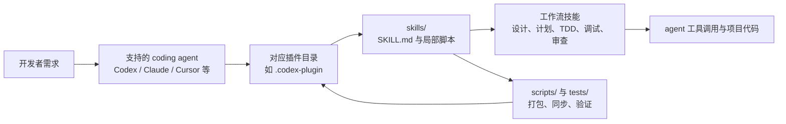

## 导语

`obra/superpowers` 是 GitHub 2026 年 9 月 11 日日榜项目。2026-09-11 17:02–17:05（北京时间，UTC+8）抓取的日榜页面标注“今日新增 732 Star”；同一时段的仓库元数据 API 快照为 284,974 Star、25,491 Fork、350 个开放 issue，默认分支为 `main`，主语言为 Shell。仓库的最近 Release 是 `v6.3.0`，发布于 2026-08-12 UTC。

日榜新增数和仓库总量来自不同页面快照，不能由此推出长期增长率。README 对流程与效果的描述属于项目文档声明；本文将仓库事实、数据观察和有限分析分开陈述。

## 产品介绍

README 将 Superpowers 定义为一组可组合的 skills 与初始指令，用来为 coding agent 提供软件开发方法：先澄清与设计，再规划实现，随后执行测试驱动开发、调试、审查与交付流程。README 的安装章节列出了 Claude Code、Codex App、Codex CLI、Cursor、Devin CLI、Gemini CLI、GitHub Copilot CLI、OpenCode、Pi、Hermes Agent 等入口，并明确提示不同 harness 需要分别安装。

仓库根目录同时提供 `.codex-plugin/`、`.claude-plugin/`、`.cursor-plugin/` 等适配目录；`.codex-plugin/plugin.json` 将 skills 指向 `./skills/`，并把能力描述为规划、TDD、调试、协作、代码审查和分支收尾工作流。`skills/` 下可核实地包含 `brainstorming`、`test-driven-development`、`systematic-debugging`、`subagent-driven-development`、`verification-before-completion` 等目录。根目录 `LICENSE` 与插件清单均标为 MIT；这些是可核实的仓库事实，不意味着项目方已证明它会在每种模型、工具或团队中带来同等结果。

## 目标人群

从安装范围与工作流名称看，它适合希望给 AI 编程助手加入明确工程步骤的个人开发者和团队：例如在开始编码前形成设计与计划、在实现时坚持 TDD、在提交前进行独立验证与审查。它也面向同时使用多种 coding agent 的团队；多个 harness 的适配目录可以降低分发同一技能库的摩擦。

这是一项基于 README、插件清单和目录组织的有限分析，而不是对实际采用率或效率的测量。适合的人仍应审查 skills 的指令内容、插件权限以及各自 agent 对 hooks、子代理和工具调用的支持边界。

## 技术架构

项目的主语言是 Shell；根目录存在 `skills/`、`scripts/`、`tests/`、`docs/` 与多种 agent 插件目录。`.codex-plugin/plugin.json` 的 `skills` 字段指向 `./skills/`，其描述与 README 中的规划、TDD、调试和协作流程一致。树 API 还显示 `skills/subagent-driven-development/scripts/`、`skills/brainstorming/scripts/` 等局部脚本；这表明技能文档可配套执行辅助脚本，而不是一个集中式云服务。

图中插件目录、`skills/`、工作流名、`scripts/` 和 `tests/` 都可以在目录树、插件清单或 README 中核对。不同 agent 如何加载技能、能否启动子代理，以及工具对本地仓库的实际影响，取决于具体 harness 与用户配置；仓库未声明自己托管这些外部 agent 服务。

## 数据分析

### Star 趋势折线图

| 可复核指标 | 数值 | 说明 |
| --- | ---: | --- |
| 日榜当日新增 Star | 732 | 趋势页的单日展示值 |
| 仓库 Star 快照 | 284,974 | 仓库元数据 API 快照 |
| 历史 Star 事件 | 数据不足，未绘制 | `stargazers` 端点返回 HTTP 401 |

数据于 2026-09-11 17:02–17:05（北京时间，UTC+8）抓取。日榜统计窗口为 GitHub Trending 的 `daily`；历史折线原计划采用带时间戳的 `GET /repos/obra/superpowers/stargazers?per_page=100`，但该端点在本次匿名请求中返回 HTTP 401，无法取得可复核时间戳，故以可见占位图替代。日榜“732 stars today”并不是历史点位，不能据此画出曲线或得出增长速度结论。

### Commit 情况柱状图

| UTC 日期 | API 返回的非合并提交数 |
| --- | ---: |
| 2026-09-04 | 0 |
| 2026-09-05 | 0 |
| 2026-09-06 | 0 |
| 2026-09-07 | 0 |
| 2026-09-08 | 0 |
| 2026-09-09 | 0 |
| 2026-09-10 | 0 |
| 2026-09-11（截至抓取） | 0 |

数据于 2026-09-11 17:03（北京时间，UTC+8）从 [commits API](https://api.github.com/repos/obra/superpowers/commits?since=2026-09-04T00%3A00%3A00Z&until=2026-09-11T09%3A05%3A00Z&per_page=100) 抓取，窗口为 2026-09-04 00:00 至 2026-09-11 09:05 UTC。端点返回空数组，故按 UTC 日期展示零记录；没有 merge/release bot 可排除。这个结果仅描述该次默认参数查询，不能证明仓库没有开发活动、没有其他分支提交，也不能代表代码质量或发布节奏。

### 社区反馈饼图

| 公开协作条目类型 | 数量 | 样本占比 |
| --- | ---: | ---: |
| Issue | 14 | 50% |
| Pull request | 14 | 50% |

数据于 2026-09-11 17:03（北京时间，UTC+8）从 [issues API](https://api.github.com/repos/obra/superpowers/issues?state=all&since=2026-09-04T00%3A00%3A00Z&per_page=100) 第 1 页取得，并以 `created_at` 落在 2026-09-04 00:00 至 2026-09-11 09:05 UTC 的条目为样本；含 `pull_request` 字段的条目计为 Pull request，其余计为 Issue。它衡量的是公开协作条目的类型构成，不是情感分析、满意度、阅读量或实际使用量；第 1 页的返回量足以覆盖本窗口这 28 条，仍不应将其延伸解释为整个社区的态度。

## 来源链接

- [GitHub Trending 日榜：Repositories](https://github.com/trending?since=daily)
- [obra/superpowers 仓库与 README](https://github.com/obra/superpowers)
- [README 原文](https://raw.githubusercontent.com/obra/superpowers/main/README.md)
- [MIT 许可证](https://github.com/obra/superpowers/blob/main/LICENSE)
- [Codex 插件清单](https://github.com/obra/superpowers/blob/main/.codex-plugin/plugin.json)
- [仓库目录树 API](https://api.github.com/repos/obra/superpowers/git/trees/main?recursive=1)
- [仓库元数据 API 快照](https://api.github.com/repos/obra/superpowers)
- [Release API](https://api.github.com/repos/obra/superpowers/releases?per_page=10)
- [提交 API](https://api.github.com/repos/obra/superpowers/commits?since=2026-09-04T00%3A00%3A00Z&until=2026-09-11T09%3A05%3A00Z&per_page=100)
- [Issue / Pull request API](https://api.github.com/repos/obra/superpowers/issues?state=all&since=2026-09-04T00%3A00%3A00Z&per_page=100)
- [GitHub Star 事件端点文档（本次端点请求返回 401）](https://docs.github.com/en/rest/activity/starring#list-stargazers)
