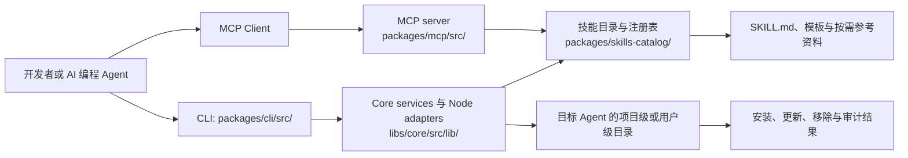

## 导语

`tech-leads-club/agent-skills` 是 GitHub 2026 年 9 月 14 日日榜项目。2026-09-14 17:02（北京时间，UTC+8）抓取的 Trending `daily` 页面显示它有 5,851 Star、505 Fork，并标注“今日新增 265 Star”；同一轮仓库元数据 API 快照也是 5,851 Star、31 个开放 issue，默认分支为 `main`，主语言为 TypeScript。仓库最近一次推送为 2026-09-12 15:29 UTC；最新 Release `skills-catalog-v0.17.8` 发布于 2026-09-10 13:33 UTC。

日榜新增数和仓库总 Star 是不同请求时刻的快照，不能连成长期增长率。下文把 README 与代码树可核对的事实、公开 API 的数据观察，以及基于它们的有限判断分开说明。

## 产品介绍

README 将该项目描述为 AI 编程 Agent 的技能目录：每个技能由 `SKILL.md` 主说明以及可选模板、按需文档组成。它提供交互式 CLI，用户可以浏览或搜索技能、选择目标 Agent、以复制或符号链接方式安装到项目或用户级目录；文档列出了 Claude Code、Cursor、GitHub Copilot、Codex 等多种目标环境，并提供 `list`、`install`、`update`、`remove`、`audit` 等命令。

仓库还提供 `@tech-leads-club/agent-skills-mcp`：README 所列 MCP Server 可搜索目录、读取技能说明与按需取文件。项目宣称在发布前做扫描、使用锁文件与内容哈希，并给出安全模型链接；这是仓库的设计与流程主张，不等同于对任意技能绝对安全或适用于所有环境的独立保证。

许可证有两层：`LICENSE` 对 CLI、脚本和工具代码使用 MIT；README 的“License and Attribution”说明，维护者编写的 `SKILL.md` 文件使用 CC-BY-4.0，而第三方技能需查看各自文件的许可与署名。使用者应据此逐项核对再进行分发或商业使用。

## 目标人群

从 CLI 的安装选项、跨 Agent 清单和 MCP 入口看，它适合希望在本地开发流程中复用结构化提示、模板与工作步骤的 AI 编程用户和团队。典型诉求是：把一项可阅读的技能安装到特定 Agent，保留项目级或用户级的选择，并通过更新、移除和审计命令管理其生命周期。

它也面向需要从目录中检索技能内容的 MCP 客户端集成者。由于仓库强调安装来源、内容许可与安全扫描，较适合愿意审阅技能文本、来源和权限边界的用户；把任意第三方技能直接授予生产凭据或文件写入权限仍需要独立的安全评估。这是依据文档和代码结构作出的适用性分析，不是实际采用规模或安全效果测评。

## 技术架构

仓库根目录的 `package.json` 显示它使用 TypeScript、Nx、Jest 与 ESLint；README 要求 Node.js 22 及以上。目录树中 `packages/cli/src/` 包含交互界面、安装/更新/移除命令和本地配置服务，`libs/core/src/lib/` 把文件系统、路径、HTTP、日志等端口与 Node 适配器分离，`packages/skills-catalog/skills/` 保存技能目录与注册表；`packages/mcp/src/` 则包含 MCP 的入口、目录、完整性和工具实现。`.github/workflows/release.yml` 与部署工作流是仓库自动化的一部分。

图中模块关系来自 README、根 `package.json` 与仓库目录树。CDN 拉取、缓存和具体目标 Agent 的落盘路径由 CLI 配置及运行环境决定；本文不把它们视为该仓库自托管或可用性承诺。

## 数据分析

### Star 趋势折线图

| UTC 小时 | 04 | 05 | 06 | 07 | 08 | 09（截至 09:01） |
| --- | ---: | ---: | ---: | ---: | ---: | ---: |
| WatchEvent 数 | 9 | 22 | 18 | 27 | 19 | 3 |

数据抓取于 2026-09-14 17:02（北京时间，UTC+8），来自 [公开仓库 Events API](https://api.github.com/repos/tech-leads-club/agent-skills/events?per_page=100&page=1)。首页 100 条事件中有 98 条 `WatchEvent`，时间范围为 2026-09-14 04:39:23–09:01:47 UTC，按 `created_at` 的 UTC 小时分桶。该端点是近期滚动样本，不是完整 Stargazer 历史；折线只描述这个短窗口的公开 Star 事件密度，不能推断全天、周度或长期 Star 趋势，也不能把日榜的 265 个“今日新增”伪装成历史点位。

### Commit 情况柱状图

| UTC 日期 | API 返回提交 | 排除 bot 提交 | 排除 merge 提交 | 非机器人、非合并提交 |
| --- | ---: | ---: | ---: | ---: |
| 2026-09-08 | 4 | 1 | 0 | 3 |
| 2026-09-09 | 14 | 2 | 0 | 12 |
| 2026-09-10 | 3 | 2 | 0 | 1 |
| 2026-09-11 | 0 | 0 | 0 | 0 |
| 2026-09-12 | 1 | 0 | 0 | 1 |

数据于 2026-09-14 17:02（北京时间，UTC+8）从 [commits API](https://api.github.com/repos/tech-leads-club/agent-skills/commits?since=2026-09-07T00%3A00%3A00Z&until=2026-09-14T09%3A02%3A24Z&per_page=100) 抓取。查询窗口为 2026-09-07 00:00 至 2026-09-14 09:02 UTC，返回 22 条记录；按 `commit.author.date` 的 UTC 日期汇总。用户名以 `[bot]` 结尾的提交不计入；多父提交也会排除，本样本中为 0。柱图是该窗口与该口径下的仓库变更频率，不代表代码质量、发布数量或总开发投入。

### 社区反馈饼图

| 公开协作条目类型 | 数量 | 样本占比 |
| --- | ---: | ---: |
| Issue | 7 | 53.8% |
| Pull request | 6 | 46.2% |

数据于 2026-09-14 17:02（北京时间，UTC+8）从 [issues API](https://api.github.com/repos/tech-leads-club/agent-skills/issues?state=all&sort=created&direction=desc&per_page=100) 抓取。该页按创建时间倒序返回 100 条，取 2026-09-07 00:00 UTC 以后创建的条目；样本中最早为 2026-09-09 14:05 UTC、最新为 2026-09-14 03:52 UTC。含 `pull_request` 字段者计为 Pull request，其余计为 Issue。此饼图只衡量近期公开协作条目的类型构成，不是情感分析、满意度、阅读量或实际使用量。

## 来源链接

- [GitHub Trending 日榜：Repositories](https://github.com/trending?since=daily)
- [tech-leads-club/agent-skills 仓库与 README](https://github.com/tech-leads-club/agent-skills)
- [README 原文](https://raw.githubusercontent.com/tech-leads-club/agent-skills/main/README.md)
- [仓库 LICENSE](https://github.com/tech-leads-club/agent-skills/blob/main/LICENSE)
- [仓库元数据 API 快照](https://api.github.com/repos/tech-leads-club/agent-skills)
- [Release API](https://api.github.com/repos/tech-leads-club/agent-skills/releases?per_page=5)
- [仓库目录树 API](https://api.github.com/repos/tech-leads-club/agent-skills/git/trees/main?recursive=1)
- [根 package.json](https://github.com/tech-leads-club/agent-skills/blob/main/package.json)
- [近期公开仓库事件 API](https://api.github.com/repos/tech-leads-club/agent-skills/events?per_page=100&page=1)
- [提交 API](https://api.github.com/repos/tech-leads-club/agent-skills/commits?since=2026-09-07T00%3A00%3A00Z&until=2026-09-14T09%3A02%3A24Z&per_page=100)
- [Issue / Pull request API](https://api.github.com/repos/tech-leads-club/agent-skills/issues?state=all&sort=created&direction=desc&per_page=100)
