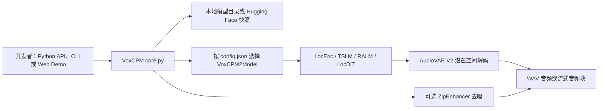

## 导语

`OpenBMB/VoxCPM` 是 GitHub 2026 年 9 月 15 日日榜项目。2026-09-15 17:03（北京时间，UTC+8）抓取的 Trending `daily` 页面显示它有 37,506 Star、4,257 Fork，并标注“今日新增 216 Star”；同一轮[仓库元数据 API](https://api.github.com/repos/OpenBMB/VoxCPM)快照也是 37,506 Star、118 个开放 issue，默认分支为 `main`，主语言为 Python。仓库元数据显示最近一次推送为 2026-09-02 12:12 UTC；[Release API](https://api.github.com/repos/OpenBMB/VoxCPM/releases?per_page=5)返回的最新发布是 `v1.5`，发布时间为 2026-04-28 02:52 UTC。

日榜的“今日新增”与仓库总 Star 都是抓取时刻的快照，不能拼成长期增长率。下文会将 README 和代码树可核实的仓库事实、公开 API 数据观察，以及据此作出的有限判断分开说明。

## 产品介绍

README 将 VoxCPM 描述为无分词器（tokenizer-free）的文本转语音系统：它通过扩散式自回归架构直接生成连续语音表征。仓库当前推荐的 VoxCPM2 是 20 亿参数模型；README 列出 30 种语言、从自然语言描述创建音色、基于参考音频的可控克隆、48 kHz 输出和流式生成等能力。README 同时给出了 Python API、`voxcpm` 命令行、基于 Gradio 的本地 Web Demo，以及面向 Nano-vLLM、vLLM-Omni 和 llama.cpp-omni 的外部部署示例。

这些功能是项目文档的功能主张，不等同于在所有硬件、语言、输入或使用场景下都能达到相同的音质、延迟或相似度。尤其语音克隆的使用者需要确保拥有参考音频和声音的合法授权；README 的“Risks and Limitations”也提示模型输出可能存在局限。

许可证文件和 `pyproject.toml` 均标明代码采用 [Apache-2.0](https://github.com/OpenBMB/VoxCPM/blob/main/LICENSE)。README 将模型权重链接至 Hugging Face 和 ModelScope；代码许可不自动覆盖模型权重、样例音频或第三方部署组件的所有使用条件，实际接入前仍应逐项核对。

## 目标人群

从安装方式、Python 调用示例和部署入口看，它适合需要把文本转为多语言语音的 Python 开发者、原型团队和语音应用集成者；其核心诉求包括离线或服务端推理、基于文本的音色设计，以及在获授权的前提下使用参考音频进行音色复现。

README 所列命令行、Web Demo 与 OpenAI 兼容服务示例，说明它也面向希望先验证效果、再接入现有应用的用户。需要微调时，仓库提供 LoRA 和训练脚本；因此有训练数据、GPU 环境且愿意审阅模型行为的开发团队更可能从中受益。这是依据仓库文档与目录结构作出的适用性分析，不代表实际用户规模、准确率或部署成本测评。

## 技术架构

根目录的 [`pyproject.toml`](https://github.com/OpenBMB/VoxCPM/blob/main/pyproject.toml) 声明项目使用 Python 3.10+，依赖 PyTorch、TorchAudio、Transformers、Gradio、Hugging Face Hub、ModelScope、SoundFile 等；`voxcpm` 控制台命令的入口是 `voxcpm.cli:main`。代码树把实现放在 `src/voxcpm/`：`core.py` 中的 `VoxCPM` 会通过 Hugging Face Hub 下载或载入本地快照，并根据 `config.json` 的 `architecture` 选择模型；`model/` 包含 VoxCPM 与 VoxCPM2，`modules/` 则包含 AudioVAE、LocDiT、LocEnc 与 MiniCPM4 等模块，`training/` 保存训练相关代码。

README 对 VoxCPM2 的结构说明为 `LocEnc → TSLM → RALM → LocDiT` 的四阶段流程，在 AudioVAE V2 潜在空间中工作。下图只连接 README 和代码树能对应的模块：具体推理调度、外部模型下载、可选去噪以及服务封装会因运行参数和部署方式不同而改变。

图中 `core.py`、`model/` 与 `modules/` 的位置可由[仓库目录树 API](https://api.github.com/repos/OpenBMB/VoxCPM/git/trees/main?recursive=1)复核；`core.py` 的加载逻辑也可直接查看其[源文件](https://github.com/OpenBMB/VoxCPM/blob/main/src/voxcpm/core.py)。vLLM-Omni、Nano-vLLM 与 llama.cpp-omni 是 README 指向的外部项目，不被当作此仓库内置模块。

## 数据分析

### Star 趋势折线图

| UTC 小时 | 03 | 04 | 05 | 06 | 07 | 08（截至 08:48） |
| --- | ---: | ---: | ---: | ---: | ---: | ---: |
| WatchEvent 数 | 20 | 17 | 17 | 14 | 15 | 10 |

数据抓取于 2026-09-15 17:03（北京时间，UTC+8），来自[公开仓库 Events API](https://api.github.com/repos/OpenBMB/VoxCPM/events?per_page=100&page=1)。首页 100 条事件中有 93 条 `WatchEvent`，时间范围为 2026-09-15 03:05:54–08:48:58 UTC，按 `created_at` 的 UTC 小时分桶。该端点是近期滚动样本，不是完整 Stargazer 历史；折线只描述这个短窗口的公开 Star 事件密度，不能推断全天、周度或长期 Star 趋势，也不能把日榜的 216 个“今日新增”伪装成历史点位。

### Commit 情况柱状图

| UTC 日期 | 08-26 | 08-27 | 08-28 | 08-29 | 08-30 | 08-31 | 09-01 | 09-02 |
| --- | ---: | ---: | ---: | ---: | ---: | ---: | ---: | ---: |
| API 返回提交 | 1 | 0 | 0 | 0 | 0 | 0 | 0 | 5 |
| 排除 bot 提交 | 0 | 0 | 0 | 0 | 0 | 0 | 0 | 0 |
| 排除 merge 提交 | 0 | 0 | 0 | 0 | 0 | 0 | 0 | 1 |
| 非机器人、非合并提交 | 1 | 0 | 0 | 0 | 0 | 0 | 0 | 4 |

数据抓取于 2026-09-15 17:03（北京时间，UTC+8），来自 [commits API](https://api.github.com/repos/OpenBMB/VoxCPM/commits?since=2026-08-26T00%3A00%3A00Z&until=2026-09-03T00%3A00%3A00Z&per_page=100)。查询窗口为 2026-08-26 00:00 至 2026-09-03 00:00 UTC，返回 6 条记录，按 `commit.author.date` 的 UTC 日期汇总；这是最近一次推送日期附近的 8 天窗口，而不是日榜当天的实时提交数。用户名以 `[bot]` 结尾者不计入，多父提交作为 merge 排除；本样本中无 bot、1 个 merge。柱图仅表达该窗口与该口径下的变更频率，不代表代码质量、发布数量或总开发投入。

### 社区反馈饼图

| 公开协作条目类型 | 数量 | 样本占比 |
| --- | ---: | ---: |
| Issue | 2 | 25% |
| Pull request | 6 | 75% |

数据抓取于 2026-09-15 17:03（北京时间，UTC+8），来自 [issues API](https://api.github.com/repos/OpenBMB/VoxCPM/issues?state=all&sort=created&direction=desc&per_page=100)。该页按创建时间倒序返回 100 条，取 2026-09-01 00:00 UTC 以后创建的条目；样本中最早为 2026-09-03 14:01 UTC、最新为 2026-09-15 00:01 UTC。GitHub 的此端点会混合返回 issue 和 pull request，含 `pull_request` 字段者计为 Pull request，其余计为 Issue。此饼图只衡量近期公开协作条目的类型构成，不是情感分析、满意度、阅读量或实际使用量。

## 来源链接

- [GitHub Trending 日榜：Repositories](https://github.com/trending?since=daily)
- [OpenBMB/VoxCPM 仓库与 README](https://github.com/OpenBMB/VoxCPM)
- [README 原文](https://raw.githubusercontent.com/OpenBMB/VoxCPM/main/README.md)
- [仓库 LICENSE](https://github.com/OpenBMB/VoxCPM/blob/main/LICENSE)
- [仓库元数据 API 快照](https://api.github.com/repos/OpenBMB/VoxCPM)
- [Release API](https://api.github.com/repos/OpenBMB/VoxCPM/releases?per_page=5)
- [仓库目录树 API](https://api.github.com/repos/OpenBMB/VoxCPM/git/trees/main?recursive=1)
- [根 pyproject.toml](https://github.com/OpenBMB/VoxCPM/blob/main/pyproject.toml)
- [VoxCPM 核心加载逻辑](https://github.com/OpenBMB/VoxCPM/blob/main/src/voxcpm/core.py)
- [近期公开仓库事件 API](https://api.github.com/repos/OpenBMB/VoxCPM/events?per_page=100&page=1)
- [提交 API](https://api.github.com/repos/OpenBMB/VoxCPM/commits?since=2026-08-26T00%3A00%3A00Z&until=2026-09-03T00%3A00%3A00Z&per_page=100)
- [Issue / Pull request API](https://api.github.com/repos/OpenBMB/VoxCPM/issues?state=all&sort=created&direction=desc&per_page=100)
