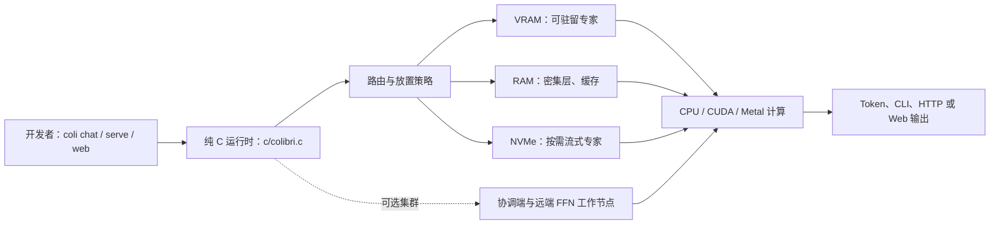

## 导语

`JustVugg/colibri` 是 GitHub 2026 年 9 月 16 日日榜项目。2026-09-16 17:03（北京时间，UTC+8）抓取的 Trending `daily` 页面显示它有 34,390 Star、3,594 Fork，并标注“今日新增 2,026 Star”；同一轮[仓库元数据 API](https://api.github.com/repos/JustVugg/colibri)快照为 34,390 Star、131 个开放 issue、默认分支 `main`、主语言 C，最近一次推送为 2026-09-15 21:33 UTC。

README 将项目定位为一个纯 C 的 MoE 模型推理引擎，尝试把存储、RAM 和 VRAM 作为同一推理层级来调度权重。Trending 的“今日新增”与仓库总 Star 都是抓取时刻的快照，不能据此推导长期增长率；下文会把可由仓库核实的事实、公开 API 的数据观察，以及基于它们作出的有限判断分开说明。

## 产品介绍

README 称 colibri 可运行多种 MoE 模型，并以 `coli chat`、`coli serve` 与 `coli web` 作为统一前端。项目的核心做法是：把密集层和高频专家放到较快的层级，而将其余专家按需从磁盘载入；README 同时列出基于路由热度的 LRU、预取、CPU/CUDA/Metal 后端、可选双 SSD 读取，以及本地集群模式。根目录的[LICENSE](https://github.com/JustVugg/colibri/blob/main/LICENSE)采用 Apache-2.0；[Release API](https://api.github.com/repos/JustVugg/colibri/releases?per_page=5)显示最新公开版本为 `v1.11.0`，发布于 2026-09-13 13:44 UTC。

这些是仓库的设计与功能主张，并非对所有模型、SSD、GPU 或提示词的性能承诺。README 也明确说明没有速度 SLA，并要求以可复现实验判断优化是否成立；因此文中不把示例吞吐、模型规模或特定硬件展示当作普遍效果。

## 目标人群

从命令行、服务端与 Web 入口，以及 `c/colibri.c` 的单文件核心实现看，项目适合愿意自行准备模型文件、存储与推理环境的本地 LLM 开发者、系统研究者和异构硬件爱好者。其主要诉求是：在快内存有限时仍可探索较大的稀疏模型，并能观察或调整权重放置、I/O 和后端选择。

README 所列的基准协议、贡献指南与集群工作节点说明，也表明它面向愿意记录硬件、命令、缓存状态和原始日志的实验参与者。对追求托管 SLA、零配置部署或已验证性能基线的团队而言，README 的实验性定位意味着应先做受控评估；这是依据文档作出的适用性分析，不代表实际用户规模或成本测评。

## 技术架构

代码树显示核心实现位于 [`c/colibri.c`](https://github.com/JustVugg/colibri/blob/main/c/colibri.c)，根目录还包含 `web/`、`desktop/`、`docker/`、`docs/` 与 `colibri/` 目录。README 对单机路径的描述是：前端接收请求后，路由器为每层选择专家；运行时按权重的驻留位置从 VRAM、RAM 或 NVMe 获取数据，并将读取与计算尽量重叠；随后输出 token 或服务响应。可选集群模式中，协调端保留 token 生成、路由和 KV 状态，远端工作节点执行路由到的 FFN。

图中模块与关系来自[README](https://raw.githubusercontent.com/JustVugg/colibri/main/README.md)的“per-token path”、存储层级及 cluster mode 描述，以及[递归代码树 API](https://api.github.com/repos/JustVugg/colibri/git/trees/main?recursive=1)。VRAM/RAM/NVMe 的实际容量、缓存命中和选用的计算后端均由机器与参数决定；图不暗示它们在每次运行中都会同时启用。

## 数据分析

### Star 趋势折线图

| UTC 十分钟起点 | 08:00 | 08:10 | 08:20 | 08:30 | 08:40 | 08:50 | 09:00（截至 09:02） |
| --- | ---: | ---: | ---: | ---: | ---: | ---: | ---: |
| WatchEvent 数 | 15 | 9 | 17 | 14 | 14 | 22 | 3 |

数据抓取于 2026-09-16 17:03（北京时间，UTC+8），来自[公开仓库 Events API](https://api.github.com/repos/JustVugg/colibri/events?per_page=100&page=1)。最新 100 条事件中有 94 条 `WatchEvent`，其 `created_at` 范围为 2026-09-16 08:02:54–09:02:28 UTC；表和折线按 UTC 十分钟分桶。该端点是近期滚动样本而不是完整 Stargazer 历史，图表仅描述这个约一小时窗口内公开可见的 Star 事件密度，不能推断全天、周度或长期 Star 趋势，更不能把 Trending 的 2,026 个“今日新增”伪装成历史点位。

### Commit 情况柱状图

| UTC 日期 | 09-09 | 09-10 | 09-11 | 09-12 | 09-13 | 09-14 | 09-15 |
| --- | ---: | ---: | ---: | ---: | ---: | ---: | ---: |
| API 返回提交 | 4 | 26 | 18 | 38 | 25 | 0 | 2 |
| 排除 merge 提交 | 0 | 11 | 7 | 10 | 15 | 0 | 1 |
| 排除 bot 提交 | 0 | 0 | 0 | 0 | 0 | 0 | 0 |
| 非机器人、非合并提交 | 4 | 15 | 11 | 28 | 10 | 0 | 1 |

数据抓取于 2026-09-16 17:03（北京时间，UTC+8）。对 2026-09-09 至 15 的每个 UTC 自然日分别查询 [commits API](https://api.github.com/repos/JustVugg/colibri/commits?since=2026-09-09T00%3A00%3A00Z&until=2026-09-10T00%3A00%3A00Z&per_page=100)，以 `commit.author.date` 所在日汇总。图表排除 GitHub 登录名以 `[bot]` 结束的提交，以及 `parents` 数大于 1 的 merge 提交；该窗口没有 bot。柱图反映明确窗口与口径下的提交频率，不代表代码质量、发布数量或总开发投入。

### 社区反馈饼图

| 公开协作条目类型 | 数量 | 样本占比 |
| --- | ---: | ---: |
| Issue | 44 | 26.5% |
| Pull request | 122 | 73.5% |

数据抓取于 2026-09-16 17:03（北京时间，UTC+8），统计窗口为 2026-09-09 00:00 UTC 至抓取时刻。使用 GitHub Search API 分别查询[新建 Issue](https://api.github.com/search/issues?q=repo%3AJustVugg%2Fcolibri%20is%3Aissue%20created%3A%3E%3D2026-09-09)和[新建 Pull request](https://api.github.com/search/issues?q=repo%3AJustVugg%2Fcolibri%20is%3Apr%20created%3A%3E%3D2026-09-09)的 `total_count`；两个响应的 `incomplete_results` 均为 `false`。饼图只衡量近期公开协作条目的类型构成，不是情感分析、满意度、阅读量或实际使用量。

## 来源链接

- [GitHub Trending 日榜：Repositories](https://github.com/trending?since=daily)
- [JustVugg/colibri 仓库](https://github.com/JustVugg/colibri)
- [README 原文](https://raw.githubusercontent.com/JustVugg/colibri/main/README.md)
- [仓库 LICENSE](https://github.com/JustVugg/colibri/blob/main/LICENSE)
- [仓库元数据 API 快照](https://api.github.com/repos/JustVugg/colibri)
- [Release API](https://api.github.com/repos/JustVugg/colibri/releases?per_page=5)
- [递归代码树 API](https://api.github.com/repos/JustVugg/colibri/git/trees/main?recursive=1)
- [核心 C 文件](https://github.com/JustVugg/colibri/blob/main/c/colibri.c)
- [近期公开仓库事件 API](https://api.github.com/repos/JustVugg/colibri/events?per_page=100&page=1)
- [提交 API（逐日查询模式）](https://api.github.com/repos/JustVugg/colibri/commits?since=2026-09-09T00%3A00%3A00Z&until=2026-09-10T00%3A00%3A00Z&per_page=100)
- [近期新建 Issue 搜索 API](https://api.github.com/search/issues?q=repo%3AJustVugg%2Fcolibri%20is%3Aissue%20created%3A%3E%3D2026-09-09)
- [近期新建 Pull request 搜索 API](https://api.github.com/search/issues?q=repo%3AJustVugg%2Fcolibri%20is%3Apr%20created%3A%3E%3D2026-09-09)
