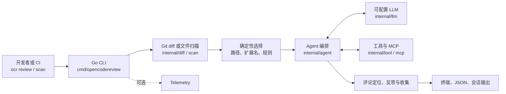

## 导语

`alibaba/open-code-review` 是 GitHub 2026 年 9 月 17 日日榜项目。2026-09-17 17:03（北京时间，UTC+8）抓取的 [Trending `daily` 页面](https://github.com/trending?since=daily)显示它有 33,173 Star、2,359 Fork，并标注“今日新增 3,231 Star”。同一时刻的[仓库元数据 API](https://api.github.com/repos/alibaba/open-code-review)快照同样为 33,173 Star，默认分支为 `main`，主语言为 Go，最近推送时间为 2026-09-17 08:45 UTC。

README 将它定位为 AI 驱动的命令行代码审查工具：读取 Git diff，把变更文件交给可配置的大语言模型与工具调用循环，再生成带行级位置的结构化评论。Trending 的日增 Star 与仓库总 Star 都只是抓取时刻的快照；下文明确区分可由仓库核实的事实、公开 API 的观察和有限的使用判断。

## 产品介绍

项目提供 `ocr review`、`ocr scan`、`ocr delegate` 等命令。README 中，`ocr review` 可审查工作区、分支范围或单个提交；`ocr scan` 用于无有效 diff 时的全文件扫描；JSON 输出可写入文件。其文档还列出 Claude Code、Codex、Cursor、Kimi Code、OpenCode 等编码代理集成，以及 GitHub Actions、GitLab CI、GitFlic CI 与 Gerrit 的 CI/CD 集成入口。

其显式设计是把确定性步骤与 Agent 分开：文件选择、路径/规则匹配及评论定位等由工程逻辑承担；模型负责动态检索和判断。根目录 [LICENSE](https://github.com/alibaba/open-code-review/blob/main/LICENSE)为 Apache-2.0；[Releases API](https://api.github.com/repos/alibaba/open-code-review/releases?per_page=10)显示最新非预发布版本是 `v1.12.4`，发布于 2026-09-16 10:12 UTC。

README 还给出一项项目方基准主张：在其设定的 50 个开源仓库、200 个真实 PR、10 种语言样本中，与通用代理作比较。这是项目文档自己的实验陈述，不应外推为所有仓库、模型、规则或 CI 环境的实际效果。

## 目标人群

从 Git diff、分支范围、JSON 输出和多种代理/CI 集成入口看，它适合想在本地开发流程或持续集成中加入可配置 AI 审查的开发者、代码审查负责人和平台团队。典型诉求是让检查覆盖明确的改动范围、按规则跳过不应审查的文件，并把结果交给人工或下游工具继续处理。

仓库中 [`internal/agent/selection.go`](https://github.com/alibaba/open-code-review/blob/main/internal/agent/selection.go)把二进制、密钥路径、用户排除规则、扩展名和默认路径等作为审查前筛选条件；这表明它更适合能够维护仓库规则、模型端点和审查门槛的团队。对不希望配置模型、规则或 API 凭据的使用者，README 的前置配置要求意味着需要先评估接入成本；这是依据文档做出的适用性分析，并非用户规模统计。

## 技术架构

代码树与源文件显示 CLI 入口在 [`cmd/opencodereview/main.go`](https://github.com/alibaba/open-code-review/blob/main/cmd/opencodereview/main.go)，`review` 子命令实现在 [`cmd/opencodereview/review_cmd.go`](https://github.com/alibaba/open-code-review/blob/main/cmd/opencodereview/review_cmd.go)，并依赖 `internal/diff`、`internal/agent`、`internal/llm`、`internal/mcp`、`internal/session`、`internal/tool` 与 `internal/telemetry`。`internal/agent/agent.go` 的参数结构也表明 Agent 接收 diff 范围、路径规则、LLM 客户端、工具注册表、并发限制和会话历史。

图中的模块和依赖来自[递归代码树 API](https://api.github.com/repos/alibaba/open-code-review/git/trees/main?recursive=1)、上述入口源文件与 README。它描绘仓库中可见的处理关系，不表示任意一次审查都会启用 MCP、遥测、所有工具或并发工作池；模型端点和工具配置由用户运行参数决定。

## 数据分析

### Star 趋势折线图

| UTC 小时起点 | 07:00 | 08:00 | 09:00（截至 09:02） |
| --- | ---: | ---: | ---: |
| WatchEvent 数 | 38 | 181 | 8 |

数据抓取于 2026-09-17 17:03（北京时间，UTC+8）。对[仓库 Events API 第 1–3 页](https://api.github.com/repos/alibaba/open-code-review/events?per_page=100&page=1)的 300 条近期事件，筛选 `WatchEvent` 的 `created_at`；得到 227 条，时间范围为 2026-09-17 07:45:47–09:02:50 UTC，并按 UTC 小时分桶。此端点是近期滚动样本而不是完整 stargazer 历史，图表只描述这约 77 分钟公开可见事件的密度，不能推出全天、周度或长期 Star 趋势，也不能把 Trending 的 3,231 个“今日新增”当作历史折线点。

### Commit 情况柱状图

| UTC 日期 | 09-10 | 09-11 | 09-12 | 09-13 | 09-14 | 09-15 | 09-16 |
| --- | ---: | ---: | ---: | ---: | ---: | ---: | ---: |
| API 返回提交 | 4 | 3 | 2 | 0 | 10 | 12 | 8 |
| 排除 merge 提交 | 0 | 0 | 0 | 0 | 0 | 0 | 0 |
| 排除 bot 提交 | 0 | 0 | 0 | 0 | 0 | 0 | 0 |
| 非机器人、非合并提交 | 4 | 3 | 2 | 0 | 10 | 12 | 8 |

数据抓取于 2026-09-17 17:03（北京时间，UTC+8）。对 2026-09-10 至 16 的每个 UTC 自然日分别调用 [commits API](https://api.github.com/repos/alibaba/open-code-review/commits?since=2026-09-10T00%3A00%3A00Z&until=2026-09-11T00%3A00%3A00Z&per_page=100)，以 `commit.author.date` 所在日汇总；图表排除 `parents` 多于 1 的 merge 提交和 GitHub 登录名以 `[bot]` 结尾的提交。该窗口没有这两类记录。柱图反映固定窗口与明确口径的提交频率，不代表代码质量、发布数量或总投入。

### 社区反馈饼图

| 公开协作条目类型 | 数量 | 样本占比 |
| --- | ---: | ---: |
| Issue | 57 | 39.6% |
| Pull request | 87 | 60.4% |

数据抓取于 2026-09-17 17:03（北京时间，UTC+8），统计窗口为 2026-09-10 00:00 UTC 至抓取时刻。使用 GitHub Search API 分别查询[新建 Issue](https://api.github.com/search/issues?q=repo%3Aalibaba%2Fopen-code-review%20is%3Aissue%20-is%3Apull-request%20created%3A%3E%3D2026-09-10)和[新建 Pull request](https://api.github.com/search/issues?q=repo%3Aalibaba%2Fopen-code-review%20is%3Apr%20created%3A%3E%3D2026-09-10)的 `total_count`；两次响应的 `incomplete_results` 都为 `false`。饼图衡量的是近期新建的公开协作条目类型构成，不是情感分析、满意度、阅读量或实际使用量。

## 来源链接

- [GitHub Trending 日榜：Repositories](https://github.com/trending?since=daily)
- [alibaba/open-code-review 仓库](https://github.com/alibaba/open-code-review)
- [README 原文](https://raw.githubusercontent.com/alibaba/open-code-review/main/README.md)
- [仓库 LICENSE](https://github.com/alibaba/open-code-review/blob/main/LICENSE)
- [仓库元数据 API 快照](https://api.github.com/repos/alibaba/open-code-review)
- [Release API](https://api.github.com/repos/alibaba/open-code-review/releases?per_page=10)
- [递归代码树 API](https://api.github.com/repos/alibaba/open-code-review/git/trees/main?recursive=1)
- [CLI 入口](https://github.com/alibaba/open-code-review/blob/main/cmd/opencodereview/main.go)
- [`review` 命令实现](https://github.com/alibaba/open-code-review/blob/main/cmd/opencodereview/review_cmd.go)
- [近期公开仓库事件 API](https://api.github.com/repos/alibaba/open-code-review/events?per_page=100&page=1)
- [提交 API（逐日查询模式）](https://api.github.com/repos/alibaba/open-code-review/commits?since=2026-09-10T00%3A00%3A00Z&until=2026-09-11T00%3A00%3A00Z&per_page=100)
- [近期新建 Issue 搜索 API](https://api.github.com/search/issues?q=repo%3Aalibaba%2Fopen-code-review%20is%3Aissue%20-is%3Apull-request%20created%3A%3E%3D2026-09-10)
- [近期新建 Pull request 搜索 API](https://api.github.com/search/issues?q=repo%3Aalibaba%2Fopen-code-review%20is%3Apr%20created%3A%3E%3D2026-09-10)
