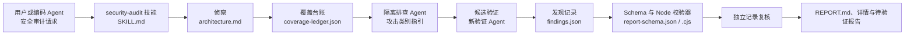

## 导语

`cloudflare/security-audit-skill` 是 GitHub 2026 年 9 月 18 日日榜项目。2026-09-18 17:01（北京时间，UTC+8）抓取的 [Trending `daily` 页面](https://github.com/trending?since=daily)显示它有 11,501 Star、621 Fork，并标注“今日新增 3,607 Star”。同一轮[仓库元数据 API](https://api.github.com/repos/cloudflare/security-audit-skill)快照为 11,501 Star，默认分支为 `main`，主语言为 JavaScript，最近推送时间为 2026-09-14 19:29 UTC。

README 将项目定位为供编码 Agent 使用的安全审计技能：把审计拆成侦察、覆盖驱动的排查、候选验证、结构化输出、独立记录复核和报告六个阶段。日榜新增 Star 和仓库总 Star 都是抓取时刻的快照；下文将仓库事实、公开 API 观察与适用性分析分开陈述。

## 产品介绍

仓库的核心产物是 `skills/security-audit/` 下的 Markdown 指引、JSON Schema 与零依赖 Node.js 校验器。README 说明，流程先建立 `architecture.md` 与 `coverage-ledger.json`，再让隔离的排查 Agent 覆盖台账中的单元；每个候选问题由新的验证者尝试证伪。随后结果被写为 `confirmed`、`needs_validation` 或 `rejected`，并由 `report-schema.json`、`validate-findings.cjs` 和 `validate-coverage-ledger.cjs` 检查。

README 的安装示例使用 Skills CLI 把该仓库安装为 `security-audit` 技能，触发语句包括“security audit this codebase”。它还明确要求目标控制的构建、测试和浏览器等执行环境具备操作系统级沙箱、禁止外网、净化环境变量与写入范围限制；在缺少这些控制时，文档要求将线索保留为 `needs_validation`，而不是执行目标代码。

根目录 [LICENSE](https://github.com/cloudflare/security-audit-skill/blob/main/LICENSE)为 MIT。抓取时 [Releases API](https://api.github.com/repos/cloudflare/security-audit-skill/releases?per_page=10)返回空数组，因而本文不把该项目描述为有 GitHub Release 的版本分发项目。

## 目标人群

从 README 的触发方式、输出目录说明和覆盖台账机制看，它适合希望把代码库安全检查组织成可复核流程的编码 Agent 使用者、应用安全工程师，以及能为 Agent 提供受控执行环境的平台团队。其核心诉求是让排查过程保留架构、覆盖范围、证据与未证实线索，而非只输出一次性的自然语言结论。

仓库把“完整来源追踪与有界观察结果”作为 `confirmed` 的条件，并为未解决的事实保留 `needs_validation` 状态。因此，它更面向愿意审阅证据、维护隔离环境并继续处置线索的团队；这是一项基于文档设计的适用性分析，不是对发现率、审计质量或用户规模的统计结论。

## 技术架构

递归代码树显示项目没有应用运行时代码目录，主体是 `skills/security-audit/` 内的工作流与攻击类别说明。`SKILL.md` 提供设置、术语和流程概览；`RECONNAISSANCE.md`、`HUNTING.md` 与 `VALIDATION-AND-REPORTING.md` 分别覆盖早期侦察、排查编排及后续验证/报告；`AI-AND-LLM.md`、`WEB-PROTOCOL-AND-AUTH.md` 等文件按攻击面提供提示词。`report-schema.json` 定义结果记录结构，两个 `.cjs` 脚本校验台账和发现记录，README 还说明它们在台账更新与记录替换后重新运行。

图中关系来自[递归代码树 API](https://api.github.com/repos/cloudflare/security-audit-skill/git/trees/main?recursive=1)和 README 对六阶段及校验器调用时机的说明。图示表达该技能规定的工件流，而不是宣称任意运行都能发现漏洞；具体目标代码、沙箱和 Agent 能力由使用者环境决定。

## 数据分析

### Star 趋势折线图

| UTC 小时起点 | 08:00 | 09:00（截至 09:01） |
| --- | ---: | ---: |
| WatchEvent 数 | 85 | 8 |

数据抓取于 2026-09-18 17:01（北京时间，UTC+8）。对[仓库 Events API 第一页](https://api.github.com/repos/cloudflare/security-audit-skill/events?per_page=100&page=1)的 100 条近期事件筛选 `WatchEvent` 的 `created_at`，得到 93 条，范围为 2026-09-18 08:21:44–09:01:16 UTC，并按 UTC 小时分桶。该端点是近期滚动事件样本，不是完整 Stargazer 历史；折线只描述这个约 40 分钟的公开 Star 事件密度，不能推断全天、周度或长期 Star 趋势，也不能把日榜的 3,607 个“今日新增”当作历史点位。

### Commit 情况柱状图

| UTC 日期 | 提交数据* |
| --- | ---: |
| 09-11 | 0 / 0 / 0 / 0 |
| 09-12 | 0 / 0 / 0 / 0 |
| 09-13 | 0 / 0 / 0 / 0 |
| 09-14 | 1 / 0 / 0 / 1 |
| 09-15 | 0 / 0 / 0 / 0 |
| 09-16 | 0 / 0 / 0 / 0 |
| 09-17 | 0 / 0 / 0 / 0 |

*数据依序为：API 返回 / 排除 merge / 排除 bot / 图中计数。*

数据抓取于 2026-09-18 17:01（北京时间，UTC+8）。查询 [commits API](https://api.github.com/repos/cloudflare/security-audit-skill/commits?since=2026-09-11T00%3A00%3A00Z&until=2026-09-18T09%3A01%3A29Z&per_page=100) 的窗口为 2026-09-11 00:00 至 2026-09-18 09:01 UTC，按 `commit.author.date` 的 UTC 日期汇总其中 2026-09-11 至 17 的完整日。返回 1 条记录，作者登录名为 `literally-dan`、父提交数为 1；按“多父提交为 merge、登录名以 `[bot]` 结尾为 bot”的口径，均无排除。柱图只反映这个固定窗口的仓库变更频率，不代表代码质量、发布数量或开发投入。

### 社区反馈饼图

| 公开协作条目类型 | 数量 | 样本占比 |
| --- | ---: | ---: |
| Issue | 8 | 30.8% |
| Pull request | 18 | 69.2% |

数据抓取于 2026-09-18 17:01（北京时间，UTC+8），统计窗口为 2026-09-11 00:00 UTC 至抓取时刻。使用 GitHub Search API 分别查询[新建 Issue](https://api.github.com/search/issues?q=repo%3Acloudflare%2Fsecurity-audit-skill%20is%3Aissue%20-is%3Apull-request%20created%3A%3E%3D2026-09-11)和[新建 Pull request](https://api.github.com/search/issues?q=repo%3Acloudflare%2Fsecurity-audit-skill%20is%3Apr%20created%3A%3E%3D2026-09-11)的 `total_count`；两次响应的 `incomplete_results` 均为 `false`。饼图衡量的是近期新建的公开协作条目类型构成，不是情感分析、满意度、阅读量或实际使用量。

## 来源链接

- [GitHub Trending 日榜：Repositories](https://github.com/trending?since=daily)
- [cloudflare/security-audit-skill 仓库](https://github.com/cloudflare/security-audit-skill)
- [README 原文](https://raw.githubusercontent.com/cloudflare/security-audit-skill/main/README.md)
- [安全审计技能入口](https://github.com/cloudflare/security-audit-skill/blob/main/skills/security-audit/SKILL.md)
- [仓库 LICENSE](https://github.com/cloudflare/security-audit-skill/blob/main/LICENSE)
- [仓库元数据 API 快照](https://api.github.com/repos/cloudflare/security-audit-skill)
- [Release API](https://api.github.com/repos/cloudflare/security-audit-skill/releases?per_page=10)
- [递归代码树 API](https://api.github.com/repos/cloudflare/security-audit-skill/git/trees/main?recursive=1)
- [近期公开仓库事件 API](https://api.github.com/repos/cloudflare/security-audit-skill/events?per_page=100&page=1)
- [提交 API](https://api.github.com/repos/cloudflare/security-audit-skill/commits?since=2026-09-11T00%3A00%3A00Z&until=2026-09-18T09%3A01%3A29Z&per_page=100)
- [近期新建 Issue 搜索 API](https://api.github.com/search/issues?q=repo%3Acloudflare%2Fsecurity-audit-skill%20is%3Aissue%20-is%3Apull-request%20created%3A%3E%3D2026-09-11)
- [近期新建 Pull request 搜索 API](https://api.github.com/search/issues?q=repo%3Acloudflare%2Fsecurity-audit-skill%20is%3Apr%20created%3A%3E%3D2026-09-11)
