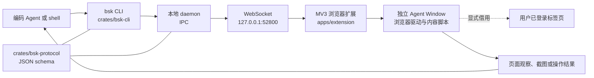

## 导语

`Tencent/BrowserSkill` 是 GitHub 2026 年 9 月 19 日日榜项目。2026-09-19 17:01（北京时间，UTC+8）抓取的 [Trending `daily` 页面](https://github.com/trending?since=daily)显示它有 5,528 Star、382 Fork，并标注“今日新增 1,306 Star”。同一轮[仓库元数据 API](https://api.github.com/repos/Tencent/BrowserSkill)快照也为 5,528 Star，默认分支为 `main`，主语言为 TypeScript，最近推送时间为 2026-09-18 15:01 UTC。

README 将它描述为连接编码 Agent 与用户已登录浏览器的工具：Agent 经 `bsk` CLI 发起请求，浏览器扩展在单独的 Agent Window 执行任务；如需使用用户已有标签页，文档要求显式借用并在结束后归还。日榜新增 Star 与仓库总 Star 都是抓取时刻的快照；以下明确区分仓库事实、公开 API 观察与适用性分析。

## 产品介绍

项目由本地 `bsk` CLI/daemon 和 BrowserSkill 浏览器扩展组成。README 的快速开始提供 CLI 安装、Chrome Web Store 或 Edge Add-ons 扩展安装，以及 `bsk doctor` 的连接检查步骤；支持 macOS、Linux、Windows x64，以及 Chrome 和 Edge。文档还列出截图、页面导航、会话和标签页借用等能力，并说明验证码、登录、确认弹窗等人类步骤会要求接管。

仓库的 [Releases API](https://api.github.com/repos/Tencent/BrowserSkill/releases?per_page=10)显示最新正式版本包括 `cli-v0.3.0`（2026-09-17 发布）和 `ext-v0.3.0`（2026-09-16 发布）。根目录 [LICENSE](https://github.com/Tencent/BrowserSkill/blob/main/LICENSE)为 MIT；这些是版本和许可事实，并不证明特定站点、账号或浏览器配置一定可自动化。

## 目标人群

从 README 的安装指引、`bsk` 命令行入口与“已登录浏览器”设计看，该项目适合需要让 Cursor、Claude Code、Codex 等 shell 可调用 Agent 处理浏览器任务的开发者，以及希望保留自身登录态、又不想让 Agent 直接扰动日常窗口的用户。其主要诉求是将命令行 Agent 的调用与浏览器执行环境连接起来，并保留标签页借用与人工接管等边界。

这是一项基于文档和目录结构的适用性分析：它更面向愿意安装本地 CLI 与扩展、审阅扩展权限并在需要时完成登录或确认的使用者。README 对 CAPTCHA 和确认对话框的处理说明也意味着它不应被理解为绕过站点权限或安全流程的工具。

## 技术架构

[递归代码树 API](https://api.github.com/repos/Tencent/BrowserSkill/git/trees/main?recursive=1)显示，仓库是混合语言项目：`crates/bsk-cli` 和 `crates/bsk-protocol` 是 Rust workspace 成员；前者的 `Cargo.toml` 将可执行文件名定义为 `bsk`，后者包含 JSON schema。`apps/extension` 是 React/WXT 扩展：其 [WXT 配置](https://github.com/Tencent/BrowserSkill/blob/main/apps/extension/wxt.config.ts)声明 MV3、`tabs`、`debugger`、`scripting` 等权限，并把默认 daemon WebSocket 地址设为 `ws://127.0.0.1:52800`。扩展目录还含 `browser-driver`、内容脚本和界面组件；共享 UI 与 i18n 包见 `packages/`。

该图复述 README 的 “How It Works” 流程，并以代码树和 WXT 配置补充模块位置；它描述的是本地桥接关系，不代表扩展会在未授权情况下使用任何标签页。

## 数据分析

### Star 趋势折线图

| UTC 小时起点 | 05:00 | 06:00 | 07:00 | 08:00 | 09:00（截至 09:01） |
| --- | ---: | ---: | ---: | ---: | ---: |
| WatchEvent 数 | 7 | 29 | 29 | 28 | 1 |

数据抓取于 2026-09-19 17:01（北京时间，UTC+8）。对[仓库 Events API 第一页](https://api.github.com/repos/Tencent/BrowserSkill/events?per_page=100&page=1)的 100 条近期事件筛选 `WatchEvent`，得到 94 条，按 `created_at` 的 UTC 小时分桶。该端点是近期滚动事件样本，并非完整 Stargazer 历史；折线只描述这段约四小时的公开 Star 事件密度，不能推断全天、周度或长期 Star 趋势，也不能把日榜的 1,306 个“今日新增”当作历史点位。

### Commit 情况柱状图

| UTC 日期 | API 返回 / 排除 merge / 排除 bot / 图中计数 |
| --- | ---: |
| 09-12 | 13 / 11 / 0 / 2 |
| 09-13 | 0 / 0 / 0 / 0 |
| 09-14 | 1 / 1 / 0 / 0 |
| 09-15 | 18 / 4 / 0 / 14 |
| 09-16 | 15 / 3 / 0 / 12 |
| 09-17 | 5 / 0 / 0 / 5 |
| 09-18 | 9 / 7 / 0 / 2 |

数据抓取于 2026-09-19 17:01（北京时间，UTC+8）。查询 [commits API](https://api.github.com/repos/Tencent/BrowserSkill/commits?since=2026-09-12T00%3A00%3A00Z&until=2026-09-19T09%3A01%3A20Z&per_page=100) 的窗口为 2026-09-12 00:00 至 2026-09-19 09:01 UTC；按 `commit.author.date` 的 UTC 日期汇总 09-12 至 09-18 的完整日。API 返回 61 条记录；图表排除父提交数大于 1 的 merge，以及登录名以 `[bot]` 结尾的 bot 提交。柱图仅表示这一定义下的代码活动频率，不代表代码质量、发布数量或团队投入。

### 社区反馈饼图

| 公开协作条目类型 | 数量 | 样本占比 |
| --- | ---: | ---: |
| Issue | 21 | 42.9% |
| Pull request | 28 | 57.1% |

数据抓取于 2026-09-19 17:01（北京时间，UTC+8），统计窗口为 2026-09-12 00:00 UTC 至抓取时刻。使用 GitHub Search API 分别查询[新建 Issue](https://api.github.com/search/issues?q=repo%3ATencent%2FBrowserSkill%20is%3Aissue%20-is%3Apull-request%20created%3A%3E%3D2026-09-12)与[新建 Pull request](https://api.github.com/search/issues?q=repo%3ATencent%2FBrowserSkill%20is%3Apr%20created%3A%3E%3D2026-09-12)的 `total_count`；两次响应的 `incomplete_results` 均为 `false`。饼图衡量的是新建公开协作条目的类型构成，不是情感分析、满意度、阅读量或实际使用量。

## 来源链接

- [GitHub Trending 日榜：Repositories](https://github.com/trending?since=daily)
- [Tencent/BrowserSkill 仓库](https://github.com/Tencent/BrowserSkill)
- [README 原文](https://raw.githubusercontent.com/Tencent/BrowserSkill/main/README.md)
- [中文 README](https://raw.githubusercontent.com/Tencent/BrowserSkill/main/README.zh-CN.md)
- [MIT LICENSE](https://github.com/Tencent/BrowserSkill/blob/main/LICENSE)
- [仓库元数据 API 快照](https://api.github.com/repos/Tencent/BrowserSkill)
- [Releases API](https://api.github.com/repos/Tencent/BrowserSkill/releases?per_page=10)
- [递归代码树 API](https://api.github.com/repos/Tencent/BrowserSkill/git/trees/main?recursive=1)
- [Rust workspace 配置](https://github.com/Tencent/BrowserSkill/blob/main/Cargo.toml)
- [CLI crate 配置](https://github.com/Tencent/BrowserSkill/blob/main/crates/bsk-cli/Cargo.toml)
- [浏览器扩展 WXT 配置](https://github.com/Tencent/BrowserSkill/blob/main/apps/extension/wxt.config.ts)
- [近期公开仓库事件 API](https://api.github.com/repos/Tencent/BrowserSkill/events?per_page=100&page=1)
- [提交 API](https://api.github.com/repos/Tencent/BrowserSkill/commits?since=2026-09-12T00%3A00%3A00Z&until=2026-09-19T09%3A01%3A20Z&per_page=100)
- [近期新建 Issue 搜索 API](https://api.github.com/search/issues?q=repo%3ATencent%2FBrowserSkill%20is%3Aissue%20-is%3Apull-request%20created%3A%3E%3D2026-09-12)
- [近期新建 Pull request 搜索 API](https://api.github.com/search/issues?q=repo%3ATencent%2FBrowserSkill%20is%3Apr%20created%3A%3E%3D2026-09-12)
