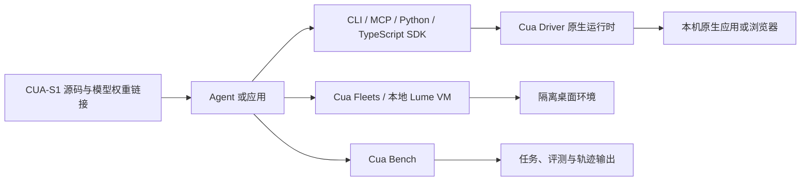

## 导语

`trycua/cua` 是 GitHub 2026 年 9 月 20 日日榜项目。2026-09-20 17:01（北京时间，UTC+8）抓取的 [Trending `daily` 页面](https://github.com/trending?since=daily)显示它有 24,781 Star、1,700 Fork，并标注“今日新增 859 Star”；同一轮[仓库元数据 API](https://api.github.com/repos/trycua/cua)快照为 24,782 Star，默认分支为 `main`，主语言为 HTML，最近推送时间为 2026-09-20 02:14 UTC。两处 Star 相差 1 是抓取先后的快照差异，而非可推导的增长曲线。

README 将 Cua 描述为供 AI Agent 使用的开源计算机使用工具集合，包含桌面自动化、隔离云桌面、本地 macOS/Linux 虚拟机、专用决策模型及评测工具。日榜热度只说明该页面在当日观察窗口内的 Star 增量；以下会把仓库事实、API 观察与适用性分析分开说明。

## 产品介绍

仓库 README 将产品入口拆为五部分：Cua Fleets 提供隔离 Linux 桌面池，Cua Driver 用 CLI、MCP 或类型化 SDK 操作 macOS、Windows、Linux 的原生应用与浏览器，Lume 管理 Apple Silicon 上的本地 macOS/Linux VM，CUA-S1 提供计算机使用的专用小模型研究代码，Cua Bench 用于构建任务、评测 Agent 与导出轨迹。

代码仓库使用 MIT 许可，见根目录 [LICENSE.md](https://github.com/trycua/cua/blob/main/LICENSE.md)。[Releases API](https://api.github.com/repos/trycua/cua/releases?per_page=10)在抓取时的最新条目是 `nightly-cua-driver-rs-v0.28.3-nightly.20260919.35421378483`，发布时间为 2026-09-19 04:52 UTC。这些是仓库分发与许可事实；并不保证某一平台、桌面应用或 Agent 配置一定可用。

## 目标人群

从 README 的 CLI/MCP/SDK 接入说明、跨系统桌面与 VM 入口、以及评测与轨迹导出功能看，它适合需要将 Agent 接到桌面软件或浏览器的开发者，搭建隔离计算机使用环境的团队，以及构建或评估 computer-use Agent 的研究和工程人员。

这是一项基于公开文档和目录结构的适用性分析：Cua 更面向能配置运行环境、权限与模型调用的使用者。README 对 Fleets 资源清理和不同运行环境要求的提示，也意味着实际采用前应核对资源成本、平台支持与权限边界，而不能把项目愿景视为已验证的业务效果。

## 技术架构

[递归代码树 API](https://api.github.com/repos/trycua/cua/git/trees/main?recursive=1)返回 5,995 个条目且未截断，显示该仓库是多语言 monorepo：根目录 [pyproject.toml](https://github.com/trycua/cua/blob/main/pyproject.toml)配置 Python 3.12–3.13 的 uv workspace，并列出 `agent`、`core`、`computer`、`computer-server`、`som`、`mcp-server` 与 `bench-ui` 等成员；代码树还包含 `libs/cua-bench`、`libs/cua-s1` 与 `libs/cua-driver`。

[Cua Driver README](https://github.com/trycua/cua/blob/main/libs/cua-driver/README.md)进一步说明，Agent 可通过 `cua-driver mcp` 的 stdio MCP 或 CLI 接入；Python 与 TypeScript 应用 SDK 经 UniFFI 生成绑定调用同一进程内原生运行时，Driver 目录内有 Rust workspace、Python SDK、TypeScript SDK、测试夹具与脚本。下图仅描绘文档和代码树可核实的调用关系；实际是否使用云端 Fleet、Lume VM 或本机驱动取决于使用者选择。

## 数据分析

### Star 趋势折线图

| UTC 小时起点 | 07:00 | 08:00 | 09:00（截至 09:02） |
| --- | ---: | ---: | ---: |
| WatchEvent 数 | 42 | 39 | 2 |

数据抓取于 2026-09-20 17:01（北京时间，UTC+8）。对[仓库 Events API 第一页](https://api.github.com/repos/trycua/cua/events?per_page=100&page=1)的 100 条近期事件筛选 `WatchEvent`，得到 83 条，时间范围为 2026-09-20 07:12:24–09:02:05 UTC，并按 `created_at` 的 UTC 小时分桶。该端点是近期滚动事件样本，不是完整 Stargazer 历史；折线只描述这段约两小时的公开 Star 事件密度，不能推断全天、周度或长期 Star 趋势，也不能把日榜的 859 个“今日新增”当作历史点位。

### Commit 情况柱状图

| UTC 日期 | API 返回 / 排除 merge / 排除 bot / 图中计数 |
| --- | ---: |
| 09-13 | 3 / 0 / 0 / 3 |
| 09-14 | 12 / 0 / 0 / 12 |
| 09-15 | 8 / 0 / 2 / 6 |
| 09-16 | 3 / 0 / 0 / 3 |
| 09-17 | 5 / 0 / 0 / 5 |
| 09-18 | 6 / 0 / 0 / 6 |
| 09-19 | 2 / 0 / 0 / 2 |

数据抓取于 2026-09-20 17:01（北京时间，UTC+8）。查询 [commits API](https://api.github.com/repos/trycua/cua/commits?since=2026-09-13T00%3A00%3A00Z&until=2026-09-20T09%3A01%3A06Z&per_page=100) 的窗口为 2026-09-13 00:00 至 2026-09-20 09:01 UTC；按 `commit.author.date` 的 UTC 日期汇总其中 09-13 至 09-19 的完整日。API 返回 39 条记录；图表排除父提交数大于 1 的 merge，以及登录名以 `[bot]` 结尾的 bot 提交（09-15 排除 2 条）。柱图仅表示这一定义下的代码活动频率，不代表代码质量、发布数量或团队投入。

### 社区反馈饼图

| 公开协作条目类型 | 数量 | 样本占比 |
| --- | ---: | ---: |
| Issue | 91 | 39.9% |
| Pull request | 137 | 60.1% |

数据抓取于 2026-09-20 17:01（北京时间，UTC+8），统计窗口为 2026-09-13 00:00 UTC 至抓取时刻。使用 GitHub Search API 分别查询[新建 Issue](https://api.github.com/search/issues?q=repo%3Atrycua%2Fcua%20is%3Aissue%20-is%3Apull-request%20created%3A%3E%3D2026-09-13)与[新建 Pull request](https://api.github.com/search/issues?q=repo%3Atrycua%2Fcua%20is%3Apr%20created%3A%3E%3D2026-09-13)的 `total_count`；两次响应的 `incomplete_results` 均为 `false`。饼图衡量的是近期新建公开协作条目的类型构成，不是情感分析、满意度、阅读量或实际使用量。

## 来源链接

- [GitHub Trending 日榜：Repositories](https://github.com/trending?since=daily)
- [trycua/cua 仓库](https://github.com/trycua/cua)
- [README 原文](https://raw.githubusercontent.com/trycua/cua/main/README.md)
- [MIT LICENSE](https://github.com/trycua/cua/blob/main/LICENSE.md)
- [仓库元数据 API 快照](https://api.github.com/repos/trycua/cua)
- [Releases API](https://api.github.com/repos/trycua/cua/releases?per_page=10)
- [递归代码树 API](https://api.github.com/repos/trycua/cua/git/trees/main?recursive=1)
- [Python workspace 配置](https://github.com/trycua/cua/blob/main/pyproject.toml)
- [Cua Driver 架构说明](https://github.com/trycua/cua/blob/main/libs/cua-driver/README.md)
- [近期公开仓库事件 API](https://api.github.com/repos/trycua/cua/events?per_page=100&page=1)
- [提交 API](https://api.github.com/repos/trycua/cua/commits?since=2026-09-13T00%3A00%3A00Z&until=2026-09-20T09%3A01%3A06Z&per_page=100)
- [近期新建 Issue 搜索 API](https://api.github.com/search/issues?q=repo%3Atrycua%2Fcua%20is%3Aissue%20-is%3Apull-request%20created%3A%3E%3D2026-09-13)
- [近期新建 Pull request 搜索 API](https://api.github.com/search/issues?q=repo%3Atrycua%2Fcua%20is%3Apr%20created%3A%3E%3D2026-09-13)
