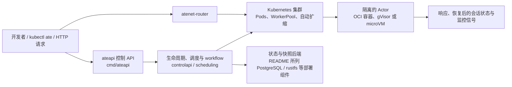

## 导语

`agent-substrate/substrate` 是 GitHub 2026 年 9 月 22 日日榜项目。2026-09-22 20:01（北京时间，UTC+8）抓取的 [Trending `daily` 页面](https://github.com/trending?since=daily)显示它有 2,689 Star，并标注“今日新增 498 Star”；同一抓取窗口的[仓库元数据 API](https://api.github.com/repos/agent-substrate/substrate)快照也是 2,689 Star，默认分支为 `main`，主语言为 Go，许可证为 Apache-2.0。仓库在 2026-09-22 10:36 UTC 仍有推送；[最新 Release](https://api.github.com/repos/agent-substrate/substrate/releases/latest)为 `v0.1.0`，发布于 2026-09-10 23:39 UTC。

README 明确把它标为早期开发阶段，尚未准备投入生产，API 很可能变化。日榜新增数、总 Star 和本文的事件样本都只是不同窗口的可复核观察，不能据此推断长期增长、稳定性或生产效果。

## 产品介绍

README 将 Agent Substrate 定位为一个默认安全的 Agent 执行运行时：它把较多的“actor”（如 Agent 应用）映射到较少的 ready worker，利用此类工作负载常有空闲时间的特点，提供创建/销毁、暂停/恢复、实时分配和入站流量路由。项目同时声明支持 microVM 与 gVisor 等 sandbox 技术，并以 Kubernetes Pod 与自动扩缩作为底层基础设施。

仓库提供 counter、sandbox、Claude Code multiplex、请求 parking、自动扩缩 worker pool 等演示；快速开始要求 Go、`kubectl`、Docker，并通过脚本创建 kind 集群、安装系统、部署 demo，再用 `kubectl ate` 创建 actor。README 还列出 ADK、LangChain、Claude Code、Codex、Antigravity 和 MCP server 等兼容场景；这是运行标准 OCI 容器的兼容性说明，并非这些项目对其效果或生产可用性的背书。

## 目标人群

从部署要求、Kubernetes 依赖和演示目录看，它适合正在评估状态化 Agent、工具服务或隔离执行环境的基础设施团队，尤其是希望统一管理 actor 生命周期、路由和 worker 资源的开发者。对于已经运行 Kubernetes，且需要把可暂停/恢复的会话或工具工作负载放进受隔离 worker 池的团队，它面向的是资源调度与运行时隔离的诉求。

它并不是用于“构建 Agent 逻辑”的 SDK。README 自己强调项目仍处早期，因而更适合作为技术验证、架构评估或跟随上游演进的对象；生产系统是否适合采用，仍需自行验证 Kubernetes 版本、sandbox、持久化、成本和兼容性边界。这是基于文档与代码结构的有限分析，不是用户规模或性能结论。

## 技术架构

代码树显示该项目以 Go 为主体：`cmd/ateapi/` 包含控制 API、调度、存储和 workflow 模块，`cmd/ate-setup/` 是集群安装与 demo 命令，`demos/` 提供场景示例；根目录 `go.mod` 直接列出 Kubernetes `client-go`、controller-runtime、Prometheus、OpenTelemetry、PostgreSQL 驱动与 gRPC 等依赖。README 的快速开始把 `kubectl ate`、`atenet-router` 服务和 actor template 串联起来。

图中关系依据 README 的部署流程、目录树和 `go.mod` 整理。具体存储后端、sandbox 类型和云资源取决于所选安装路径与配置；图并不表示所有部署都同时启用这些组件。

## 数据分析

### Star 趋势折线图

| UTC 小时 | WatchEvent（Star）数 |
| --- | ---: |
| 03 | 1 |
| 04 | 7 |
| 05 | 8 |
| 06 | 7 |
| 07 | 7 |
| 08 | 3 |
| 09 | 4 |
| 10 | 11 |
| 11 | 21 |
| 12（截至 12:01） | 1 |

数据抓取于 2026-09-22 20:01（北京时间，UTC+8），来自[仓库 Events API 第 1 页](https://api.github.com/repos/agent-substrate/substrate/events?per_page=100&page=1)。首页 100 条近期事件中有 70 条 `WatchEvent`，时间范围为 2026-09-22 03:46:16–12:01:01 UTC；按 `created_at` 的 UTC 小时分桶。该端点是近期滚动样本，而非完整 Stargazer 历史；折线只描述这段公开 Star 事件密度，不能推断全天、周度或长期 Star 趋势，也不能把 Trending 的“今日新增 498 Star”当作历史点位。

### Commit 情况柱状图

| UTC 日期 | 非合并提交 |
| --- | ---: |
| 2026-09-16 | 7 |
| 2026-09-17 | 7 |
| 2026-09-18 | 13 |
| 2026-09-19 | 0 |
| 2026-09-20 | 2 |
| 2026-09-21 | 4 |
| 2026-09-22（截至 12:01） | 3 |

数据于 2026-09-22 20:01（北京时间，UTC+8）从[commits API](https://api.github.com/repos/agent-substrate/substrate/commits?since=2026-09-15T16%3A00%3A00Z&until=2026-09-22T12%3A01%3A01Z&per_page=100)抓取。统计窗口为 2026-09-16 00:00 至 2026-09-22 12:01 UTC，按返回记录的 `commit.author.date` 分日；仅保留窗口内的 36 条记录，并排除提交信息以 `Merge ` 开头的条目（本窗口无此类条目）。此图只说明指定窗口与口径下的提交频率，不代表开发投入、发布次数或代码质量。

### 社区反馈饼图

| 公开协作条目类型 | 数量 | 样本占比 |
| --- | ---: | ---: |
| Issue | 52 | 43.7% |
| Pull request | 67 | 56.3% |

数据于 2026-09-22 20:01（北京时间，UTC+8）从 [Issues 搜索 API](https://api.github.com/search/issues?q=repo%3Aagent-substrate%2Fsubstrate%20is%3Aissue%20-is%3Apr%20created%3A2026-09-16..2026-09-22) 与 [Pull requests 搜索 API](https://api.github.com/search/issues?q=repo%3Aagent-substrate%2Fsubstrate%20is%3Apr%20created%3A2026-09-16..2026-09-22)获取。窗口为 2026-09-16 至抓取时已发生的 2026-09-22 UTC 公开新建条目；两类查询的 `total_count` 分别为 52 和 67。此饼图衡量的是公开协作条目的类型构成，不是情感分析、满意度、阅读量或实际使用量。

## 来源链接

- [GitHub Trending 日榜：Repositories](https://github.com/trending?since=daily)
- [agent-substrate/substrate 仓库与 README](https://github.com/agent-substrate/substrate)
- [README 原文](https://raw.githubusercontent.com/agent-substrate/substrate/main/README.md)
- [Apache-2.0 许可证](https://github.com/agent-substrate/substrate/blob/main/LICENSE)
- [仓库元数据 API 快照](https://api.github.com/repos/agent-substrate/substrate)
- [Release API](https://api.github.com/repos/agent-substrate/substrate/releases/latest)
- [仓库目录树 API](https://api.github.com/repos/agent-substrate/substrate/git/trees/main?recursive=1)
- [Go 依赖清单](https://raw.githubusercontent.com/agent-substrate/substrate/main/go.mod)
- [近期公开事件 API](https://api.github.com/repos/agent-substrate/substrate/events?per_page=100&page=1)
- [提交 API](https://api.github.com/repos/agent-substrate/substrate/commits?since=2026-09-15T16%3A00%3A00Z&until=2026-09-22T12%3A01%3A01Z&per_page=100)
- [Issues 搜索 API](https://api.github.com/search/issues?q=repo%3Aagent-substrate%2Fsubstrate%20is%3Aissue%20-is%3Apr%20created%3A2026-09-16..2026-09-22)
- [Pull requests 搜索 API](https://api.github.com/search/issues?q=repo%3Aagent-substrate%2Fsubstrate%20is%3Apr%20created%3A2026-09-16..2026-09-22)
