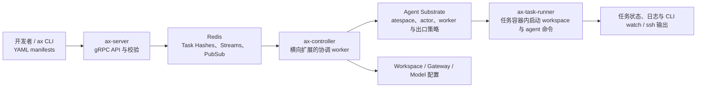

## 导语

`google/ax` 是 GitHub 2026 年 9 月 23 日日榜项目。2026-09-23 17:02（北京时间，UTC+8）抓取的 [Trending `daily` 页面](https://github.com/trending?since=daily)标注它“今日新增 2,305 Star”；17:03 的[仓库元数据 API](https://api.github.com/repos/google/ax)快照为 8,141 Star，默认分支为 `main`、主语言为 Go、许可证为 Apache-2.0。仓库的[最新 Release](https://api.github.com/repos/google/ax/releases/latest)是 `v0.3.0`，发布于 2026-09-20 03:33 UTC。

README 同时明确警告：核心概念、协议和规范仍在积极调整，稳定版前可能发生重大破坏性变更。日榜新增数与 Star 总数分别是特定页面和 API 快照，不能据此推断长期增长、成熟度或生产效果。

## 产品介绍

README 将 AX 描述为“高吞吐、声明式”的代理工作负载编排器：开发者用 `ax.io/v1alpha1` YAML 声明 `Task`、`Workspace`、`Gateway` 与 `Model`，由平台准备 Git 仓库、MCP server 和 skill 包，限制出站主机，并在 sandbox 中运行任务。CLI 提供 `apply`、`get`、`watch`、`ssh`、`suspend` 与 `resume` 等命令；部署说明要求 Kubernetes 集群、`ko`、容器镜像仓库和可达的 Agent Substrate Control API。

它运行在 [Agent Substrate](https://github.com/agent-substrate/substrate) 之上，而不是自行实现底层隔离执行器。README 关于“每集群数十亿任务”的表述是项目愿景，不能视为本文验证过的性能结果；同样，文档列出的 Git、MCP 和模型配置能力也仍应按当前预稳定版本自行评估。

## 目标人群

从 Kubernetes 部署前提、声明式 manifest、gRPC 控制面及任务 runner 结构看，AX 适合正在探索大规模代理任务调度、隔离运行和工作区预置的基础设施团队。它面向的典型诉求是：在统一的集群控制面里，让任务有可观察的状态、可受限的网络出口，以及可暂停/恢复的生命周期。

对于希望把代理逻辑直接嵌进网页或仅需要单进程脚本自动化的个人开发者，AX 的集群和镜像构建前提通常较重。上述定位是依据文档与代码结构作出的有限分析；README 已说明版本可能有破坏性调整，是否用于生产仍取决于安全、模型接入、运行成本和部署条件的独立验证。

## 技术架构

[设计文档](https://raw.githubusercontent.com/google/ax/main/DESIGN.md)说明 AX 不把大量短生命周期任务存成 Kubernetes CRD，而是以 Redis 保存任务状态，并用 Redis Streams 在 API server 与可横向扩容的 controller 之间传递工作。代码树中的 `cmd/ax`、`cmd/ax-server`、`cmd/ax-controller` 和 `cmd/ax-task-runner` 与此对应；`internal/store/redis`、`internal/controller`、`internal/workspace`、`runner` 等目录也可在[目录树 API](https://api.github.com/repos/google/ax/git/trees/main?recursive=1)核对。根目录 [go.mod](https://raw.githubusercontent.com/google/ax/main/go.mod)直接依赖 Redis client、gRPC、protobuf、YAML 与 Agent Substrate。

图中是设计文档描述的控制面关系：`ax-task-runner` 是任务容器内入口，Redis 是 AX 的任务状态与队列，Agent Substrate 负责底层 actor 和 worker 操作。具体模型供应商、MCP server、Git 工作区和网络规则由 manifest 与集群配置决定，图不表示所有部署都会启用全部可选项。

## 数据分析

### Star 趋势折线图

| 可复核指标 | 值 | 口径 |
| --- | ---: | --- |
| Trending 当日新增 Star | 2,305 | 日榜页面于 2026-09-23 17:02 BJT 的显示值 |
| 仓库 Star 总数 | 8,141 | 仓库元数据 API 于 2026-09-23 17:03 BJT 的快照 |
| 带时间戳的 Star 事件 | 数据不足 | `stargazers` API 于抓取时返回 HTTP 401 |

数据日期为 2026-09-23（UTC+8）。历史折线需要带时间戳的 Stargazer 事件或其他可复核历史数据；访问 [stargazers API](https://api.github.com/repos/google/ax/stargazers?per_page=100&page=1) 时，带 `application/vnd.github.star+json` 请求头仍返回 HTTP 401，因此不能取得合规的历史点位。图中明确标注“数据不足，未绘制”；不能把日榜“今日新增”或单一 Star 快照伪装成历史趋势。

### Commit 情况柱状图

| UTC 日期 | 非合并提交 |
| --- | ---: |
| 2026-09-16 | 0 |
| 2026-09-17 | 0 |
| 2026-09-18 | 0 |
| 2026-09-19 | 0 |
| 2026-09-20 | 2 |
| 2026-09-21 | 0 |
| 2026-09-22 | 0 |
| 2026-09-23（截至 09:05） | 0 |

数据于 2026-09-23 17:03（北京时间，UTC+8）从 [commits API](https://api.github.com/repos/google/ax/commits?since=2026-09-16T00%3A00%3A00Z&until=2026-09-23T09%3A05%3A00Z&per_page=100)抓取。统计窗口为 2026-09-16 00:00 至 2026-09-23 09:05 UTC，按返回记录的 `commit.author.date` 分日；API 返回 2 条记录，均为单父提交，故排除多父 merge commit 后仍为 2 条。未按机器人身份二次排除，原因是这两条提交署名均为 `rakyll`；该图只描述此端点、窗口和口径下的提交频率，不代表研发投入、发布次数或代码质量。

### 社区反馈饼图

| 公开协作条目类型 | 数量 | 样本占比 |
| --- | ---: | ---: |
| Issue | 34 | 97.1% |
| Pull request | 1 | 2.9% |

数据于 2026-09-23 17:03（北京时间，UTC+8）从 [Issues 搜索 API](https://api.github.com/search/issues?q=repo%3Agoogle%2Fax%20is%3Aissue%20-is%3Apr%20created%3A2026-09-16..2026-09-23) 与 [Pull requests 搜索 API](https://api.github.com/search/issues?q=repo%3Agoogle%2Fax%20is%3Apr%20created%3A2026-09-16..2026-09-23)取得。窗口为 2026-09-16 至抓取时已发生的 2026-09-23 UTC 公开新建条目；两个可复核查询的 `total_count` 分别为 34 与 1。该饼图衡量的是公开协作条目的类型构成，不是情感分析、满意度、阅读量或实际使用量。

## 来源链接

- [GitHub Trending 日榜：Repositories](https://github.com/trending?since=daily)
- [google/ax 仓库与 README](https://github.com/google/ax)
- [README 原文](https://raw.githubusercontent.com/google/ax/main/README.md)
- [AX 设计文档](https://raw.githubusercontent.com/google/ax/main/DESIGN.md)
- [Apache-2.0 许可证](https://github.com/google/ax/blob/main/LICENSE)
- [仓库元数据 API 快照](https://api.github.com/repos/google/ax)
- [Release API](https://api.github.com/repos/google/ax/releases/latest)
- [仓库目录树 API](https://api.github.com/repos/google/ax/git/trees/main?recursive=1)
- [Go 依赖清单](https://raw.githubusercontent.com/google/ax/main/go.mod)
- [Stargazers API（本次返回 401）](https://api.github.com/repos/google/ax/stargazers?per_page=100&page=1)
- [提交 API](https://api.github.com/repos/google/ax/commits?since=2026-09-16T00%3A00%3A00Z&until=2026-09-23T09%3A05%3A00Z&per_page=100)
- [Issues 搜索 API](https://api.github.com/search/issues?q=repo%3Agoogle%2Fax%20is%3Aissue%20-is%3Apr%20created%3A2026-09-16..2026-09-23)
- [Pull requests 搜索 API](https://api.github.com/search/issues?q=repo%3Agoogle%2Fax%20is%3Apr%20created%3A2026-09-16..2026-09-23)
