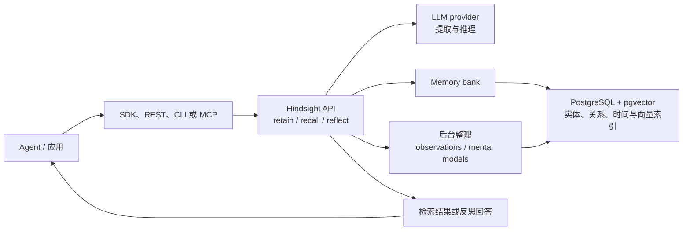

## 导语

`vectorize-io/hindsight` 是 GitHub 2026 年 9 月 24 日日榜项目。2026-09-24 20:01（北京时间，UTC+8）抓取的 [Trending `daily` 页面](https://github.com/trending?since=daily)显示它“今日新增 1,607 Star”；20:02 的[仓库元数据 API](https://api.github.com/repos/vectorize-io/hindsight)快照为 26,925 Star，默认分支为 `main`、主语言为 Python、许可证为 MIT。仓库的[最新 Release](https://api.github.com/repos/vectorize-io/hindsight/releases/latest)是 `v0.10.1`，发布于 2026-09-21 15:24 UTC。

日榜新增数与 Star 总数是特定时点的页面/API 快照，不能单独证明长期增长、稳定性或生产效果。下文将 README 的功能声明、GitHub API 的活动记录和作者的有限分析分开表述。

## 产品介绍

README 将 Hindsight 描述为 AI Agent 的记忆系统：开发者可通过服务端、Python/Node.js/Go 客户端、CLI、REST API 或 MCP 接入，在隔离的 memory bank 中调用 `retain`、`recall` 与 `reflect`。其中，`retain` 接收并整理信息；`recall` 面向语义、关键词、图谱和时间条件检索；`reflect` 对既有记忆作较深入的关联与回答。这些是仓库文档描述的能力，而不是本文独立验证的准确率或效果承诺。

README 列出的存储选择包括 PostgreSQL + pgvector，或 Oracle AI Database 23ai；项目也提供 Docker Compose、Helm chart、监控目录和多种集成。最新 `v0.10.1` Release 以及默认分支在统计窗口内的 123 条非合并提交，构成其近期公开维护信号，但不等同于适配所有生产环境。

## 目标人群

从 SDK、REST/MCP 接口、memory bank 隔离和部署文档看，Hindsight 适合需要让对话 Agent、编码 Agent、客服或项目型 Agent 跨会话保留上下文的开发团队。其核心诉求是避免把历史信息只作为一段不断增长的 prompt，同时让检索、时间关系和已整理知识可经由 API 使用。

对于只需要一次性 RAG 查询、没有 LLM 或数据库运维条件的轻量脚本，Hindsight 的服务、模型与存储配置可能偏重。这个定位是根据 README 的示例、配置与目录作出的有限分析；是否适用仍取决于数据边界、模型费用、延迟和自行评估的安全要求。

## 技术架构

仓库根目录包含 `hindsight-api`、`hindsight-cli`、`hindsight-clients`、`hindsight-embed`、`hindsight-control-plane`、`docker`、`helm` 与 `monitoring` 等模块，可由[目录树 API](https://api.github.com/repos/vectorize-io/hindsight/git/trees/main?recursive=1)核对。`hindsight-api/README.md` 将 API 描述为采用 PostgreSQL + pgvector 的时间、语义与实体记忆架构；其配置表也列出 LLM provider、数据库 URL、host/port 和多 worker 运行参数。根 README 进一步说明：记忆进入 bank 后会被表示为实体、关系、时间序列和稀疏/稠密向量，并用于后续检索。

图示的是 README 与 API 文档共同描述的基础关系：调用入口进入 API，API 使用模型与 memory bank，bank 的信息持久化到文档列出的存储，并把结果返回调用方。Oracle、托管服务、具体模型供应商与可选的 control plane 均是部署选择，图不表示每个实例都会启用它们。

## 数据分析

### Star 趋势折线图

| 可复核指标 | 值 | 口径 |
| --- | ---: | --- |
| Trending 当日新增 Star | 1,607 | 日榜页面于 2026-09-24 20:01 BJT 的显示值 |
| 仓库 Star 总数 | 26,925 | 仓库元数据 API 于 2026-09-24 20:02 BJT 的快照 |
| 带时间戳的 Star 事件 | 数据不足 | `stargazers` API 在本次抓取时返回 HTTP 401 |

数据日期为 2026-09-24（UTC+8）。历史折线需要带时间戳的 Stargazer 事件或其他可复核历史数据；访问 [stargazers API](https://api.github.com/repos/vectorize-io/hindsight/stargazers?per_page=100&page=1) 时，以 `application/vnd.github.star+json` 请求仍返回 HTTP 401，故不能取得合规的历史点位。图中明确标注“数据不足，未绘制”；日榜“今日新增”与单一 Star 快照不能替代历史曲线。

### Commit 情况柱状图

| UTC 日期 | 非合并提交 |
| --- | ---: |
| 2026-09-17 | 24 |
| 2026-09-18 | 19 |
| 2026-09-19 | 15 |
| 2026-09-20 | 1 |
| 2026-09-21 | 17 |
| 2026-09-22 | 11 |
| 2026-09-23 | 27 |
| 2026-09-24（截至 12:05） | 9 |

数据于 2026-09-24 20:05（北京时间，UTC+8）从 [commits API](https://api.github.com/repos/vectorize-io/hindsight/commits?since=2026-09-17T00%3A00%3A00Z&until=2026-09-24T12%3A05%3A00Z&per_page=100)抓取。统计窗口为 2026-09-17 00:00 至 2026-09-24 12:05 UTC；端点共分页返回 123 条记录，按 `commit.author.date` 分日。所有记录均为单父提交，故排除多父 merge commit 后仍为 123 条；未按 bot 身份二次排除，因而柱图包含依赖更新等自动化提交。该图只描述指定端点和窗口的提交频率，不代表研发投入、发布次数或代码质量。

### 社区反馈饼图

| 公开协作条目类型 | 数量 | 样本占比 |
| --- | ---: | ---: |
| Issue | 78 | 30.4% |
| Pull request | 179 | 69.6% |

数据于 2026-09-24 20:05（北京时间，UTC+8）从 [Issues 搜索 API](https://api.github.com/search/issues?q=repo%3Avectorize-io%2Fhindsight%20is%3Aissue%20-is%3Apr%20created%3A2026-09-17..2026-09-24) 与 [Pull requests 搜索 API](https://api.github.com/search/issues?q=repo%3Avectorize-io%2Fhindsight%20is%3Apr%20created%3A2026-09-17..2026-09-24)取得。窗口为 2026-09-17 至抓取时已发生的 2026-09-24 UTC 公开新建条目；两个可复核查询的 `total_count` 分别为 78 与 179。该饼图衡量公开协作条目的类型构成，不是情感分析、满意度、阅读量或实际使用量。

## 来源链接

- [GitHub Trending 日榜：Repositories](https://github.com/trending?since=daily)
- [vectorize-io/hindsight 仓库与 README](https://github.com/vectorize-io/hindsight)
- [README 原文](https://raw.githubusercontent.com/vectorize-io/hindsight/main/README.md)
- [Hindsight API README](https://raw.githubusercontent.com/vectorize-io/hindsight/main/hindsight-api/README.md)
- [MIT 许可证](https://github.com/vectorize-io/hindsight/blob/main/LICENSE)
- [仓库元数据 API 快照](https://api.github.com/repos/vectorize-io/hindsight)
- [Release API](https://api.github.com/repos/vectorize-io/hindsight/releases/latest)
- [仓库目录树 API](https://api.github.com/repos/vectorize-io/hindsight/git/trees/main?recursive=1)
- [根目录 pyproject.toml](https://raw.githubusercontent.com/vectorize-io/hindsight/main/pyproject.toml)
- [Stargazers API（本次返回 401）](https://api.github.com/repos/vectorize-io/hindsight/stargazers?per_page=100&page=1)
- [提交 API](https://api.github.com/repos/vectorize-io/hindsight/commits?since=2026-09-17T00%3A00%3A00Z&until=2026-09-24T12%3A05%3A00Z&per_page=100)
- [Issues 搜索 API](https://api.github.com/search/issues?q=repo%3Avectorize-io%2Fhindsight%20is%3Aissue%20-is%3Apr%20created%3A2026-09-17..2026-09-24)
- [Pull requests 搜索 API](https://api.github.com/search/issues?q=repo%3Avectorize-io%2Fhindsight%20is%3Apr%20created%3A2026-09-17..2026-09-24)
