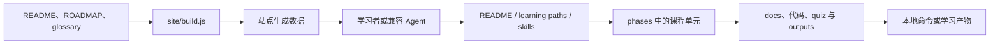

## 导语

`rohitg00/ai-engineering-from-scratch` 是 GitHub 2026 年 9 月 25 日日榜项目。2026-09-25 17:03（北京时间，UTC+8）抓取的 [Trending `daily` 页面](https://github.com/trending?since=daily)标注“今日新增 347 Star”；同一时段的[仓库元数据 API](https://api.github.com/repos/rohitg00/ai-engineering-from-scratch)快照显示 56,958 Star、9,970 Fork、43 个开放 issue，默认分支为 `main`，主语言为 Python，许可证为 MIT。其最近 Release 是 `v2026.09`，发布于 2026-09-07 11:42 UTC。

日榜新增数和 API Star 总数都是特定时点的观察值，不能单独证明长期增长、课程质量或学习效果。以下将仓库事实、活动数据与有限判断分开叙述。

## 产品介绍

README 将该仓库定位为从数学基础到自主系统的 AI 工程课程：它列出 20 个阶段、523 节课，并覆盖 Python、TypeScript、Rust 与 Julia。每课除了文档和代码，还声明会附带 prompt、skill、agent 或 MCP server 等可复用产物；这些是仓库的课程设计与内容声明，并非本文对全部课件可运行性或教学效果的独立验证。

仓库为不同目标给出从完整基础、生产 LLM 应用、Agent、MCP 到 Agent Skills 的入口；根目录 [ROADMAP](https://raw.githubusercontent.com/rohitg00/ai-engineering-from-scratch/main/ROADMAP.md)逐课维护完成状态，`requirements.txt` 列出 NumPy、PyTorch、Transformers、Datasets、OpenAI 与 Anthropic 等 Python 依赖。README 还提供通过 `npx skills add rohitg00/ai-engineering-from-scratch` 安装课程技能的说明。最新 Release 与 9 月 24–25 日可见提交构成近期公开维护信号，但不代表所有学习环境或模型服务都已被本文测试。

## 目标人群

从阶段划分、源码练习与按目标分流的学习路径看，这个项目适合希望系统学习 AI 工程、且愿意阅读代码并在本机运行练习的开发者。对已掌握部分基础、只想学习 LLM 工程、MCP 或 Agent 的读者，README 的专门路线可减少在完整课程中寻找切入点的成本。

它也面向希望把学习过程沉淀为提示词、技能或可复现实验记录的人；README 要求运行时保留命令、退出码、输出和改动产物。对于只想消费短视频式概览、没有本地运行环境，或不准备自行判断第三方 API 费用与数据边界的读者，课程的动手与依赖要求可能不合适。这些是根据文档、示例和目录作出的有限分析。

## 技术架构

目录树 API 显示仓库以 `phases/` 为主体，另有 `learning-paths/`、`skills/`、`projects/`、`certifications/`、`site/`、`scripts/` 与 `api/`。课程单元的实际文件结构包含文档、代码、练习输出与测验；例如 Phase 14 的 README 指向 Agent Loop 的 Python 入口。`skills/start-learning/SKILL.md` 则定义了可跨兼容宿主使用的入门技能。站点的 [build.js](https://raw.githubusercontent.com/rohitg00/ai-engineering-from-scratch/main/site/build.js)明确说明会解析根 README、ROADMAP 与术语表来生成站点数据，并在每次推送时由 GitHub Actions 调用。

图中左侧是 README 和目录可核实的学习入口与课程内容关系；右侧是 `site/build.js` 说明的静态站点数据生成路径。它不意味着每节课都必须使用 Agent，也不表示本仓库本身提供模型推理、用户数据库或托管 API。

## 数据分析

### Star 趋势折线图

| 可复核指标 | 值 | 口径 |
| --- | ---: | --- |
| Trending 当日新增 Star | 347 | 日榜页面于 2026-09-25 17:03 BJT 的显示值 |
| 仓库 Star 总数 | 56,958 | 仓库元数据 API 于 2026-09-25 17:03 BJT 的快照 |
| 带时间戳的 Star 事件 | 数据不足 | 匿名 `stargazers` API 本次返回 HTTP 401 |

数据日期为 2026-09-25（UTC+8），日榜统计窗口为 GitHub Trending 的 `daily`。历史折线需要带时间戳的 Stargazer 事件或其他可复核历史数据；本次使用推荐媒体类型访问 [stargazers API](https://api.github.com/repos/rohitg00/ai-engineering-from-scratch/stargazers?per_page=100&page=1)仍收到 HTTP 401，故以可见占位图替代。日榜“今日新增”与单一 Star 快照不能被当作历史点位，也不能据此推导增长速度。

### Commit 情况柱状图

| UTC 日期 | 非合并、非 `github-actions[bot]` 提交 |
| --- | ---: |
| 2026-09-18 | 0 |
| 2026-09-19 | 0 |
| 2026-09-20 | 0 |
| 2026-09-21 | 0 |
| 2026-09-22 | 0 |
| 2026-09-23 | 0 |
| 2026-09-24 | 9 |
| 2026-09-25（截至 10:00） | 4 |

数据于 2026-09-25 17:03（北京时间，UTC+8）从 [commits API](https://api.github.com/repos/rohitg00/ai-engineering-from-scratch/commits?since=2026-09-18T00%3A00%3A00Z&until=2026-09-25T10%3A00%3A00Z&per_page=100)抓取。窗口为 2026-09-18 00:00 至 2026-09-25 10:00 UTC；端点返回 25 条记录，按 `commit.author.date` 分日。全部为单父提交；剔除 12 条 `github-actions[bot]` 自动化提交后余 13 条，图中未再按其他 bot 名称过滤。该图只描述指定端点和窗口的提交频率，不代表研发投入、发布次数或代码质量。

### 社区反馈饼图

| 公开协作条目类型 | 数量 | 样本占比 |
| --- | ---: | ---: |
| Issue | 5 | 33.3% |
| Pull request | 10 | 66.7% |

数据于 2026-09-25 17:03（北京时间，UTC+8）从 [Issues 搜索 API](https://api.github.com/search/issues?q=repo%3Arohitg00%2Fai-engineering-from-scratch%20is%3Aissue%20-is%3Apr%20created%3A2026-09-18..2026-09-25) 与 [Pull requests 搜索 API](https://api.github.com/search/issues?q=repo%3Arohitg00%2Fai-engineering-from-scratch%20is%3Apr%20created%3A2026-09-18..2026-09-25)取得。窗口为 2026-09-18 00:00 至 2026-09-25 10:00 UTC 内公开新建的条目；两个查询的 `total_count` 分别为 5 和 10。该饼图衡量公开协作条目的类型构成，不是情感分析、满意度、阅读量或实际使用量。

## 来源链接

- [GitHub Trending 日榜：Repositories](https://github.com/trending?since=daily)
- [rohitg00/ai-engineering-from-scratch 仓库与 README](https://github.com/rohitg00/ai-engineering-from-scratch)
- [README 原文](https://raw.githubusercontent.com/rohitg00/ai-engineering-from-scratch/main/README.md)
- [路线图](https://raw.githubusercontent.com/rohitg00/ai-engineering-from-scratch/main/ROADMAP.md)
- [MIT 许可证](https://github.com/rohitg00/ai-engineering-from-scratch/blob/main/LICENSE)
- [仓库元数据 API 快照](https://api.github.com/repos/rohitg00/ai-engineering-from-scratch)
- [Release API](https://api.github.com/repos/rohitg00/ai-engineering-from-scratch/releases/latest)
- [仓库目录树 API](https://api.github.com/repos/rohitg00/ai-engineering-from-scratch/git/trees/main?recursive=1)
- [Python 依赖清单](https://raw.githubusercontent.com/rohitg00/ai-engineering-from-scratch/main/requirements.txt)
- [Phase 14 Agent Engineering README](https://raw.githubusercontent.com/rohitg00/ai-engineering-from-scratch/main/phases/14-agent-engineering/README.md)
- [start-learning 技能定义](https://raw.githubusercontent.com/rohitg00/ai-engineering-from-scratch/main/skills/start-learning/SKILL.md)
- [站点构建脚本](https://raw.githubusercontent.com/rohitg00/ai-engineering-from-scratch/main/site/build.js)
- [Stargazers API（本次返回 401）](https://api.github.com/repos/rohitg00/ai-engineering-from-scratch/stargazers?per_page=100&page=1)
- [提交 API](https://api.github.com/repos/rohitg00/ai-engineering-from-scratch/commits?since=2026-09-18T00%3A00%3A00Z&until=2026-09-25T10%3A00%3A00Z&per_page=100)
- [Issues 搜索 API](https://api.github.com/search/issues?q=repo%3Arohitg00%2Fai-engineering-from-scratch%20is%3Aissue%20-is%3Apr%20created%3A2026-09-18..2026-09-25)
- [Pull requests 搜索 API](https://api.github.com/search/issues?q=repo%3Arohitg00%2Fai-engineering-from-scratch%20is%3Apr%20created%3A2026-09-18..2026-09-25)
