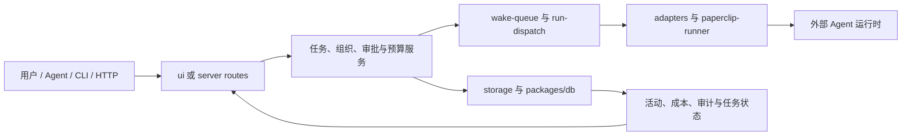

## 导语

`paperclipai/paperclip` 是 GitHub 2026 年 9 月 26 日日榜项目。2026-09-26 17:02（北京时间，UTC+8）抓取的 [Trending `daily` 页面](https://github.com/trending?since=daily)显示“今日新增 2,109 Star”；同一时段的[仓库元数据 API](https://api.github.com/repos/paperclipai/paperclip)快照显示 85,659 Star、15,285 Fork、5,712 个开放 issue，默认分支为 `master`，主语言为 TypeScript，许可证为 MIT。最近 Release 是 [v2026.916.1](https://github.com/paperclipai/paperclip/releases/tag/v2026.916.1)，发布于 2026-09-21 21:22 UTC。

日榜新增数和 API Star 总数都是特定时点的观察值，不能单独证明长期增长、产品效果或稳定性。以下将仓库事实、活动数据与有限判断分开叙述。

## 产品介绍

README 将 Paperclip 定位为面向 AI Agent 团队的开源编排工具：以 Node.js 服务和 React 界面提供一个控制面板，用户可以接入自己的 Agent、分配目标，并在同一仪表盘查看工作与成本。文档列出的核心能力包括任务与审批、组织结构与角色、心跳式唤醒、预算控制、运行日志、审计记录、插件与多组织隔离；这些是仓库的功能声明，并不等于本文已独立验证每项部署效果。

README 中明确列出 Claude Code、Codex、CLI Agent 与 HTTP/Webhook bot 等接入方式，并声明每个任务可关联公司、项目、目标和父任务。根目录还提供 Docker Compose 配置、CLI、`server/`、`ui/` 以及多个 `packages/` 工作区包；这说明它不是只提供提示词的单一 Agent 框架，而是试图承接团队层面的运行、治理与记录。

## 目标人群

从 README 的“组织图、预算、审批、定时心跳和审计”描述及目录中的 adapter、runner、MCP 包看，这个项目适合同时运行多个 Agent、希望统一追踪任务、成本和责任边界的技术团队或个人自动化运营者。对需要让不同 Agent 在同一工作目标下协作、又希望保留人工审核入口的使用者，Paperclip 的任务关联、执行策略与审批机制可能降低跨工具协调成本。

它面向的主要痛点是多 Agent 会话和任务状态分散、定期工作需要人工唤醒、以及成本或权限缺少可见边界。反过来，README 也将它描述为团队工具而非单 Agent 聊天工具；只需要一次性调用或不愿维护 Node.js、存储和 Agent 凭据的读者，部署与治理面可能超过实际需求。这些是依据文档和代码目录作出的有限分析。

## 技术架构

仓库根 `package.json` 显示其使用 pnpm，并由 `server/` 与 `ui/` 两个包提供开发脚本；目录树中还可见 `packages/db`、`packages/paperclip-runner`、`packages/mcp-server` 和 `packages/adapters/*`。`server/src/` 包含 `routes`、`services`、`storage`、`adapters`、`modules/run-dispatch` 与 `modules/wake-queue` 等入口；`ui/src/main.tsx` 是界面入口。结合 README 的系统说明，可核实的关系是：人或接入 Agent 通过 UI/API/CLI 进入服务端，服务端处理任务、组织、审批和心跳调度，调用 adapter/runner，并把任务、事件、成本、审计等状态写入存储后回显到界面。

图中模块名称来自目录树和 README；它只表达仓库中声明的控制面、调度、适配器与存储关系，不表示本文对任一外部 Agent、模型或云服务进行了连通性测试。

## 数据分析

### Star 趋势折线图

| 可复核指标 | 值 | 口径 |
| --- | ---: | --- |
| Trending 当日新增 Star | 2,109 | 日榜页面于 2026-09-26 17:02 BJT 的显示值 |
| 仓库 Star 总数 | 85,659 | 仓库元数据 API 于 2026-09-26 17:02 BJT 的快照 |
| 带时间戳的 Star 事件 | 数据不足 | 匿名 `stargazers` API 本次返回 HTTP 401 |

数据日期为 2026-09-26（UTC+8），日榜统计窗口为 GitHub Trending 的 `daily`。历史折线需要带时间戳的 Stargazer 事件或其他可复核历史数据；本次以推荐媒体类型访问 [stargazers API](https://api.github.com/repos/paperclipai/paperclip/stargazers?per_page=100&page=1)仍收到 HTTP 401，故以可见占位图替代。日榜“今日新增”与单一 Star 快照不能被当作历史点位，也不能据此推导增长速度。

### Commit 情况柱状图

| UTC 日期 | 非合并、非 `[bot]` 账号提交 |
| --- | ---: |
| 2026-09-19 | 22 |
| 2026-09-20 | 4 |
| 2026-09-21 | 19 |
| 2026-09-22 | 26 |
| 2026-09-23 | 21 |
| 2026-09-24 | 12 |
| 2026-09-25 | 10 |
| 2026-09-26（截至 09:03） | 6 |

数据于 2026-09-26 17:03（北京时间，UTC+8）从 [commits API 第 1 页](https://api.github.com/repos/paperclipai/paperclip/commits?since=2026-09-19T00%3A00%3A00Z&until=2026-09-26T09%3A03%3A00Z&per_page=100&page=1)与[第 2 页](https://api.github.com/repos/paperclipai/paperclip/commits?since=2026-09-19T00%3A00%3A00Z&until=2026-09-26T09%3A03%3A00Z&per_page=100&page=2)抓取。窗口为 2026-09-19 00:00 至 2026-09-26 09:03 UTC；两个分页共返回 123 条记录，按 `commit.author.date` 分日。记录中没有多父 merge；剔除 3 条账号名以 `[bot]` 结尾的自动化提交后余 120 条。该图只描述指定端点和窗口的提交频率，不代表研发投入、发布次数或代码质量。

### 社区反馈饼图

| 公开协作条目类型 | 数量 | 样本占比 |
| --- | ---: | ---: |
| Issue | 131 | 28.9% |
| Pull request | 322 | 71.1% |

数据于 2026-09-26 17:03（北京时间，UTC+8）从 [Issues 搜索 API](https://api.github.com/search/issues?q=repo%3Apaperclipai%2Fpaperclip%20is%3Aissue%20-is%3Apr%20created%3A2026-09-19T00%3A00%3A00Z..2026-09-26T09%3A03%3A00Z)与[Pull requests 搜索 API](https://api.github.com/search/issues?q=repo%3Apaperclipai%2Fpaperclip%20is%3Apr%20created%3A2026-09-19T00%3A00%3A00Z..2026-09-26T09%3A03%3A00Z)取得。窗口为 2026-09-19 00:00 至 2026-09-26 09:03 UTC 内公开新建的条目；两个查询的 `total_count` 分别为 131 和 322。该饼图衡量公开协作条目的类型构成，不是情感分析、满意度、阅读量或实际使用量。

## 来源链接

- [GitHub Trending 日榜：Repositories](https://github.com/trending?since=daily)
- [paperclipai/paperclip 仓库与 README](https://github.com/paperclipai/paperclip)
- [README 原文](https://raw.githubusercontent.com/paperclipai/paperclip/master/README.md)
- [MIT 许可证](https://github.com/paperclipai/paperclip/blob/master/LICENSE)
- [仓库元数据 API 快照](https://api.github.com/repos/paperclipai/paperclip)
- [Release API](https://api.github.com/repos/paperclipai/paperclip/releases/latest)
- [仓库目录树 API](https://api.github.com/repos/paperclipai/paperclip/git/trees/master?recursive=1)
- [根 package.json](https://raw.githubusercontent.com/paperclipai/paperclip/master/package.json)
- [服务端入口](https://raw.githubusercontent.com/paperclipai/paperclip/master/server/src/index.ts)
- [界面入口](https://raw.githubusercontent.com/paperclipai/paperclip/master/ui/src/main.tsx)
- [Stargazers API（本次返回 401）](https://api.github.com/repos/paperclipai/paperclip/stargazers?per_page=100&page=1)
- [提交 API 第 1 页](https://api.github.com/repos/paperclipai/paperclip/commits?since=2026-09-19T00%3A00%3A00Z&until=2026-09-26T09%3A03%3A00Z&per_page=100&page=1)
- [提交 API 第 2 页](https://api.github.com/repos/paperclipai/paperclip/commits?since=2026-09-19T00%3A00%3A00Z&until=2026-09-26T09%3A03%3A00Z&per_page=100&page=2)
- [Issues 搜索 API](https://api.github.com/search/issues?q=repo%3Apaperclipai%2Fpaperclip%20is%3Aissue%20-is%3Apr%20created%3A2026-09-19T00%3A00%3A00Z..2026-09-26T09%3A03%3A00Z)
- [Pull requests 搜索 API](https://api.github.com/search/issues?q=repo%3Apaperclipai%2Fpaperclip%20is%3Apr%20created%3A2026-09-19T00%3A00%3A00Z..2026-09-26T09%3A03%3A00Z)
