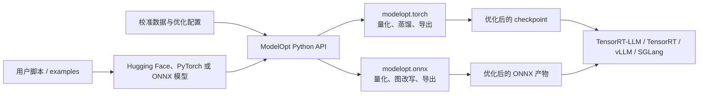

## 导语

`NVIDIA/Model-Optimizer` 是 GitHub 2026 年 9 月 27 日的 Trending 日榜项目。2026-09-27 17:02（北京时间，UTC+8）抓取的 [Trending `daily` 页面](https://github.com/trending?since=daily)显示“今日新增 357 Star”；同一时段的[仓库元数据 API](https://api.github.com/repos/NVIDIA/Model-Optimizer)快照显示 4,853 Star、676 Fork、426 个开放 issue，默认分支为 `main`，主语言为 Python，许可证为 Apache-2.0。仓库在 2026-09-27 08:31 UTC 有推送记录；最近 Release 是 [0.47.0](https://github.com/NVIDIA/Model-Optimizer/releases/tag/0.47.0)，发布于 2026-09-23 18:55 UTC。

日榜新增 Star 与 API 的 Star 总数都是某一抓取时点的公开观察，不能单独证明长期增长、模型质量或性能提升。下文将仓库事实、数据观察与作者判断分开表述。

## 产品介绍

README 将 Model Optimizer（ModelOpt）描述为一套模型优化库，覆盖量化、剪枝、神经架构搜索、蒸馏、推测解码和稀疏化等技术。文档明确列出 Hugging Face、PyTorch 与 ONNX 模型作为输入；用户可通过 Python API 组合优化方法，并导出优化后的量化 checkpoint，供 SGLang、TensorRT-LLM、TensorRT 或 vLLM 等下游推理框架使用。

从根目录的 `pyproject.toml` 可核实其包名为 `nvidia-modelopt`，依赖 PyTorch；可选依赖中包含 ONNX 与 Transformers。README 的 PTQ 示例以 `modelopt.torch.quantization` 导入、加载模型、准备校准数据、执行 `mtq.quantize` 为主线；`examples/hf_ptq/` 还提供 Hugging Face 模型的量化与导出示例。这些均是仓库声明与示例，不代表本文已对任一模型、GPU 或下游框架跑出相同性能结果。

## 目标人群

这个项目适合需要把已有 LLM、视觉语言模型、扩散模型或 ONNX 模型部署到推理环境的 ML/平台工程团队，尤其是需要在模型大小、内存占用、精度与吞吐之间做可复现技术取舍的人。面向 Hugging Face、PyTorch、ONNX 的输入与多种导出路径，意味着已有模型训练或推理流水线的开发者可以在不改写整套应用的前提下评估量化、剪枝或蒸馏流程。

根据安装文档、校准示例与支持矩阵，用户需要自行准备模型、依赖、校准数据和目标运行时；部分格式还依赖特定硬件或下游框架。因此它更适合能验证任务精度、延迟和显存占用的工程场景，而非只想一键获得通用加速效果的轻量使用者。这是基于文档和代码组织作出的有限分析，不是对部署结果的承诺。

## 技术架构

目录树显示核心包分为 `modelopt/torch`、`modelopt/onnx` 与 `modelopt/deploy`；其中 `modelopt/torch/quantization` 初始化量化配置、压缩、转换与量化模块，`modelopt/torch/distill` 和 `modelopt/torch/export` 分别包含蒸馏与导出实现；`modelopt/onnx` 下可见量化、导出和图改写模块。根目录的 `examples/hf_ptq/`、`examples/onnx_ptq/`、`examples/llm_qat/` 与 `examples/megatron_bridge/` 是面向不同模型来源与工作流的示例入口。

据此，真实可核实的关系是：用户脚本或示例把本地/模型仓库中的 Hugging Face、PyTorch 或 ONNX 模型连同校准数据交给 ModelOpt 的 PyTorch 或 ONNX 模块；模块生成优化后的 checkpoint 或 ONNX 产物；产物可交给 README 列出的下游推理框架。图中只描述文档和目录可核实的输入、模块与导出关系，不代表 ModelOpt 自己托管模型或运行推理服务。

## 数据分析

### Star 趋势折线图

| 可复核指标 | 值 | 口径 |
| --- | ---: | --- |
| Trending 当日新增 Star | 357 | 日榜页面于 2026-09-27 17:02 BJT 的显示值 |
| 仓库 Star 总数 | 4,853 | 仓库元数据 API 于 2026-09-27 17:02 BJT 的快照 |
| 带时间戳的 Star 事件 | 数据不足 | 推荐媒体类型的 `stargazers` API 本次返回 HTTP 401 |

数据日期为 2026-09-27（UTC+8），日榜统计窗口为 GitHub Trending 的 `daily`。历史折线需要带时间戳的 Stargazer 事件或其他可复核历史数据；本次以推荐媒体类型访问 [stargazers API](https://api.github.com/repos/NVIDIA/Model-Optimizer/stargazers?per_page=100&page=1)收到 HTTP 401，故以可见占位图替代。日榜“今日新增”与单一 Star 快照不能当作历史点位，也不能据此推导增长速度。

### Commit 情况柱状图

| UTC 日期 | 非合并、非 `[bot]` 账号提交 |
| --- | ---: |
| 2026-09-20 | 0 |
| 2026-09-21 | 3 |
| 2026-09-22 | 5 |
| 2026-09-23 | 9 |
| 2026-09-24 | 2 |
| 2026-09-25 | 1 |
| 2026-09-26 | 0 |
| 2026-09-27（截至 09:10） | 0 |

数据于 2026-09-27 17:02（北京时间，UTC+8）从 [commits API](https://api.github.com/repos/NVIDIA/Model-Optimizer/commits?since=2026-09-20T00%3A00%3A00Z&until=2026-09-27T09%3A10%3A00Z&per_page=100&page=1)与[第 2 页](https://api.github.com/repos/NVIDIA/Model-Optimizer/commits?since=2026-09-20T00%3A00%3A00Z&until=2026-09-27T09%3A10%3A00Z&per_page=100&page=2)抓取。窗口为 2026-09-20 00:00 至 2026-09-27 09:10 UTC；两个分页共返回 21 条记录，按 `commit.author.date` 分日。记录中没有多父 merge commit；剔除 1 条账号名以 `[bot]` 结尾的自动化提交后余 20 条。该图只描述指定端点和窗口的提交频率，不代表研发投入、发布次数或代码质量。

### 社区反馈饼图

| 公开协作条目类型 | 数量 | 样本占比 |
| --- | ---: | ---: |
| Issue | 7 | 10.0% |
| Pull request | 63 | 90.0% |

数据于 2026-09-27 17:02（北京时间，UTC+8）从 [Issues 搜索 API](https://api.github.com/search/issues?q=repo%3ANVIDIA%2FModel-Optimizer%20is%3Aissue%20-is%3Apr%20created%3A2026-09-20T00%3A00%3A00Z..2026-09-27T09%3A10%3A00Z)与[Pull requests 搜索 API](https://api.github.com/search/issues?q=repo%3ANVIDIA%2FModel-Optimizer%20is%3Apr%20created%3A2026-09-20T00%3A00%3A00Z..2026-09-27T09%3A10%3A00Z)取得。窗口为 2026-09-20 00:00 至 2026-09-27 09:10 UTC 内公开新建的条目；两个查询的 `total_count` 分别为 7 和 63。该饼图衡量公开协作条目的类型构成，不是情感分析、满意度、阅读量或实际使用量。

## 来源链接

- [GitHub Trending 日榜：Repositories](https://github.com/trending?since=daily)
- [NVIDIA/Model-Optimizer 仓库与 README](https://github.com/NVIDIA/Model-Optimizer)
- [README 原文](https://raw.githubusercontent.com/NVIDIA/Model-Optimizer/main/README.md)
- [Apache-2.0 许可证](https://github.com/NVIDIA/Model-Optimizer/blob/main/LICENSE)
- [仓库元数据 API 快照](https://api.github.com/repos/NVIDIA/Model-Optimizer)
- [Release API](https://api.github.com/repos/NVIDIA/Model-Optimizer/releases/latest)
- [仓库目录树 API](https://api.github.com/repos/NVIDIA/Model-Optimizer/git/trees/main?recursive=1)
- [根目录 pyproject.toml](https://raw.githubusercontent.com/NVIDIA/Model-Optimizer/main/pyproject.toml)
- [PyTorch 量化模块入口](https://raw.githubusercontent.com/NVIDIA/Model-Optimizer/main/modelopt/torch/quantization/__init__.py)
- [Hugging Face PTQ 示例](https://raw.githubusercontent.com/NVIDIA/Model-Optimizer/main/examples/hf_ptq/README.md)
- [Stargazers API（本次返回 401）](https://api.github.com/repos/NVIDIA/Model-Optimizer/stargazers?per_page=100&page=1)
- [提交 API 第 1 页](https://api.github.com/repos/NVIDIA/Model-Optimizer/commits?since=2026-09-20T00%3A00%3A00Z&until=2026-09-27T09%3A10%3A00Z&per_page=100&page=1)
- [提交 API 第 2 页](https://api.github.com/repos/NVIDIA/Model-Optimizer/commits?since=2026-09-20T00%3A00%3A00Z&until=2026-09-27T09%3A10%3A00Z&per_page=100&page=2)
- [Issues 搜索 API](https://api.github.com/search/issues?q=repo%3ANVIDIA%2FModel-Optimizer%20is%3Aissue%20-is%3Apr%20created%3A2026-09-20T00%3A00%3A00Z..2026-09-27T09%3A10%3A00Z)
- [Pull requests 搜索 API](https://api.github.com/search/issues?q=repo%3ANVIDIA%2FModel-Optimizer%20is%3Apr%20created%3A2026-09-20T00%3A00%3A00Z..2026-09-27T09%3A10%3A00Z)
