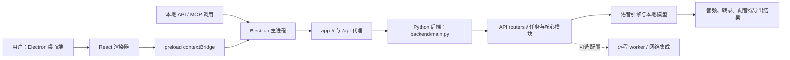

## 导语

`debpalash/VoiceStudio` 是 GitHub 2026 年 9 月 28 日的 Trending 日榜项目。2026-09-28 17:04（北京时间，UTC+8）抓取的 [Trending `daily` 页面](https://github.com/trending?since=daily)显示“今日新增 3,086 Star”；同一时段的[仓库元数据 API](https://api.github.com/repos/debpalash/VoiceStudio)快照显示 41,193 Star、4,887 Fork、27 个开放 issue，默认分支为 `main`，主语言为 Python，许可证为 AGPL-3.0。仓库最近一次推送记录为 2026-09-27 13:29 UTC；最新正式 [Release v0.5.6](https://github.com/debpalash/VoiceStudio/releases/tag/v0.5.6)发布于 2026-09-23 08:53 UTC。

日榜新增 Star 与 API 的 Star 总数都只是抓取时点的公开观察，不能单独证明长期增长、语音质量或商业可用性。下文将仓库事实、数据观察与作者判断分开表述。

## 产品介绍

README 将 VoiceStudio 描述为一套开源、以本地工作流为主的语音工具，覆盖声音克隆、声音设计、视频配音、听写、转录与有声书制作；文档声明支持 646 种语言。它的桌面端提供声线参考录音或导入、文本生成、模型下载与管理等入口；README 同时列出本地 API 与 MCP 供自动化调用。远程 worker、网络集成和使用分析是可选配置，README 说明本地工作流在用户自己的硬件上运行。

从安装说明可核实项目当前维护 Electron 桌面端；根目录 `package.json` 的 `setup:api`、`dev` 与 `build` 脚本分别准备 Python 依赖、启动开发环境和构建桌面应用。仓库也明确提醒模型有各自许可证，并要求在克隆声音时取得许可。这些是仓库文档与代码提供的能力和限制，不代表本文已实际生成、测评或比较任何声音。

## 目标人群

这个项目适合希望把语音生成、转录或配音放在本地设备上完成的内容创作者、播客/有声书制作人员，以及需要将语音能力接入内部流程的开发者。README 中的桌面工作区、批量任务、本地 API、MCP 与可选远程 worker 表明，它面向的不只是一次性网页试用，也适合需要把音频素材、模型和工作流放在同一工具中的用户。

依据安装步骤、模型下载提示和性能文档的指向，使用者仍需准备符合所选引擎要求的设备、模型和参考音频，并自行确认模型许可与授权边界。因此它更适合愿意管理本地运行环境、验证输出并承担语音授权责任的团队或个人；这是基于公开文档作出的有限分析，不是对隐私、质量或硬件表现的承诺。

## 技术架构

仓库的 [`electron/README.md`](https://raw.githubusercontent.com/debpalash/VoiceStudio/main/electron/README.md)将架构分为 Electron 主进程、preload 与 React 渲染器：主进程负责后端监督、`app://` 协议与 `/api` 代理，preload 通过 `contextBridge` 提供受类型约束的桥接，渲染器则是 React UI。根目录 `package.json` 显示 Electron 子项目采用 Electron、Vite、React、Tailwind 与 Bun；目录树中可见 `backend/main.py`、`backend/api/routers/`、`backend/engines/` 与 `backend/core/`。README 还说明 Electron 会探测本地后端；未发现时会启动准备好的 Python 环境。

据此，真实可核实的关系是：用户在 Electron/React 界面或通过本地 API、MCP 发起语音任务；Electron 将同源 `/api` 请求交给本机 Python 后端；后端的路由、任务与引擎模块调用本地模型/文件，产出音频、转录或导出结果。图中将远程 worker 标为可选，避免把文档中的可选集成误写成默认数据流。

## 数据分析

### Star 趋势折线图

| 可复核指标 | 值 | 口径 |
| --- | ---: | --- |
| Trending 当日新增 Star | 3,086 | 日榜页面于 2026-09-28 17:04 BJT 的显示值 |
| 仓库 Star 总数 | 41,193 | 仓库元数据 API 于 2026-09-28 17:04 BJT 的快照 |
| 带时间戳的 Star 事件 | 数据不足 | `stargazers` API 本次返回 HTTP 401 |

数据日期为 2026-09-28（UTC+8），日榜统计窗口为 GitHub Trending 的 `daily`。历史折线需要带时间戳的 Stargazer 事件或其他可复核的历史数据；本次以推荐媒体类型访问 [stargazers API](https://api.github.com/repos/debpalash/VoiceStudio/stargazers?per_page=100&page=1)收到 HTTP 401，故用可见占位图替代。日榜“今日新增”与单一 Star 快照不能当作历史点位，也不能据此推导增长速度。

### Commit 情况柱状图

| UTC 日期 | 非合并、非 `[bot]` 账号提交 |
| --- | ---: |
| 2026-09-21 | 16 |
| 2026-09-22 | 10 |
| 2026-09-23 | 13 |
| 2026-09-24 | 13 |
| 2026-09-25 | 6 |
| 2026-09-26 | 34 |
| 2026-09-27 | 44 |

数据于 2026-09-28 17:04（北京时间，UTC+8）从 [commits API](https://api.github.com/repos/debpalash/VoiceStudio/commits?since=2026-09-21T00%3A00%3A00Z&until=2026-09-28T00%3A00%3A00Z&per_page=100&page=1)按自然 UTC 日分页抓取。窗口为 2026-09-21 00:00 至 2026-09-28 00:00 UTC；每日端点均少于 100 条、无下一页。按 `commit.author.date` 分日后，剔除多父 merge commit 与账号名以 `[bot]` 结尾的提交。该图只描述指定端点和窗口内的提交频率，不代表研发投入、发布次数或代码质量。

### 社区反馈饼图

| 公开协作条目类型 | 数量 | 样本占比 |
| --- | ---: | ---: |
| Issue | 43 | 37.1% |
| Pull request | 73 | 62.9% |

数据于 2026-09-28 17:04（北京时间，UTC+8）从 [Issues 搜索 API](https://api.github.com/search/issues?q=repo%3Adebpalash%2FVoiceStudio%20is%3Aissue%20-is%3Apr%20created%3A2026-09-21T00%3A00%3A00Z..2026-09-28T09%3A04%3A00Z)与[Pull requests 搜索 API](https://api.github.com/search/issues?q=repo%3Adebpalash%2FVoiceStudio%20is%3Apr%20created%3A2026-09-21T00%3A00%3A00Z..2026-09-28T09%3A04%3A00Z)取得。窗口为 2026-09-21 00:00 至 2026-09-28 09:04 UTC 内公开新建的条目，两个查询的 `total_count` 分别为 43 和 73。该饼图衡量公开协作条目的类型构成，不是情感分析、满意度、阅读量或实际使用量。

## 来源链接

- [GitHub Trending 日榜：Repositories](https://github.com/trending?since=daily)
- [debpalash/VoiceStudio 仓库与 README](https://github.com/debpalash/VoiceStudio)
- [README 原文](https://raw.githubusercontent.com/debpalash/VoiceStudio/main/README.md)
- [AGPL-3.0 许可证](https://github.com/debpalash/VoiceStudio/blob/main/LICENSE)
- [仓库元数据 API 快照](https://api.github.com/repos/debpalash/VoiceStudio)
- [最新 Release](https://github.com/debpalash/VoiceStudio/releases/tag/v0.5.6)
- [Release API](https://api.github.com/repos/debpalash/VoiceStudio/releases/latest)
- [仓库目录树 API](https://api.github.com/repos/debpalash/VoiceStudio/git/trees/main?recursive=1)
- [根目录 package.json](https://raw.githubusercontent.com/debpalash/VoiceStudio/main/package.json)
- [Electron 架构说明](https://raw.githubusercontent.com/debpalash/VoiceStudio/main/electron/README.md)
- [Python 后端入口](https://raw.githubusercontent.com/debpalash/VoiceStudio/main/backend/main.py)
- [Stargazers API（本次返回 401）](https://api.github.com/repos/debpalash/VoiceStudio/stargazers?per_page=100&page=1)
- [提交 API](https://api.github.com/repos/debpalash/VoiceStudio/commits?since=2026-09-21T00%3A00%3A00Z&until=2026-09-28T00%3A00%3A00Z&per_page=100&page=1)
- [Issues 搜索 API](https://api.github.com/search/issues?q=repo%3Adebpalash%2FVoiceStudio%20is%3Aissue%20-is%3Apr%20created%3A2026-09-21T00%3A00%3A00Z..2026-09-28T09%3A04%3A00Z)
- [Pull requests 搜索 API](https://api.github.com/search/issues?q=repo%3Adebpalash%2FVoiceStudio%20is%3Apr%20created%3A2026-09-21T00%3A00%3A00Z..2026-09-28T09%3A04%3A00Z)
