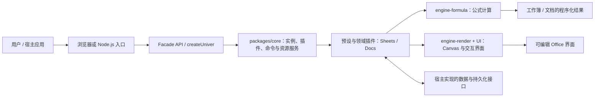

## 导语

`dream-num/univer` 是 GitHub 2026 年 9 月 29 日日榜项目。2026-09-29 17:02（北京时间，UTC+8）抓取的 [Trending `daily` 页面](https://github.com/trending?since=daily)显示“今日新增 1,099 Star”；同一时段的[仓库元数据 API](https://api.github.com/repos/dream-num/univer)快照为 21,524 Star、1,820 Fork、142 个开放 issue，默认分支为 `dev`，主语言为 TypeScript，许可证为 Apache-2.0。仓库最近一次推送为 2026-09-29 08:02 UTC；[最新 Release v1.0.2](https://github.com/dream-num/univer/releases/tag/v1.0.2)发布于 2026-09-24 11:32 UTC。

日榜新增 Star 与仓库 Star 总数都只是抓取时点的公开观察，不能单独证明长期增长、产品性能或生产可用性。下文将仓库事实、数据观察与作者判断分开表述。

## 产品介绍

README 将 Univer 定义为可在自有产品中嵌入 Office 功能的开源 SDK，覆盖电子表格、文档、演示文稿、画布、关系表和 PDF。它强调可按需组合的插件、Canvas 渲染、公式引擎与统一 Facade API，并称浏览器和 Node.js 可复用同一套架构。文档列出的使用场景包括 SaaS、内部工具、BI 工作流和 AI 应用中的编辑界面，以及服务端的工作簿/文档处理。

这些能力有代码与示例可交叉核实：根 `package.json` 使用 pnpm 与 Turborepo；`packages/` 下有核心、表格、文档、公式引擎、渲染与 UI 包；`presets/` 提供预设包；`examples/` 维护 Sheets、Docs 与 Slides 的挂载示例。README 也区分开源与 Pro 范围，并提示协作功能和部分许可随包而异，因此不应把 README 的愿景理解为本文已经实测的功能或效果。

## 目标人群

这个项目适合要在现有 Web 产品中嵌入可编辑表格、文档或演示内容的应用开发团队，也适合希望在 Node.js 侧以同一模型处理 Office 内容的自动化或 Agent 团队。README 提到插件模式、预设模式、Facade API 与 React、Vue、Web Components 等集成路径，表明它面向需要定制 UI、功能组合与宿主应用集成的使用者，而不是单纯的在线文件查看器。

根据仓库的安装包清单与示例，采用者需要自行选择包、语言包、容器和数据模型，并在宿主侧处理持久化、权限与协作等产品决策。因而它更适合愿意维护前端或 Node.js 集成、验证文件兼容性与许可边界的团队；这是基于公开文档的有限分析，并非对实现成本或功能覆盖率的承诺。

## 技术架构

仓库目录可核实其 TypeScript monorepo 结构：`packages/core` 导出插件、命令、资源、实例和本地存储等基础服务；`packages/sheets`、`packages/docs`、`packages/engine-formula`、`packages/engine-render` 与 `packages/ui` 分别承载领域、公式、渲染和界面能力；`presets/packages/` 组合常用插件。`examples/src/sheets/mount.ts` 则展示了示例通过 `createUniver` 加载表格预设与语言包，获得 `univerAPI` 后以 `createWorkbook` 创建工作簿。

因此，图中只描绘仓库可见的集成关系：浏览器宿主或 Node.js 调用 Facade/预设，核心运行时装配领域插件；表格或文档数据经公式、渲染和 UI 模块成为编辑界面或程序化输出。持久化接口和外部服务由宿主产品接入，仓库并未在该示例中指定某个默认云存储，故特意标为“宿主实现”。

## 数据分析

### Star 趋势折线图

| 可复核指标 | 值 | 口径 |
| --- | ---: | --- |
| Trending 当日新增 Star | 1,099 | 日榜页面于 2026-09-29 17:02 BJT 的显示值 |
| 仓库 Star 总数 | 21,524 | 仓库元数据 API 于 2026-09-29 17:02 BJT 的快照 |
| 带时间戳的 Star 事件 | 数据不足 | `stargazers` API 本次返回 HTTP 401 |

数据日期为 2026-09-29（UTC+8），日榜统计窗口为 GitHub Trending 的 `daily`。历史折线需要带时间戳的 Stargazer 事件或其他可复核的历史数据；本次以推荐媒体类型访问 [stargazers API](https://api.github.com/repos/dream-num/univer/stargazers?per_page=100&page=1)仍收到 HTTP 401，故用可见占位图替代。日榜“今日新增”与单一 Star 快照不能当作历史点位，也不能据此推导增长速度。

### Commit 情况柱状图

| UTC 日期 | 非合并、非 `[bot]` 账号提交 |
| --- | ---: |
| 2026-09-22 | 1 |
| 2026-09-23 | 2 |
| 2026-09-24 | 4 |
| 2026-09-25 | 0 |
| 2026-09-26 | 0 |
| 2026-09-27 | 3 |
| 2026-09-28 | 10 |
| 2026-09-29（截至 09:02） | 5 |

数据于 2026-09-29 17:02（北京时间，UTC+8）从 [commits API](https://api.github.com/repos/dream-num/univer/commits?since=2026-09-22T00%3A00%3A00Z&amp;until=2026-09-29T09%3A02%3A00Z&amp;per_page=100)按自然 UTC 日抓取。窗口为 2026-09-22 00:00 至 2026-09-29 09:02 UTC；每个自然日请求均少于 100 条记录。按 `commit.author.date` 分日后，剔除多父 merge commit 与账号名以 `[bot]` 结尾的提交；本次各日没有符合这些排除条件的记录。该图只描述指定端点和窗口内的提交频率，不代表研发投入、发布次数或代码质量。

### 社区反馈饼图

| 公开协作条目类型 | 数量 | 样本占比 |
| --- | ---: | ---: |
| Issue | 10 | 20.8% |
| Pull request | 38 | 79.2% |

数据于 2026-09-29 17:02（北京时间，UTC+8）从 [Issues 搜索 API](https://api.github.com/search/issues?q=repo%3Adream-num%2Funiver%20is%3Aissue%20-is%3Apr%20created%3A2026-09-22T00%3A00%3A00Z..2026-09-29T09%3A02%3A00Z)与[Pull requests 搜索 API](https://api.github.com/search/issues?q=repo%3Adream-num%2Funiver%20is%3Apr%20created%3A2026-09-22T00%3A00%3A00Z..2026-09-29T09%3A02%3A00Z)取得。窗口为 2026-09-22 00:00 至 2026-09-29 09:02 UTC 内公开新建的条目，两个查询的 `total_count` 分别为 10 和 38。该饼图衡量公开协作条目的类型构成，不是情感分析、满意度、阅读量或实际使用量。

## 来源链接

- [GitHub Trending 日榜：Repositories](https://github.com/trending?since=daily)
- [dream-num/univer 仓库与 README](https://github.com/dream-num/univer)
- [README 原文](https://raw.githubusercontent.com/dream-num/univer/dev/README.md)
- [Apache-2.0 许可证](https://github.com/dream-num/univer/blob/dev/LICENSE)
- [仓库元数据 API 快照](https://api.github.com/repos/dream-num/univer)
- [最新 Release v1.0.2](https://github.com/dream-num/univer/releases/tag/v1.0.2)
- [Release API](https://api.github.com/repos/dream-num/univer/releases/latest)
- [仓库目录树 API](https://api.github.com/repos/dream-num/univer/git/trees/dev?recursive=1)
- [根目录 package.json](https://raw.githubusercontent.com/dream-num/univer/dev/package.json)
- [Sheets 挂载示例](https://raw.githubusercontent.com/dream-num/univer/dev/examples/src/sheets/mount.ts)
- [核心包入口](https://raw.githubusercontent.com/dream-num/univer/dev/packages/core/src/index.ts)
- [Stargazers API（本次返回 401）](https://api.github.com/repos/dream-num/univer/stargazers?per_page=100&page=1)
- [提交 API](https://api.github.com/repos/dream-num/univer/commits?since=2026-09-22T00%3A00%3A00Z&amp;until=2026-09-29T09%3A02%3A00Z&amp;per_page=100)
- [Issues 搜索 API](https://api.github.com/search/issues?q=repo%3Adream-num%2Funiver%20is%3Aissue%20-is%3Apr%20created%3A2026-09-22T00%3A00%3A00Z..2026-09-29T09%3A02%3A00Z)
- [Pull requests 搜索 API](https://api.github.com/search/issues?q=repo%3Adream-num%2Funiver%20is%3Apr%20created%3A2026-09-22T00%3A00%3A00Z..2026-09-29T09%3A02%3A00Z)
