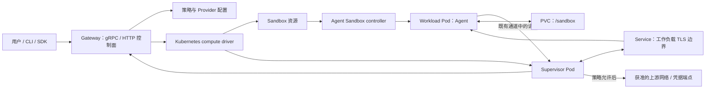

## 导语

`NVIDIA/OpenShell` 是 GitHub 2026 年 9 月 30 日日榜项目。本次在 2026-09-30 17:04（北京时间，UTC+8）核对 [Trending `daily` 页面](https://github.com/trending?since=daily)，页面显示其“今日新增 990 Star”；同一运行的[仓库元数据 API](https://api.github.com/repos/NVIDIA/OpenShell)快照为 11,036 Star、1,456 Fork、496 个开放条目，默认分支为 `main`，主语言为 Rust，许可证为 Apache-2.0。仓库最近一次推送为 2026-09-30 09:01 UTC；[v0.1.2](https://github.com/NVIDIA/OpenShell/releases/tag/v0.1.2) 发布于 2026-09-28 03:58 UTC。

日榜新增 Star 和 API 的 Star 总数都只是抓取时点的公开观察，不能单独证明长期增长、隔离强度或生产可用性。下文会将仓库事实、数据观察和有限分析分开表述。

## 产品介绍

README 将 OpenShell 描述为自主 AI Agent 集群的安全、私有运行时：使用者为 Agent 声明可访问的文件、系统调用、网络和凭据边界，再由项目执行策略。文档称其会在运行时检查文件访问、系统调用和网络连接，并在策略变更应用前以形式化验证标出可能新增的风险访问；这些是仓库的产品声明，并不等于本文对其安全性或效果的独立验证。

从 README 可核实的使用路径是安装 CLI、创建 sandbox，再让 Agent 在其中运行；项目还提供 Python、TypeScript、Go 和 Rust 的 SDK 接入说明。根目录同时包含 `crates/`、`proto/`、`providers/`、`sdk/`、`skills/`、`deploy/` 和 `docs/`，说明它既覆盖本地开发入口，也维护网关、策略、provider、SDK 和部署资料。其 Kubernetes 文档则明确要求能落实 ingress/egress `NetworkPolicy` 的 CNI，提示部署环境本身也是安全边界的一部分。

## 目标人群

这个项目适合需要让 Agent 读取工作区、安装依赖、调用 API 或代表用户访问已批准服务，但又希望收紧文件、网络和凭据权限的开发平台团队。README 提到策略、沙箱、provider 和 gateway；Kubernetes 文档描述了 gateway、supervisor、workload Pod、Service 与 PVC 的关系，因此它也面向愿意在集群中运行这类控制面的团队。

基于公开文档，OpenShell 更适合能维护 Linux/macOS（Apple Silicon）或 Windows WSL 2 环境，并愿意配置 Docker、Podman 或主机虚拟化的使用者；Kubernetes 使用者还需要验证 CNI 的策略执行能力。这是由安装与部署前提作出的有限推断，不是对集成成本、兼容范围或风险消除效果的承诺。

## 技术架构

项目是 Rust workspace：根 [Cargo.toml](https://github.com/NVIDIA/OpenShell/blob/main/Cargo.toml)以 `crates/*` 作为成员。`openshell-cli` 的清单定义 `openshell` 二进制，并依赖 core、policy、providers 与 SDK；`openshell-server` 则依赖 core、policy、prover、providers、gateway interceptor 与 supervisor middleware，并使用 Tokio、Tonic、Axum 与 SQLx。目录中还可见 `openshell-gateway`、`openshell-supervisor`、`openshell-sandbox` 和多个 driver crate。

下图只表达仓库文档给出的 Kubernetes 关系：gateway 通过 Kubernetes compute driver 创建 `Sandbox` 资源和 supervisor Pod；Agent Sandbox controller 创建 workload Pod；Service 提供 supervisor 到 workload TLS 边界的稳定地址，PVC 保存 `/sandbox`；supervisor 保持到 gateway 的出站会话，审查策略后再打开获准的上游连接。文档没有把某个外部模型或云存储设为默认组件，故未将其画成必经依赖。

## 数据分析

### Star 趋势折线图

| 可复核指标 | 值 | 口径 |
| --- | ---: | --- |
| Trending 当日新增 Star | 990 | 日榜页面在本次运行中显示的值 |
| 仓库 Star 总数 | 11,036 | 仓库元数据 API 于 2026-09-30 17:04 BJT 的快照 |
| 带时间戳的 Star 事件 | 数据不足 | `stargazers` 端点本次以认证请求返回 HTTP 404 |

数据日期为 2026-09-30（UTC+8），日榜统计窗口为 GitHub Trending 的 `daily`。历史折线需要带时间戳的 Stargazer 事件或另一份可复核的历史序列；本次对 `GET /repos/NVIDIA/OpenShell/stargazers?per_page=100&page=1` 的认证请求返回 HTTP 404，故以可见占位图替代。日榜“今日新增”与单一 Star 快照不能当作历史点位，也不能据此推导增长速度；该端点的预期响应格式见 [GitHub REST Starring 文档](https://docs.github.com/rest/activity/starring#list-stargazers)。

### Commit 情况柱状图

| UTC 日期 | 非合并、非 `[bot]` 账号提交 |
| --- | ---: |
| 2026-09-23（09:04 后） | 18 |
| 2026-09-24 | 10 |
| 2026-09-25 | 18 |
| 2026-09-26 | 5 |
| 2026-09-27 | 4 |
| 2026-09-28 | 15 |
| 2026-09-29 | 14 |
| 2026-09-30（截至 09:04） | 4 |

数据于 2026-09-30 17:04（北京时间，UTC+8）从 [commits API](https://api.github.com/repos/NVIDIA/OpenShell/commits?since=2026-09-23T09%3A04%3A08Z&amp;until=2026-09-30T09%3A04%3A08Z&amp;per_page=100)抓取，并按 `commit.author.date` 的 UTC 自然日汇总。窗口是 2026-09-23 09:04 至 2026-09-30 09:04 UTC；返回少于 100 条记录。统计排除多父 merge commit 与登录名以 `[bot]` 结尾的作者提交。首日和末日并非完整自然日；图表只描述该窗口的提交频率，不能代表研发投入、发布次数或代码质量。

### 社区反馈饼图

| 公开协作条目类型 | 数量 | 样本占比 |
| --- | ---: | ---: |
| Issue | 116 | 36.6% |
| Pull request | 201 | 63.4% |

数据于 2026-09-30 17:04（北京时间，UTC+8）从 [Issues 搜索 API](https://api.github.com/search/issues?q=repo%3ANVIDIA%2FOpenShell%20is%3Aissue%20-is%3Apr%20created%3A2026-09-23T09%3A04%3A08Z..2026-09-30T09%3A04%3A08Z)与 [Pull requests 搜索 API](https://api.github.com/search/issues?q=repo%3ANVIDIA%2FOpenShell%20is%3Apr%20created%3A2026-09-23T09%3A04%3A08Z..2026-09-30T09%3A04%3A08Z)取得 `total_count`。窗口为 2026-09-23 09:04 至 2026-09-30 09:04 UTC 内公开新建的条目。该饼图衡量公开协作条目的类型构成，不是情感分析、满意度、阅读量或实际使用量。

## 来源链接

- [GitHub Trending 日榜：Repositories](https://github.com/trending?since=daily)
- [NVIDIA/OpenShell 仓库与 README](https://github.com/NVIDIA/OpenShell)
- [README 原文](https://raw.githubusercontent.com/NVIDIA/OpenShell/main/README.md)
- [Apache-2.0 许可证](https://github.com/NVIDIA/OpenShell/blob/main/LICENSE)
- [仓库元数据 API 快照](https://api.github.com/repos/NVIDIA/OpenShell)
- [v0.1.2 Release](https://github.com/NVIDIA/OpenShell/releases/tag/v0.1.2)
- [Releases API](https://api.github.com/repos/NVIDIA/OpenShell/releases?per_page=10)
- [根目录与代码目录 API](https://api.github.com/repos/NVIDIA/OpenShell/contents)
- [Rust workspace 清单](https://github.com/NVIDIA/OpenShell/blob/main/Cargo.toml)
- [`openshell-cli` 清单](https://github.com/NVIDIA/OpenShell/blob/main/crates/openshell-cli/Cargo.toml)
- [`openshell-server` 清单](https://github.com/NVIDIA/OpenShell/blob/main/crates/openshell-server/Cargo.toml)
- [Kubernetes 部署架构说明](https://github.com/NVIDIA/OpenShell/blob/main/docs/kubernetes/setup.mdx)
- [GitHub REST Starring 端点文档（本次请求的端点返回 404）](https://docs.github.com/rest/activity/starring#list-stargazers)
- [提交 API](https://api.github.com/repos/NVIDIA/OpenShell/commits?since=2026-09-23T09%3A04%3A08Z&amp;until=2026-09-30T09%3A04%3A08Z&amp;per_page=100)
- [Issues 搜索 API](https://api.github.com/search/issues?q=repo%3ANVIDIA%2FOpenShell%20is%3Aissue%20-is%3Apr%20created%3A2026-09-23T09%3A04%3A08Z..2026-09-30T09%3A04%3A08Z)
- [Pull requests 搜索 API](https://api.github.com/search/issues?q=repo%3ANVIDIA%2FOpenShell%20is%3Apr%20created%3A2026-09-23T09%3A04%3A08Z..2026-09-30T09%3A04%3A08Z)
