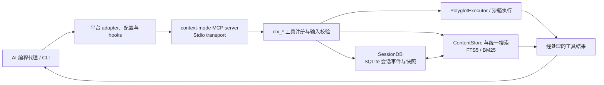

## 导语

`mksglu/context-mode` 是 GitHub 2026 年 10 月 1 日日榜项目。本次于 2026-10-01 17:01（北京时间，UTC+8）查看 [Trending `daily` 页面](https://github.com/trending?since=daily)，页面显示其“今日新增 90 Star”。同一时点的[仓库元数据 API](https://api.github.com/repos/mksglu/context-mode)快照为 24,607 Star、1,774 Fork、303 个开放条目；默认分支是 `main`，主语言为 TypeScript，最近推送发生在 2026-10-01 00:15 UTC。

这些是抓取时的公开观察：日榜新增数与 Star 总数都不能单独证明长期增长或实际节省比例。仓库根目录的 [LICENSE](https://github.com/mksglu/context-mode/blob/main/LICENSE)为 Elastic License 2.0（ELv2）；它允许在条款范围内使用、复制和分发，但对把软件作为托管/受管服务提供给第三方设有限制。因此，本文将它称为“公开源码仓库”，不把它笼统等同于 OSI 认证的开源许可。

## 产品介绍

README 将 Context Mode 描述为给 AI 编程代理使用的 MCP server：把体量较大的工具输出放入沙箱处理，让模型只接收较小的结果；同时记录文件编辑、Git 操作、任务、错误与用户决定，以便会话压缩后按需找回。README 所称的“98% reduction”、会话连续性与“17 个平台”是项目方的产品说明，并非本文对节省效果、可靠性或兼容范围的独立验证。

从文档和源码可核实的入口包括 `context-mode` CLI、MCP 配置示例、插件目录和平台 adapter。README 列出 `ctx_execute`、`ctx_search`、`ctx_index`、`ctx_stats`、`ctx_doctor` 等工具；[package.json](https://github.com/mksglu/context-mode/blob/main/package.json)将 `context-mode` 指向 `cli.bundle.mjs`，并声明 `@modelcontextprotocol/sdk`、`better-sqlite3`、`zod` 等依赖。最新公开 Release 是 [v1.0.169](https://github.com/mksglu/context-mode/releases/tag/v1.0.169)，发布于 2026-06-29；这只说明本次查询到的最新 Release，不推断其后的功能发布节奏。

## 目标人群

该项目适合在 Claude Code、Codex CLI、Cursor、OpenCode 等 AI 编程环境中，频繁让代理读取大文件、执行命令、检索资料或跨会话工作的人。其核心诉求是减少原始工具输出直接占用模型上下文，并在压缩或恢复会话时保留可检索的工作线索。

从 README 的安装分组、MCP 配置和 hooks 说明推断，它尤其面向能够修改本地代理配置、愿意检查插件权限和本地数据保留策略的个人开发者或工程团队。这里的“适合”是基于公开文档作出的有限分析，不表示项目适用于所有模型、编辑器或合规环境；采用前还应逐条审阅 ELv2 的限制与所连接平台的权限。

## 技术架构

仓库是 TypeScript/Node.js 项目。根目录包含 `src/`、`hooks/`、`configs/`、`.codex-plugin/`、`.cursor-plugin/`、`.openclaw-plugin/`、`tests/` 和 `web/`；递归[代码树 API](https://api.github.com/repos/mksglu/context-mode/git/trees/main?recursive=1)可见 `src/adapters/` 下的 Codex、Claude Code、Cursor、OpenCode、OpenClaw 等 adapter。[`src/server.ts`](https://github.com/mksglu/context-mode/blob/main/src/server.ts)创建 `McpServer` 与 stdio transport，并导入执行器、内容存储、搜索、session DB 和 adapter；[`src/session/db.ts`](https://github.com/mksglu/context-mode/blob/main/src/session/db.ts)明确说明 `SessionDB` 是保存会话事件和恢复快照的持久 SQLite 数据库。

下图据这些源码入口与 README 的工具说明表达真实的本地数据流：各平台代理/CLI 经配置或 hooks 进入 MCP server；server 调用 sandbox 执行与搜索，写入或查询 SQLite/内容存储，再把经处理的结果返回代理。项目也有 OpenClaw 的原生 gateway plugin 路径，因其并非所有使用方式的必经环节，未画成默认依赖。

## 数据分析

### Star 趋势折线图

| 可复核指标 | 值 | 口径 |
| --- | ---: | --- |
| Trending 当日新增 Star | 90 | 日榜页面在本次运行中显示的值 |
| 仓库 Star 总数 | 24,607 | 仓库元数据 API 于 2026-10-01 17:01 BJT 的快照 |
| 带时间戳的 Star 事件 | 数据不足 | `stargazers` 端点本次返回 HTTP 401（Requires authentication） |

数据日期为 2026-10-01（UTC+8），热度统计窗口为 GitHub Trending 的 `daily` 页面。历史折线需要带时间戳的 Stargazer 事件或其他可复核历史序列；本次按 [GitHub REST Starring 文档](https://docs.github.com/rest/activity/starring#list-stargazers)所述格式请求该端点，响应返回认证要求，故以可见占位图代替。日榜“今日新增”与一个 Star 总数快照不能当作历史点位，也不能据此得出增长率。

### Commit 情况柱状图

![2026 年 9 月 24 日 09:01 至 10 月 1 日 09:01 UTC 内，提交 API 返回的按日提交数为 1、1、2、2、1、1、2、1；全部由 github-actions[bot] 创建。](/images/daily-github-trending-2026-10-01/mksglu-context-mode-commits.svg)

| UTC 日期 | API 返回提交 | 非合并、非机器人提交 |
| --- | ---: | ---: |
| 2026-09-24（09:01 后） | 1 | 0 |
| 2026-09-25 | 1 | 0 |
| 2026-09-26 | 2 | 0 |
| 2026-09-27 | 2 | 0 |
| 2026-09-28 | 1 | 0 |
| 2026-09-29 | 1 | 0 |
| 2026-09-30 | 2 | 0 |
| 2026-10-01（截至 09:01） | 1 | 0 |

数据于 2026-10-01 17:01（北京时间，UTC+8）从 [commits API](https://api.github.com/repos/mksglu/context-mode/commits?since=2026-09-24T09%3A01%3A23Z&amp;until=2026-10-01T09%3A01%3A23Z&amp;per_page=100)抓取，按 `commit.author.date` 的 UTC 日期汇总。窗口为 2026-09-24 09:01 至 2026-10-01 09:01 UTC，返回 11 条记录，均非 merge、且作者登录名为 `github-actions[bot]`。柱图展示 API 返回总数；表格单列了剔除 bot 后的结果。首尾日期并不完整，且这些自动更新提交不能作为人工研发投入、代码质量或发布频率的证据。

### 社区反馈饼图

| 公开协作条目类型 | 数量 | 样本占比 |
| --- | ---: | ---: |
| Issue | 21 | 60.0% |
| Pull request | 14 | 40.0% |

数据于 2026-10-01 17:01（北京时间，UTC+8）从 [Issues 搜索 API](https://api.github.com/search/issues?q=repo%3Amksglu%2Fcontext-mode%20is%3Aissue%20-is%3Apr%20created%3A2026-09-24T09%3A01%3A23Z..2026-10-01T09%3A01%3A23Z)与 [Pull requests 搜索 API](https://api.github.com/search/issues?q=repo%3Amksglu%2Fcontext-mode%20is%3Apr%20created%3A2026-09-24T09%3A01%3A23Z..2026-10-01T09%3A01%3A23Z)取得 `total_count`。窗口内统计的是公开新建条目的类型构成，而不是情感分析、满意度、阅读量或实际使用量；搜索接口在本次响应中 `incomplete_results` 为 `false`。

## 来源链接

- [GitHub Trending 日榜：Repositories](https://github.com/trending?since=daily)
- [mksglu/context-mode 仓库与 README](https://github.com/mksglu/context-mode)
- [README 原文](https://raw.githubusercontent.com/mksglu/context-mode/main/README.md)
- [ELv2 许可证](https://github.com/mksglu/context-mode/blob/main/LICENSE)
- [仓库元数据 API 快照](https://api.github.com/repos/mksglu/context-mode)
- [v1.0.169 Release](https://github.com/mksglu/context-mode/releases/tag/v1.0.169)
- [Releases API](https://api.github.com/repos/mksglu/context-mode/releases?per_page=5)
- [递归代码目录 API](https://api.github.com/repos/mksglu/context-mode/git/trees/main?recursive=1)
- [根 package.json](https://github.com/mksglu/context-mode/blob/main/package.json)
- [MCP server 入口](https://github.com/mksglu/context-mode/blob/main/src/server.ts)
- [SessionDB 实现](https://github.com/mksglu/context-mode/blob/main/src/session/db.ts)
- [提交 API](https://api.github.com/repos/mksglu/context-mode/commits?since=2026-09-24T09%3A01%3A23Z&amp;until=2026-10-01T09%3A01%3A23Z&amp;per_page=100)
- [Issues 搜索 API](https://api.github.com/search/issues?q=repo%3Amksglu%2Fcontext-mode%20is%3Aissue%20-is%3Apr%20created%3A2026-09-24T09%3A01%3A23Z..2026-10-01T09%3A01%3A23Z)
- [Pull requests 搜索 API](https://api.github.com/search/issues?q=repo%3Amksglu%2Fcontext-mode%20is%3Apr%20created%3A2026-09-24T09%3A01%3A23Z..2026-10-01T09%3A01%3A23Z)
