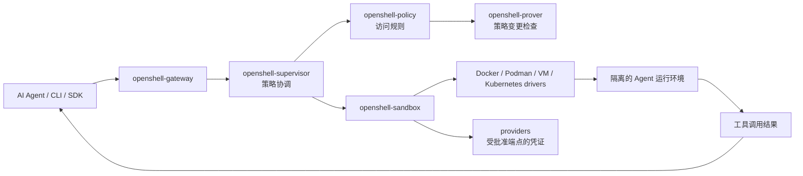

## 导语

`NVIDIA/OpenShell` 是 GitHub 2026 年 10 月 2 日日榜项目。本次于 2026-10-02 17:03（北京时间，UTC+8）查看 [Trending `daily` 页面](https://github.com/trending?since=daily)，页面显示“今日新增 2,456 Star”。同次运行的[仓库元数据 API](https://api.github.com/repos/NVIDIA/OpenShell)快照为 14,182 Star、1,637 Fork、525 个开放条目；默认分支为 `main`，主语言为 Rust，最近一次推送为 2026-10-02 08:56 UTC。

这些是抓取时的公开观察，不能单独证明长期增长、用户规模或安全效果。仓库的 [LICENSE](https://raw.githubusercontent.com/NVIDIA/OpenShell/main/LICENSE) 是 Apache-2.0；[v0.1.2](https://github.com/NVIDIA/OpenShell/releases/tag/v0.1.2) 于 2026-09-28 发布，说明该仓库近期有公开版本发布，但不代表本文对其稳定性作出保证。

## 产品介绍

README 将 OpenShell 定义为面向自主 AI Agent 队列的安全、私有运行时：用户通过策略声明 Agent 可访问的文件、系统调用、网络与凭证边界，由运行时执行。文档称其会在内核层面对文件访问、系统调用和网络连接进行策略检查，并在应用策略变更前使用形式化验证提示可能扩大访问范围的变更；这些是项目方文档的能力说明，并非本文的独立安全审计。

README 的 Quickstart 使用 `openshell sandbox create` 创建沙箱，并要求 Linux、Apple Silicon macOS 或实验性的 WSL 2，以及 Docker、Podman 或主机虚拟化。它还列出 Python、TypeScript、Go 与 Rust SDK，及 Kubernetes/Helm、provider、gateway 等部署与集成入口。根目录 [Cargo.toml](https://raw.githubusercontent.com/NVIDIA/OpenShell/main/Cargo.toml)表明该项目是 Rust workspace，使用 Tokio、Axum、Tonic/Prost、OpenTelemetry、SQLx 与 Kubernetes 相关依赖。

## 目标人群

该项目适合需要让 AI Agent 调用工具、读取文件、联网或使用凭证，同时希望把权限控制和隔离环境纳入工程流程的开发者、平台团队与安全团队。对需要以 gateway 管理多沙箱、在 Kubernetes 部署，或为应用接入 SDK 的团队也更贴近其公开文档所覆盖的使用场景。

从 README 的策略、provider、sandbox 与 gateway 文档，以及仓库的多种 driver 和 SDK 目录可以有限推断，它面向愿意维护运行环境和访问策略的人，而不是零配置的通用聊天产品。这里的“适合”是基于公开资料的分析；实际采用前仍应验证平台支持、权限模型、遥测选项与组织的安全要求。

## 技术架构

仓库根目录的 [`crates/`](https://github.com/NVIDIA/OpenShell/tree/main/crates)包含 `openshell-cli`、`openshell-gateway`、`openshell-supervisor`、`openshell-sandbox`、`openshell-policy` 和 `openshell-prover` 等包；同时有 `providers/`、`proto/`、`sdk/`、`deploy/`、`telemetry/`、`tests/` 与 `e2e/`。工作区依赖 Tonic/Prost 说明存在 gRPC/Protobuf 通信层，Axum/Tower 是 HTTP 服务栈，Tokio 用于异步运行；这些均可在根 Cargo 配置中核实。

下图只表达 README 与源码目录共同指向的主路径：CLI/SDK 请求由 gateway 接入，supervisor 按策略协调 sandbox；sandbox 经 driver 使用本地容器、虚拟化或 Kubernetes 等隔离后端，provider 在获批端点上处理凭证，结果再返回调用方。形式化策略检查由 prover 相关模块支撑；图中不将其表述为所有运行路径的必经网络服务。

## 数据分析

### Star 趋势折线图

| 可复核指标 | 值 | 口径 |
| --- | ---: | --- |
| Trending 当日新增 Star | 2,456 | `daily` 页面于 2026-10-02 17:03 BJT 显示的值 |
| 仓库 Star 总数 | 14,182 | 仓库元数据 API 的同次快照 |
| 带时间戳的 Star 事件 | 数据不足 | `stargazers` 端点本次返回 HTTP 401（需要认证） |

数据日期为 2026-10-02（UTC+8），热度窗口为 GitHub Trending 的 `daily` 页面。历史折线需要带时间戳的 Stargazer 事件或其他可复核的历史序列；本次按 [GitHub REST Starring 文档](https://docs.github.com/rest/activity/starring#list-stargazers)的格式请求端点，但服务要求认证，故以可见占位图替代。日榜新增和单个总数快照不能被当成历史点位，不能据此得出增长率。

### Commit 情况柱状图

| UTC 日期 | API 返回提交 | 非合并、非机器人提交 |
| --- | ---: | ---: |
| 2026-09-26 | 5 | 5 |
| 2026-09-27 | 4 | 4 |
| 2026-09-28 | 15 | 15 |
| 2026-09-29 | 14 | 14 |
| 2026-09-30 | 13 | 13 |
| 2026-10-01 | 21 | 21 |
| 2026-10-02（截至抓取） | 1 | 1 |

数据于 2026-10-02 17:03（北京时间，UTC+8）从 [commits API](https://api.github.com/repos/NVIDIA/OpenShell/commits?since=2026-09-26T00%3A00%3A00Z&amp;until=2026-10-03T00%3A00%3A00Z&amp;per_page=100)抓取，按 `commit.author.date` 的 UTC 日期汇总。图表采用排除多父提交（merge）及作者登录名以 `bot` 结尾记录后的数量；本窗口返回的 73 条记录均满足该排除口径。10 月 2 日是未完整自然日，且提交数量不能单独代表代码质量、人工投入或发布频率。

### 社区反馈饼图

| 公开协作条目类型 | 数量 | 样本占比 |
| --- | ---: | ---: |
| Issue | 130 | 40.4% |
| Pull request | 192 | 59.6% |

数据于 2026-10-02 17:03（北京时间，UTC+8）从 [Issues 搜索 API](https://api.github.com/search/issues?q=repo%3ANVIDIA%2FOpenShell%20is%3Aissue%20created%3A2026-09-26..2026-10-02)与 [Pull requests 搜索 API](https://api.github.com/search/issues?q=repo%3ANVIDIA%2FOpenShell%20is%3Apr%20created%3A2026-09-26..2026-10-02)取得 `total_count`，两次响应的 `incomplete_results` 均为 `false`。统计窗口为 UTC 日历日，10 月 2 日截至抓取时尚未结束。这里衡量的是公开新建条目的类型构成，而不是情感分析、满意度、实际使用量或讨论质量。

## 来源链接

- [GitHub Trending 日榜：Repositories](https://github.com/trending?since=daily)
- [NVIDIA/OpenShell 仓库与 README](https://github.com/NVIDIA/OpenShell)
- [README 原文](https://raw.githubusercontent.com/NVIDIA/OpenShell/main/README.md)
- [Apache-2.0 许可证](https://raw.githubusercontent.com/NVIDIA/OpenShell/main/LICENSE)
- [仓库元数据 API 快照](https://api.github.com/repos/NVIDIA/OpenShell)
- [v0.1.2 Release](https://github.com/NVIDIA/OpenShell/releases/tag/v0.1.2)
- [Releases API](https://api.github.com/repos/NVIDIA/OpenShell/releases?per_page=10)
- [根 Cargo.toml](https://raw.githubusercontent.com/NVIDIA/OpenShell/main/Cargo.toml)
- [crates 目录](https://github.com/NVIDIA/OpenShell/tree/main/crates)
- [commits API](https://api.github.com/repos/NVIDIA/OpenShell/commits?since=2026-09-26T00%3A00%3A00Z&amp;until=2026-10-03T00%3A00%3A00Z&amp;per_page=100)
- [Issues 搜索 API](https://api.github.com/search/issues?q=repo%3ANVIDIA%2FOpenShell%20is%3Aissue%20created%3A2026-09-26..2026-10-02)
- [Pull requests 搜索 API](https://api.github.com/search/issues?q=repo%3ANVIDIA%2FOpenShell%20is%3Apr%20created%3A2026-09-26..2026-10-02)
