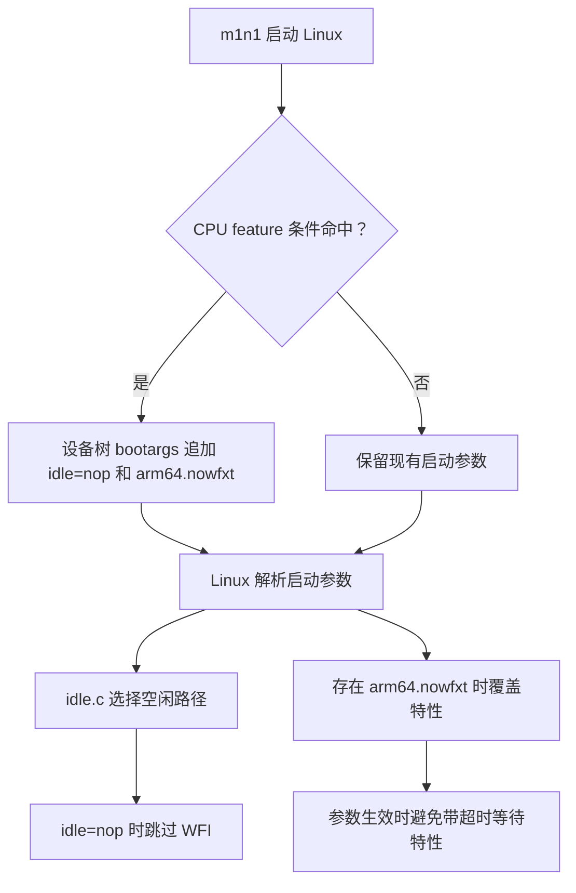

## 导语

本文保留 2026-10-03 的选题与数据快照，于 2026-10-06 补发；下文排名、分数和评论数均不是补发当日的实时数据。

想象你正在算一道题，临时离开座位，回来却发现草稿纸被清空。程序也需要“休息后继续工作”：CPU 等待中断时，应该保留恢复执行所需的状态。

开发者 Yureka Lilian 在 [M4 Linux 启动记录](https://yuka.dev/blog-2026-10-02-linux-m4.html) 中描述了类似问题：M4 上的等待指令会丢失状态，导致 Linux 崩溃。解决它，需要引导程序和内核配合。

本文选自北京时间 2026 年 10 月 3 日的 Hacker News 前 30 项快照，原题为 The Forgetful CPU (Linux on M4)，story ID 49933869，首次快照中排名第 2、148 分、64 条评论；随后采集评论树时，保留了 65 条可见评论。排名和分数只是当时热度；选择它，是因为作者提供了可核查的上游补丁，且本站尚未讨论这一问题。

## 背景与核心问题

WFI（Wait For Interrupt，等待中断）让 CPU 在没有任务时等待下一次事件。作者报告，早期 Apple Silicon 可由 m1n1 调整相关控制位，避免状态丢失；M4 上原有方法不再奏效。作者关于芯片行为的实验，是本文引用的开发者观察，本文没有独立测量硬件。

这也解释了为什么“能启动一个核心”和“所有核心都能工作”之间还有距离：更多核心进入空闲路径，就可能碰到等待指令的问题。作者曾通过将内核里的 WFI、WFIT（带超时的等待中断）替换为空操作，让 M4 的所有核心启动。

但把等待指令一律禁掉，会伤及正常场景。Linux 的 [idle 参数提交](https://api.github.com/repos/torvalds/linux/commits/d97afae6f16a4f8ac7d50af0070816270b5380c1) 明确指出：macOS 内的虚拟机也可能呈现相同 CPU 标识，然而其 WFI 由虚拟机管理器正确处理。因此，不能只看 CPU 型号就全局打补丁。

## 技术原理与架构

可以把引导程序看成开场前布置舞台的人：它了解当前机器，给内核留下启动参数；内核则根据参数选择执行路径。

核对 [m1n1 PR 672 的代码差异](https://api.github.com/repos/AsahiLinux/m1n1/pulls/672/files)，改动位于 src/kboot.c 的 dt_set_chosen。代码在特定 CPU feature 条件下，将 idle=nop 和 arm64.nowfxt 追加到设备树的 bootargs。设备树是一份向内核描述硬件及启动信息的数据。

- idle=nop：内核解析参数后，在 cpu_do_idle 中跳过默认 WFI 空闲指令路径。补丁文档明确提醒，这可能增加耗电
- arm64.nowfxt：通过特性覆盖机制禁用 WFxT，也就是带超时的等待事件／等待中断支持；不是仅改一条普通空闲循环
- 两者配合：避免内核走到有问题的等待路径，保留由引导程序针对运行环境决定是否启用的空间

以下流程来自上述 m1n1 差异、Linux idle.c 和 [WFxT 覆盖提交](https://api.github.com/repos/torvalds/linux/commits/baaa9b126b875b40ffd9356da52c7c871917e5bb)，不是根据项目名推测的架构：

调试过程中还有一个很有教育意义的细节：作者最早用串口打印字符定位问题，开启 MMU（内存管理单元）后打印却消失了。原因是地址开始经由页表翻译，而 Linux 没有保留那段串口 MMIO（内存映射输入输出）的等地址映射。看不到日志，不一定表示程序没有运行，也可能是观察工具本身失效。

## 适用人群与场景

这篇记录适合内核、嵌入式和虚拟化开发者：它展示了如何缩小启动故障范围，以及为什么硬件兼容策略需要区分裸机和虚拟机。

对普通 M4 用户，最重要的边界是：作者报告的是“所有核心可用并启动到 shell”。显示、GPU 等外围设备仍有后续工作，不能据此认定已有成熟的日常桌面发行版。本文也不是修改启动安全设置的操作教程。

## 数据分析

我们没有同硬件、同内核配置的耗电或性能测试，因此不绘制性能对比图。下面三图衡量这条 HN 讨论的时间分布和结构，帮助读者理解“热度”具体来自什么；不能证明补丁质量或产品成熟度。

[原始榜单、评论元数据与汇总数据](/daily-hacker-news/2026-10-03/manifest.json) 可复核。榜单与 story 分数取最初请求；评论树递归采集于 UTC 2026-10-03 04:03—04:04，完成于 04:04:37，即北京时间 12:04:37。原帖发于 UTC 10 月 2 日 14:22:12。

### 时间趋势：按评论创建时间分桶

| UTC 10 月 3 日小时起点 | 北京时间 | 评论数 |
| --- | --- | ---: |
| 00:00 | 08:00 | 11 |
| 01:00 | 09:00 | 26 |
| 02:00 | 10:00 | 17 |
| 03:00 | 11:00 | 10 |
| 04:00，未满一小时 | 12:00 | 1 |

来源：[HN item API](https://hacker-news.firebaseio.com/v0/item/49933869.json)，从 kids 递归到每个评论的 item 端点，使用 time 字段。窗口为 UTC 00:00 至采集完成，样本 65 条，单位为评论；排除 deleted 和 dead，所有保留样本均位于此窗口。图重建的是当前仍可见评论的创建时间分布，不是历史 score 或榜单曲线。最后一桶不完整，不能据此声称讨论突然降温；删除或隐藏的历史评论也不会进入这条曲线。

### 柱状比较：评论树有多深

| 深度 | 1 | 2 | 3 | 4 | 5 | 6 | 7 |
| --- | ---: | ---: | ---: | ---: | ---: | ---: | ---: |
| 评论数 | 3 | 10 | 13 | 13 | 10 | 9 | 7 |

来源同上，时间为 UTC 04:04:37 采集完成的评论树快照，窗口与样本同前图，单位为评论。深度 1 表示直接回复原帖，其余逐层加一；即使祖先评论被删除或隐藏，也保留它所在的树层级。较深回复说明存在来回讨论，不能解释为共识或赞同。

### 组成：顶层评论与回复

| 互斥类别 | 数量 | 占比 |
| --- | ---: | ---: |
| 直接回复原帖 | 3 | 4.6% |
| 回复其他评论 | 62 | 95.4% |
| 合计 | 65 | 100.0% |

来源、窗口及 UTC 抓取时间同前两图，分母为 65 条保留评论，单位为条。总共遍历 74 个节点，剔除 7 个 deleted、2 个 dead 节点；分类按 parent 是否等于 story ID，互斥且覆盖全样本。这是评论构成，不是人数统计或情绪分析。API 递归抓取不是原子快照，稍后重抓可能不同。

## 局限与结论

已核查的事实是：Linux 上游提交包含两项参数机制；m1n1 PR 672 已在 2026 年 9 月 29 日合并，并包含追加参数的实现。开发者报告了多核心启动进展，但本文没有复现启动，也没有验证所有外设。

这个案例的通用价值，在于把“机器特殊行为”和“系统通用策略”分开处理：引导层提供环境信息，内核提供明确的可选机制。代价同样要讲清楚，绕开省电等待路径可能增加耗电。真正判断是否适合日常使用，还需要设备支持清单、稳定性验证和可重复的功耗测量。

## 来源链接

- [HN 讨论与原始标题](https://news.ycombinator.com/item?id=49933869)
- [HN 官方 topstories API](https://hacker-news.firebaseio.com/v0/topstories.json)；[官方 API 字段说明](https://github.com/HackerNews/API)
- [开发者原文：The Forgetful CPU](https://yuka.dev/blog-2026-10-02-linux-m4.html)
- [Linux idle 参数提交与代码差异](https://api.github.com/repos/torvalds/linux/commits/d97afae6f16a4f8ac7d50af0070816270b5380c1)
- [Linux WFxT 覆盖提交与代码差异](https://api.github.com/repos/torvalds/linux/commits/baaa9b126b875b40ffd9356da52c7c871917e5bb)
- [m1n1 PR 672 与合并状态](https://api.github.com/repos/AsahiLinux/m1n1/pulls/672)
- [本次图表数据](/daily-hacker-news/2026-10-03/chart-data.json)；[评论元数据](/daily-hacker-news/2026-10-03/story-comments.json)；[榜单快照](/daily-hacker-news/2026-10-03/top30.json)
