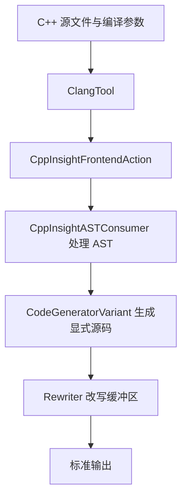

## 导语

本文保留 2026-10-04 的选题与数据快照，于 2026-10-06 补发；下文排名、分数和评论数均不是补发当日的实时数据。

读 C++ 有时像看一张简写的菜谱：你写下“拌匀”，厨房里却发生了好几个步骤。复制对象、推导类型、遍历容器也一样，简短语法背后有编译器替你完成的工作。C++ Insights 将其中一部分展开成更显式的 C++，帮助人理解程序。

北京时间 2026-10-04 08:57:33（UTC 00:57:33）抓取的 [Hacker News 官方榜单](https://hacker-news.firebaseio.com/v0/topstories.json)前 30 项中，该项目排第 30；[条目 49928361](https://hacker-news.firebaseio.com/v0/item/49928361.json)有 135 分、27 条后代评论计数。原始标题为“C++ Insights – See your source code with the eyes of a Compiler”，原始发帖时间为 2026-10-01 23:53:36 UTC（北京时间 10 月 2 日 07:53:36）。结合 [HN 首页](https://news.ycombinator.com/)和[讨论页](https://news.ycombinator.com/item?id=49928361)，本文选择这个有源码可查、适合解释编译机制且未在现有文章中重复的热点。排名与互动量只代表抓取时快照，不能解释成全天热度或用户规模。

## 背景与核心问题

例如给对象写下 `d2 = d`，表面上是赋值，实际可能调用赋值运算符。项目 README 的示例将它展示为 `d2.operator=(d)`，还展示编译器提供的特殊成员函数与派生类到基类的转换。

[项目说明](https://raw.githubusercontent.com/andreasfertig/cppinsights/e98716c35910812ad0ea9848d50b1b2da47fef37/Readme.md)介绍了 lambda、范围 for 循环、结构化绑定以及 `auto` 类型推导等转换。这里的用途是理解语言规则。展开结果不是汇编，也不是程序跑得快慢的测量结果。

## 技术原理/架构

AST（抽象语法树）可以理解为编译器读懂代码后整理出的结构化笔记。C++ Insights 基于 Clang 的这份笔记重新生成源码，因此能展示仅靠搜索替换难以可靠识别的类型和隐式行为。

本文核查的是仓库提交 `e98716c35910812ad0ea9848d50b1b2da47fef37`，而非对线上服务内部实现的猜测。[Insights.cpp](https://raw.githubusercontent.com/andreasfertig/cppinsights/e98716c35910812ad0ea9848d50b1b2da47fef37/Insights.cpp)的入口创建 ClangTool，运行前端动作；前端动作建立 AST 消费器与 Rewriter，消费器处理翻译单元并使用 CodeGeneratorVariant，最后将改写缓冲区写到标准输出。翻译单元就是编译器本次处理的一份源文件及相关上下文。

代码生成并非一个简单模板：[CodeGenerator.cpp](https://raw.githubusercontent.com/andreasfertig/cppinsights/e98716c35910812ad0ea9848d50b1b2da47fef37/CodeGenerator.cpp)覆盖不同语法节点，仓库还有协程等专门生成模块。上图只描述已核查的命令行主路径，不暗示存在数据库或外部模型服务。项目使用 MIT 许可证，具体义务以 [LICENSE](https://raw.githubusercontent.com/andreasfertig/cppinsights/e98716c35910812ad0ea9848d50b1b2da47fef37/LICENSE)为准。

## 适用人群与场景

- 学习 C++ 的开发者：遇到类型推导、对象复制或 lambda 时，先用小例子观察展开形式
- 教师与团队分享者：在熟悉的 C++ 表达中讲清隐式步骤，再深入标准规则
- 排查理解偏差的工程师：把工具输出作为线索，再用编译器诊断、测试和标准文档核对

这些是基于文档与实现的适用性分析。本文没有编译运行 C++ Insights 本身，也没有对转换正确性或性能作独立测试。

## 数据分析

数据采集于 2026-10-04 UTC（北京时间同日），统计固定在上述源码提交。原始记录、逐条提交 SHA、文件清单见[可复核数据](/daily-hacker-news/2026-10-04/data.json)，HN 快照见[条目记录](/daily-hacker-news/2026-10-04/hn-snapshot.json)。以下图表均由本文依据 Git 仓库计算绘制，不能替代性能基准或质量评估。

### 时间趋势折线图

| UTC 月份 | 非合并提交数 |
| --- | ---: |
| 2025-10 | 0 |
| 2025-11 | 0 |
| 2025-12 | 0 |
| 2026-01 | 0 |
| 2026-02 | 2 |
| 2026-03 | 7 |
| 2026-04 | 0 |
| 2026-05 | 1 |
| 2026-06 | 1 |
| 2026-07 | 0 |
| 2026-08 | 3 |
| 2026-09 | 0 |

来源为[固定提交的 Git 历史](https://github.com/andreasfertig/cppinsights/commits/e98716c35910812ad0ea9848d50b1b2da47fef37/)。窗口是 2025-10-01 00:00 至 2026-10-01 00:00 UTC，左闭右开；完整拉取历史后统计该提交可达的非合并提交，按提交者时间转 UTC 分月，样本 14 次、单位“次”。仅排除多父合并提交，不按作者身份排除机器人或发布提交，因此不是人类开发工作量。零值表示此口径无提交，不能推断没有维护活动。这是真实历史序列，不是用当前 Star 数拼出的趋势。

### 可比较量柱状图

| 文件 | 物理行数 |
| --- | ---: |
| Insights.cpp | 473 |
| CodeGenerator.cpp | 5126 |
| CoroutinesCodeGenerator.cpp | 1048 |
| CfrontCodeGenerator.cpp | 1252 |

来源为[固定版本源码树](https://github.com/andreasfertig/cppinsights/tree/e98716c35910812ad0ea9848d50b1b2da47fef37)。时间口径为 2026-10-04 UTC 抓取的固定版本快照，无历史窗口；样本是明确选定的四个入口/生成器文件，单位“物理行”，包含注释与空行，按文本分行计算。CodeGenerator.cpp 在这四个文件中最长，只说明文本规模，不能推出运行耗时、复杂度或缺陷率，也不是跨平台 benchmark。

### 明确组成饼图

| 互斥类别 | 文件数 | 占比 |
| --- | ---: | ---: |
| C++ 输入：.cpp | 575 | 47.5% |
| 预期输出：.expect | 573 | 47.3% |
| 其他扩展名及无扩展名 | 63 | 5.2% |

来源为[固定版本 tests 目录](https://github.com/andreasfertig/cppinsights/tree/e98716c35910812ad0ea9848d50b1b2da47fef37/tests)。这是 2026-10-04 UTC 抓取的文件快照，无历史窗口；分母是 `git ls-files tests` 返回的全部 1211 个跟踪文件，单位“文件”，按后缀分成互斥类别，百分比保留一位小数。文件数接近不代表一一配对，也不能把 575 个输入文件称为 575 项已通过测试。这张图体现测试资料的组成，不衡量覆盖率或社区情绪。

## 局限与结论

项目 README 明确提醒，工具基于 Clang 对 AST 的理解，目标虽是生成可编译代码，却并非所有情况都能做到。看懂展开形式有助于学习，但复杂边界条件仍须核对语言标准与实际工具链。

公开 Git 历史显示此统计窗口的改动并不密集；HN 上再次受到关注与近期大量开发是两件不同的事。本文抓取 GitHub 目录 API 时遇到限流，改用完整 Git 历史与固定提交源码核实，未依赖搜索摘要补齐；没有取得连续 Star 历史，所以没有声称 Star 增长趋势。

结论是：当一段 C++ 看起来太“自动”时，C++ Insights 提供了一个值得观察的中间层。把它当成解释语言机制的显微镜，再用编译与测试验证具体程序，会比将展开结果当作性能或正确性证明更稳妥。

## 来源链接

- [HN 原始讨论](https://news.ycombinator.com/item?id=49928361)及[官方条目 API](https://hacker-news.firebaseio.com/v0/item/49928361.json)
- [项目原文入口](https://github.com/andreasfertig/cppinsights)
- [固定版本 README](https://raw.githubusercontent.com/andreasfertig/cppinsights/e98716c35910812ad0ea9848d50b1b2da47fef37/Readme.md)、[入口源码](https://raw.githubusercontent.com/andreasfertig/cppinsights/e98716c35910812ad0ea9848d50b1b2da47fef37/Insights.cpp)与[许可证](https://raw.githubusercontent.com/andreasfertig/cppinsights/e98716c35910812ad0ea9848d50b1b2da47fef37/LICENSE)
- [统计数据与样本清单](/daily-hacker-news/2026-10-04/data.json)
