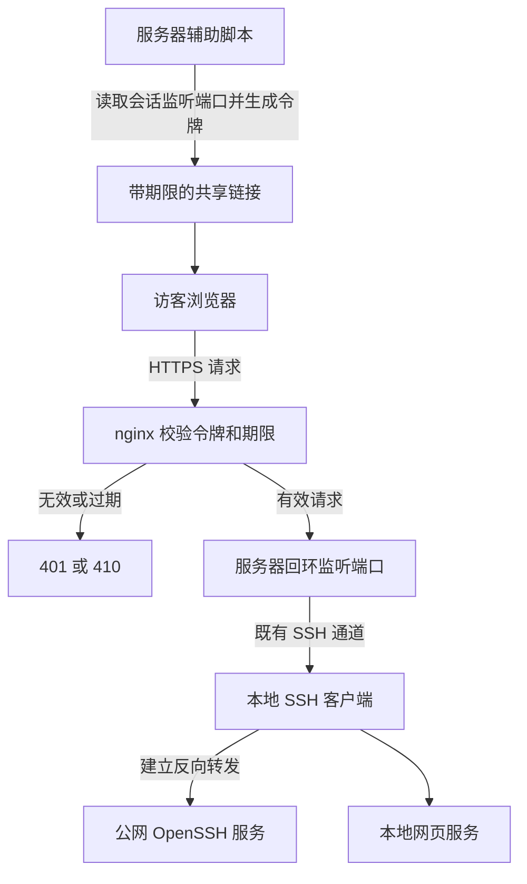

## 导语

本文保留 2026-10-05 的选题与数据快照，于 2026-10-06 补发；下文排名、分数和评论数均不是补发当日的实时数据。

你在电脑上写好一个网页，朋友却打不开 localhost 地址：这个地址只指向访问者自己的电脑。可以把一台公网服务器当作“接待台”，让它把访客请求送回你的开发服务。

2026 年 10 月 5 日 01:04:02 UTC（北京时间 09:04:02），Hacker News 的 [topstories API](https://hacker-news.firebaseio.com/v0/topstories.json) 第 5 项是 Vincent Bernat 的《Self-hosted HTTP tunnels with SSH and Nginx》，story ID 为 49958569，当时为 45 分、11 条后代评论。HN 帖子发布于 10 月 4 日 22:25:10 UTC（北京时间 10 月 5 日 06:25:10）。这只是一次榜单快照，不是全天排名。

## 背景与核心问题

隧道就是把一种连接装进另一条连接。这里，本地电脑主动建立 SSH 加密连接，公网服务器再借这条连接把请求送回本地，因此不要求访客直接连入你的电脑。

方案的价值在于复用已有 OpenSSH 与 nginx。但“连通”与“谁能访问”是两回事；猜不到端口号不等于可靠的访问控制。

## 技术原理与架构

[OpenSSH 手册](https://man.openbsd.org/ssh.1)说明，反向转发的监听端位于远端服务器，目标连接从本地发起；远端端口填写 0 时，服务器动态分配端口。理解这个方向，是读懂方案的关键。

请求处理分为四步：

1. 本地 SSH 客户端建立反向转发，服务器分配监听端口
2. 访客通过 HTTPS 请求公网 nginx，域名中的端口编号决定转发目标
3. nginx 校验访问令牌及期限；无效凭证返回 401，过期返回 410
4. 校验通过后，nginx 请求服务器回环端口，经 SSH 通道抵达本地网页服务

以下关系来自[作者配置与辅助脚本](https://vincent.bernat.ch/en/blog/2026-http-over-ssh)，不是根据产品名称推测。图中“共享链接”是带访问凭证的链接，不应随意公开。

[nginx secure_link 官方文档](https://nginx.org/en/docs/http/ngx_http_secure_link_module.html)给出了校验结果及过期判断。作者把期限、端口和服务器秘密纳入校验，并在代理前移除 Authorization 请求头，避免把访问凭证继续传给本地应用。该模块并非默认编译启用，部署前必须核实可用性。

[辅助脚本](https://github.com/vincentbernat/nixops-take1/blob/master/tags/http-over-ssh.sh)查找当前会话的 sshd-session 祖先进程，再借助 ss 查询监听端口。它依赖 OpenSSH 9.8 及以后的进程命名及相应 sudo 配置，不是所有系统上即拷即用的通用命令。

## 适用人群与场景

从依赖和运维要求判断，它适合已经有公网服务器、域名和证书管理经验，想临时分享开发预览的人。它也适合用作理解反向代理与端口转发的教学案例。

对于没有服务器维护经验的团队，减少组件并不一定减少工作：证书续期、访问凭证、日志清理和服务隔离仍要负责。本文没有实际部署该方案，也没有测量性能。

## 数据分析

下面只分析该 HN 讨论的结构，不评价方案性能或评论情绪。数据来自[story API](https://hacker-news.firebaseio.com/v0/item/49958569.json)及递归读取 kids 所指向的 item API。

抓取窗口为 2026-10-05 01:05:19 至 01:05:34 UTC（北京时间 09:05:19 至 09:05:34）。共读取 13 个评论节点，其中 2 个同时标记 deleted 和 dead，按并集排除一次，留下 11 个可见节点。后一次 story 快照为 49 分；不要与前面的 45 分混作同一时刻。抓取并非原子快照，期间变化可能造成差异。

[原始字段](/daily-hacker-news/2026-10-05/hn-data.json)保留 ID、父节点、时间、状态与分组，不保留用户名称或评论正文；[聚合数据](/daily-hacker-news/2026-10-05/chart-data.json)可用于复算。每个评论端点格式为 https://hacker-news.firebaseio.com/v0/item/评论ID.json。

### 时间趋势：评论何时出现

| UTC 小时起点 | 可见评论数 |
| --- | ---: |
| 10-04 22:00 | 0 |
| 10-04 23:00 | 5 |
| 10-05 00:00 | 6 |
| 10-05 01:00 | 0 |

来源为上述 item API 的 time，样本 n=11，单位“条”，统计窗口从原帖发出到抓取结束。22 时段只覆盖发帖后的部分；01 时段只覆盖约 5 分钟。图表是现存可见评论的创建时间分布，不是逐小时在线采样，也不是点赞走势。最后一点不能被解释为热度突然下降。

### 柱状比较：讨论集中在哪些分支

| 顶层评论 ID | 分支可见节点数 |
| --- | ---: |
| 49958868 | 3 |
| 49958903 | 2 |
| 49959059 | 2 |
| 49959165 | 1 |
| 49959358 | 1 |
| 49959366 | 1 |
| 49959440 | 1 |

来源为 item API 的 parent/kids 关系，同一抓取窗口，样本为 7 个含可见节点的顶层分支，合计 11 个节点，单位“条”。每个分支包含顶层评论自身及其全部可见回复。最大分支也只有 3 条，不能据此概括社区共识；两个已删除且无子节点的分支不进入图表。

### 饼图组成：发起讨论还是继续回复

| 互斥类别 | 条数 | 比例 |
| --- | ---: | ---: |
| 直接回复原帖 | 7 | 63.6% |
| 回复其他评论 | 4 | 36.4% |

来源为相同 item API 与抓取窗口，分母是 11 个可见节点，单位“条”。parent 等于 story ID 的归第一类，其余归第二类，类别互斥且覆盖全部样本。这是讨论层级构成，既不是独立用户数，也不是赞成与反对比例。

## 局限与结论

数据只能说明一个很小的讨论样本，无法证明方案流行程度、吞吐量或安全性。这里没有公平的性能对照实验，因此不宣称它比托管隧道服务更快或更省钱。

作者特别提醒：拥有服务器秘密的人可能构造能访问服务器其他监听端口的链接。部署时必须考虑端口限制和服务隔离。期限也不是完整的会话绑定：端口可能重新分配，过期机制不能替代访问审计。

链接中的凭证可能随着复制、历史记录或日志泄露；分享链接就是分享访问能力。MD5 校验方案不能被包装成现代身份认证系统，也不应直接用于公开敏感后台。

我的判断是：这个例子最值得借鉴的是清楚的分工。SSH 负责跨网络传递，nginx 负责公网 HTTP 入口，访问控制负责决定放行。把三件事分开理解，比只记住一条隧道命令更重要。

## 来源链接

- [HN 讨论](https://news.ycombinator.com/item?id=49958569)
- [HN 官方 API 定义](https://github.com/HackerNews/API)
- [作者原文与配置](https://vincent.bernat.ch/en/blog/2026-http-over-ssh)
- [作者辅助脚本](https://github.com/vincentbernat/nixops-take1/blob/master/tags/http-over-ssh.sh)
- [OpenSSH 命令手册](https://man.openbsd.org/ssh.1)
- [nginx secure_link 文档](https://nginx.org/en/docs/http/ngx_http_secure_link_module.html)
