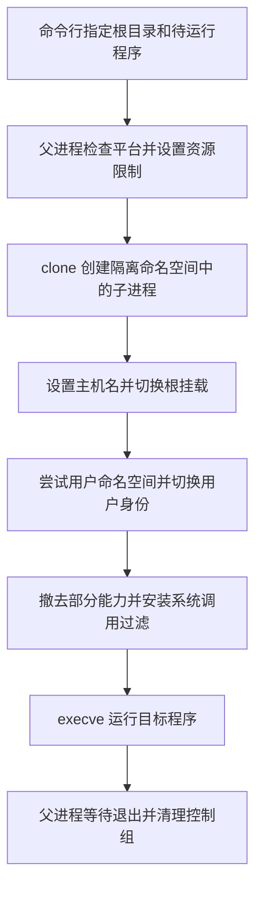

## 导语

把程序放进容器，像给租客分配一间房：门牌可以不同，能用多少水电也可以限制，但整栋楼仍共用基础设施。容器同样不会凭空获得一套独立内核，隔离要靠多种机制配合。

2026 年 10 月 6 日 01:04:46 至 01:05:20 UTC（北京时间 09:04:46 至 09:05:20）的抓取中，[HN 官方榜单](https://hacker-news.firebaseio.com/v0/topstories.json)第 27 项是《Linux containers in 500 lines of code (2016)》，ID 为 49965118，story 快照为 93 分、21 条后代评论。原帖发布于 10 月 5 日 14:09:15 UTC（北京时间 22:09:15）。这是一篇旧文再次受到关注，不是新的容器产品发布；排名和分数只代表抓取时快照。

## 背景与核心问题

[原文](https://blog.lizzie.io/linux-containers-in-500-loc.html)用一个 C 程序解释容器怎样形成。作者明确说，修订后代码已比标题中的 500 行多约 70 行，因此不应把“500 行”当成当前精确统计或安全保证。

核心问题不是怎样“藏住一个目录”，而是同时回答：程序看见什么、能做什么、最多消耗多少资源？只回答其中一个问题，另外两个边界仍可能敞开。

## 技术原理与架构

根据[作者提供的 contained.c](https://blog.lizzie.io/linux-containers-in-500-loc/contained.c)，可把机制理解为四组：

- 命名空间（namespace）改变进程看到的系统对象，例如进程编号、挂载点与网络设备。它像隔开的房间，不是性能配额
- 控制组（cgroup）及资源限制管理资源使用。代码配置 memory、cpu、pids、blkio 等控制器，并设置文件描述符限制
- 能力（capability）把超级用户权限拆开，程序撤去部分能力，减少能做的事
- 安全计算过滤（seccomp）过滤系统调用，即程序向内核提出的操作请求。它并不替代文件权限或资源限制

下面的顺序来自 main、child、mounts、userns、capabilities 与 syscalls 函数，而不是容器产品的概念示意图。

代码还通过 socketpair 在父子进程之间同步用户 ID 映射。用户命名空间创建失败时，它会继续执行，而非保证这一层始终存在。命名空间清单中包含独立网络空间，但这不等于已经配置好可用的外网连接。

这里特别容易误解的是 CPU 配额。[内核 cgroup v1 文档](https://www.kernel.org/doc/html/latest/admin-guide/cgroup-v1/cgroups.html)说明了控制组的组织方式；代码使用的 cpu.shares 是竞争时的相对权重，不能直接理解为“CPU 使用率不得超过某个百分比”。[带宽控制文档](https://www.kernel.org/doc/html/latest/scheduler/sched-bwc.html)另行说明 quota 与 period 的限额机制。

## 适用人群与场景

从代码规模和讲解方式判断，这个例子适合想理解 Docker 等工具底层机制的开发者，也适合教学中比较“可见范围”“资源预算”“操作权限”三类问题。

它不适合直接充当生产环境中运行不可信程序的安全边界。本文只阅读代码和文档，没有编译运行它，也没有做容器逃逸测试或性能实验。

## 数据分析

下面三图分析的是这一次 HN 讨论的结构，不是容器性能。来源为 [story API](https://hacker-news.firebaseio.com/v0/item/49965118.json)及递归读取 kids 指向的 item API。抓取窗口同导语；各请求不同时完成，因此不是原子快照。

共读取 23 个评论节点，排除 2 个标记 dead 的节点，留下 21 个可见节点，没有 deleted 节点。这里只把未标记 dead/deleted 的节点称作“可见”，不推断每位用户实际看到的页面状态。

[原始字段](/daily-hacker-news/2026-10-06/hn-data.json)保留评论 ID、parent、创建时间和状态，不保存用户名称或正文；[聚合数据](/daily-hacker-news/2026-10-06/chart-data.json)供复算。单个节点端点为 https://hacker-news.firebaseio.com/v0/item/评论ID.json。

### 时间趋势：评论何时创建

| UTC 区间起点 | 可见评论数 |
| --- | ---: |
| 10-05 12:00 | 1 |
| 10-05 18:00 | 20 |
| 10-06 00:00 | 0 |

单位“条”，样本 n=21，来源为上述 item API 的 time。每箱长六小时，统计范围从发帖到抓取结束；首箱实际始于 14:09:15，末箱只覆盖至 01:05:20。它是现存评论的创建时间分布，不是连续在线采样，也不是点赞历史。末点为零不能说明完整六小时内热度归零。

### 柱状比较：哪些分支更长

| 顶层评论 ID | 分支可见节点数 |
| --- | ---: |
| 49968424 | 15 |
| 49969829 | 2 |
| 49968041 | 1 |
| 49968502 | 1 |
| 49971205 | 1 |
| 49972184 | 1 |

单位“条”，同一抓取窗口，来源为 parent/kids 关系。六个含可见节点的分支共计 21 个节点，每支包含根评论自身及全部可见回复；另一个 dead 根节点无可见后代，不进入图表。较长分支只表示讨论集中，不能说明技术观点正确或得到多数赞同。

### 饼图组成：顶层评论与回复

| 互斥类别 | 条数 | 比例 |
| --- | ---: | ---: |
| 直接回复原帖 | 6 | 28.6% |
| 回复其他评论 | 15 | 71.4% |

同一抓取窗口，分母 n=21，单位“条”；来源为 item API 的 parent。parent 等于 story ID 的归第一类，其余归第二类。两类互斥且覆盖全部样本；这不是独立用户构成，更不是正负情绪分析。

## 局限与结论

这份历史代码明确只接受 Linux 4.7 或 4.8 的 x86_64 平台，并使用 cgroup v1 接口。不能把它对当年内核的假设套用到今天所有发行版。[cgroup v2 官方文档](https://www.kernel.org/doc/html/latest/admin-guide/cgroup-v2.html)展示的是另一套统一层级接口。

源码的 seccomp 初始化采用默认允许，再拒绝特定操作的方式。新增系统调用、内核漏洞和遗漏的权限都可能改变边界；“有过滤器”不等于“已证明安全”。作者自己也提醒，对真实暴露面应尽量限制，而不是只寻找最低限度的约束。

HN 的 21 条可见评论是小样本，三图只能帮助读者复核讨论结构，不能证明代码安全、行业采用率或效率优势。

我的判断是，这篇旧文最有价值的地方是拆开黑箱：看见哪些对象、分到多少资源、允许哪些操作，是三个互补的问题。理解它们的差别，比照抄一个能启动 shell 的容器例子更重要。

## 来源链接

- [HN 讨论](https://news.ycombinator.com/item?id=49965118)
- [HN 官方 API 定义](https://github.com/HackerNews/API)
- [作者原文](https://blog.lizzie.io/linux-containers-in-500-loc.html)
- [作者完整源码](https://blog.lizzie.io/linux-containers-in-500-loc/contained.c)
- [Linux cgroup v1 文档](https://www.kernel.org/doc/html/latest/admin-guide/cgroup-v1/cgroups.html)
- [Linux CPU 带宽控制文档](https://www.kernel.org/doc/html/latest/scheduler/sched-bwc.html)
- [Linux cgroup v2 文档](https://www.kernel.org/doc/html/latest/admin-guide/cgroup-v2.html)
