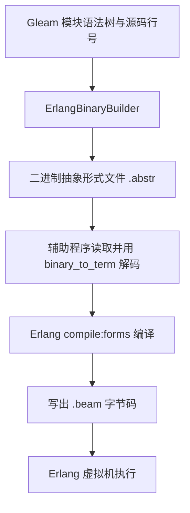

## 导语

把一份已经整理好的表格交给同事，通常比先改写成文章、再让对方重新整理成表格更省事。编译器也会遇到类似的重复劳动。

Gleam 1.19 的 Erlang 后端改变了交接方式：不再默认先生成 Erlang 源代码，而是把结构化的“抽象形式”交给 Erlang 编译器。它没有绕过 Erlang 编译器，也没有更换运行时。

2026 年 10 月 7 日 01:02:34 UTC（北京时间 09:02:34）保存的 [HN 官方榜单快照](https://hacker-news.firebaseio.com/v0/topstories.json)中，这篇新闻排名第 27，293 分，descendants 为 123。原始标题是《Gleam doesn't compile to Erlang source anymore》，[story ID 49975619](https://news.ycombinator.com/item?id=49975619)。原帖发布于 2026 年 10 月 6 日 08:08:20 UTC（北京时间 16:08:20）。排名只是抓取时快照，不代表全天排名。

## 背景与核心问题

Gleam 是带静态类型检查的语言，可以面向 Erlang 虚拟机或 JavaScript 运行环境。[官方发布说明](https://gleam.run/news/gleam-doesnt-compile-to-erlang-source-anymore/)发表于 2026 年 10 月 5 日，介绍的是 v1.19.0。

旧流程中，Gleam 已经理解了程序，却要先生成 Erlang 文本；Erlang 编译器随后再把文本分词、解析成结构。这就像双方已经知道表格的行列，却仍通过散文传递信息。

新流程直接传递 Erlang abstract forms，即带有位置等元数据的语法树。语法树把函数、调用和表达式组织成树状结构；二进制编码使用 Erlang 的 external term format，即用于表示 Erlang 数据项的格式。节省的是这一段文本解析工作，并不是取消所有编译步骤。

## 技术原理与架构

本文核查了 [v1.19.0 对应源码](https://github.com/gleam-lang/gleam/tree/904f81cc85f3bdc03fc3d0a6695055ce7ce4a64c)。其中 [codegen.rs](https://github.com/gleam-lang/gleam/blob/904f81cc85f3bdc03fc3d0a6695055ce7ce4a64c/compiler-core/src/codegen.rs)的 Binary 分支通过 ErlangBinaryBuilder 生成 .abstr 文件，同时传入由 Gleam 源码计算的位置数据。

[编译辅助程序](https://github.com/gleam-lang/gleam/blob/904f81cc85f3bdc03fc3d0a6695055ce7ce4a64c/compiler-cli/templates/gleam%40%40compile.erl)随后读取文件，用 binary_to_term 解码，调用 compile:forms，最后写出 .beam 文件。BEAM 是 Erlang 虚拟机使用的字节码格式。下面画的是这条实际的二进制输出路径，而非全部工具链。

源码也保留了 Textual 分支和 ErlangSourceBuilder。因此，“不再编译成 Erlang 源码”描述的是新构建路径，不能理解成仓库已经删除一切文本输出能力。原生 .erl 文件仍走 compile:file，不能把图中的路径套用到所有输入。

官方称，变化还让崩溃报告和调用栈的位置更准确地对应 Gleam 源码。这是发布方的说明；本文没有运行编译器验证错误栈。官方提到这类元数据可能帮助调试器集成，但明确表示尚未自行开展那部分工作，不能写成调试器支持已经完成。

为什么不直接输出 BEAM？官方给出的考虑是字节码会随虚拟机演进，直接生成需要持续兼容，也要重做 Erlang 编译器积累的优化。作者判断是：保留成熟后端，把工程投入集中在语言自身，比追求“全栈自研”更适合这个社区项目。

## 适用人群与场景

- 使用 Gleam 构建 Erlang 项目的开发者：适合关注构建耗时与错误位置，但应拿自己的项目验证收益
- 编译器和开发工具作者：可以参考中间表示作为组件间接口，减少先序列化为源码再解析的重复工作
- 主要使用 JavaScript 后端的团队：这次 Erlang 路径变化不能直接解释自己的运行性能；两个后端应分开评估

官方展示了一个合成编译基准：100 个模块，每个模块有 100 个返回字符串的函数，并比较 v1.17 与 v1.19。本文未复现实验，也不从图形宽度反推精确耗时。该基准不能代表所有真实项目，更不能证明业务代码运行得更快。

## 数据分析

以下三图全部由本文依据 [HN item API](https://hacker-news.firebaseio.com/v0/item/49975619.json)重新绘制，不是性能基准。采集时间为 2026 年 10 月 7 日 01:03:17—01:04:16 UTC（北京时间 09:03:17—09:04:16）。递归读取故事及评论的 kids，取得 131 个评论节点；每个节点可用同一 API 的 item/节点ID.json 复查。

数据保存在[节点记录](/daily-hacker-news/2026-10-07/hn-data.json)与[图表数据](/daily-hacker-news/2026-10-07/chart-data.json)，不保存评论正文或用户名。删除优先于 dead 标记，二者均未标记的节点记作“可见”，共 123 个。分数和 descendants 来自较早的故事快照，不能与稍后递归取得的全部节点数混为一个指标；抓取期间也可能新增或改变节点。

### 折线图：评论发布日期分布

| UTC 日期 | 可见评论数（条） |
| --- | ---: |
| 2026-10-06 | 122 |
| 2026-10-07，未满一天 | 1 |

来源为上述逐节点 item API 的 time 字段；窗口为原帖发布至抓取结束，样本为 123 个可见评论。折线仅连接两个日期的计数，最后一天只有约一小时，不能由此判断热度骤降。这是抓取时仍可见的历史发帖分布，不是当时的榜单排名、分数曲线，也不是评论总量的完整历史。

### 柱状图：回复深度分布

| 回复深度 | 评论数（条） |
| --- | ---: |
| 1，直接回复故事 | 21 |
| 2，回复一级评论 | 30 |
| 3 及以上 | 72 |

来源为同一采集窗口的 kids/parent 关系，样本数 123，单位为评论节点。深度从故事向下逐层计算；即使祖先被删除，也不把层级压缩。大部分可见节点位于较深回复链，说明这个样本含有较多延伸讨论；它不能证明技术论点更可靠，也不能衡量独立参与人数。

### 饼图：所取节点的可见状态

| 互斥类别 | 节点数 | 占 131 个节点 |
| --- | ---: | ---: |
| 无 deleted/dead 标记 | 123 | 93.9% |
| deleted 为真 | 3 | 2.3% |
| 未删除且 dead 为真 | 5 | 3.8% |

来源为同一窗口内 item API 的 deleted/dead 字段，分母为取得的全部 131 个评论节点，单位为节点与百分比。类别按“先 deleted、再 dead、其余可见”的顺序划分，保证互斥。状态没有解释其原因，也不是支持、反对或中立的情绪比例。

## 局限与结论

代码和发布说明共同支持的结论是：Gleam 把 Erlang 后端的一次交接从源码文本换成了结构化表示，同时继续使用 Erlang 编译器。减少重复解析和改善位置传递是明确的设计方向；实际提速多少仍需要同机器、同版本配置、同项目和重复实验。

HN 数据只能说明一个讨论样本的时间、结构和状态。本文没有补造编译耗时，也没有把社区互动当作性能或质量证明。对工具开发者而言，更值得借鉴的是这道问题：上下游已经拥有结构，是否还有必要把它变成文本后重新理解一次？

## 来源链接

- [HN 讨论及原始标题](https://news.ycombinator.com/item?id=49975619)
- [HN 官方 topstories API](https://hacker-news.firebaseio.com/v0/topstories.json)
- [HN 官方 story API](https://hacker-news.firebaseio.com/v0/item/49975619.json)
- [Gleam v1.19 官方发布说明](https://gleam.run/news/gleam-doesnt-compile-to-erlang-source-anymore/)
- [固定版本的代码生成入口](https://github.com/gleam-lang/gleam/blob/904f81cc85f3bdc03fc3d0a6695055ce7ce4a64c/compiler-core/src/codegen.rs)
- [固定版本的 Erlang 编译辅助程序](https://github.com/gleam-lang/gleam/blob/904f81cc85f3bdc03fc3d0a6695055ce7ce4a64c/compiler-cli/templates/gleam%40%40compile.erl)
