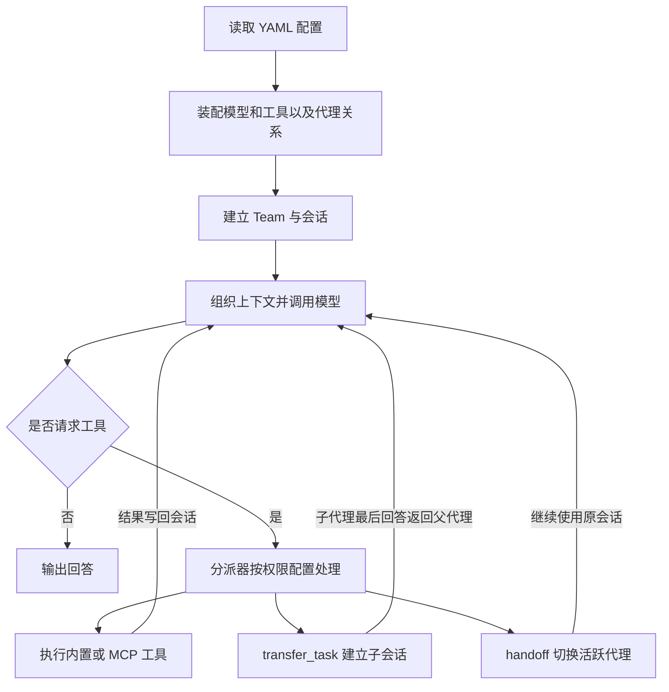

## 导语

把一个复杂任务交给“项目经理”，再由它找写代码、查资料的同事帮忙，这种分工并不难理解。难点是：每个人拿到什么上下文，能用哪些工具，做完之后怎样交回结果？

Docker Agent 把这些安排写进 YAML，一种便于阅读的配置文件格式。它是 Docker 命令行的插件，可以通过 `docker agent run agent.yaml` 运行。[官方 README](https://github.com/docker/docker-agent/blob/ef10abf85d53175551d1528544df841a4c98bd5c/README.md)介绍了模型、工具、多代理和打包分享等能力；本文聚焦前面三者的实际工作方式。

2026 年 10 月 8 日 04:00:50—04:01:43 UTC（北京时间 12:00:50—12:01:43）采集的 [HN 官方榜单](https://hacker-news.firebaseio.com/v0/topstories.json)中，原始标题为《Docker Agent》的[帖子 49996259](https://news.ycombinator.com/item?id=49996259)位列第 11，随后取得的 item 快照为 199 分、descendants 88。它发布于 10 月 7 日 17:48:38 UTC（北京时间 10 月 8 日 01:48:38），原文链接指向项目仓库。热度与排名仅代表采集快照，不是全天名次或趋势。

选择它，是因为它位于前 30 项、有可审查源码和公开数据，而且尚未在本博客讨论过。HN 评论只用于判断关注度，不作为技术能力的证据。

## 背景与核心问题

普通聊天往往到“模型回答”就结束。代理还要把模型提出的动作变成真实工具调用，把结果放回对话，再决定是否继续。这需要模型适配、工具发现、会话记录和错误处理等外围程序。

Docker Agent 的配置把角色说明、模型与工具放在一起。工具既可以来自内置能力，也可以来自 MCP，即让应用以统一接口暴露工具的协议。README 列出多个云模型提供商和 Docker Model Runner 本地模型支持；这表示框架提供接入路径，不等于不同模型的效果一致，也不表示已经摆脱外部 API 或运行环境依赖。

## 技术原理与架构

本文把源码固定在 2026 年 10 月 7 日的提交 ef10abf85d53175551d1528544df841a4c98bd5c。[teamloader](https://github.com/docker/docker-agent/blob/ef10abf85d53175551d1528544df841a4c98bd5c/pkg/teamloader/teamloader.go)读取配置，装配模型和工具，再连接代理之间的关系。运行时建立会话；[loop.go](https://github.com/docker/docker-agent/blob/ef10abf85d53175551d1528544df841a4c98bd5c/pkg/runtime/loop.go#L867-L1059)负责组织上下文、调用模型，并把模型请求的工具动作交给分派器执行。

可以把运行循环想成一次接力：模型说“需要查文件”，程序执行工具，结果回到会话，模型再继续。这里没有必要假设固定存在三个独立的“思考、行动、评估”阶段；下图按源码整理实际控制关系，省略了预算、压缩和异常处理等分支。

图中的权限处理对应[工具分派源码](https://github.com/docker/docker-agent/blob/ef10abf85d53175551d1528544df841a4c98bd5c/pkg/runtime/tool_dispatch.go#L37-L79)。配置会影响是否请求确认，不能理解成“每次写操作一定先问用户”。

多代理有两种容易混淆的交接方式。在[委派实现](https://github.com/docker/docker-agent/blob/ef10abf85d53175551d1528544df841a4c98bd5c/pkg/runtime/agent_delegation.go)中：

- sub_agents 通过 transfer_task 新建子会话，传入任务、预期输出与附件信息；完成后，把子代理最后的回答作为工具结果交回。它不是默认复制整段聊天历史，但沿用父会话的工作目录。
- handoffs 在同一个会话中切换活跃代理，保留已有对话，更像把当前服务窗口转交给另一位同事。

因此，“上下文分开”不等于“文件系统隔离”。另外，[官方多代理文档](https://github.com/docker/docker-agent/blob/ef10abf85d53175551d1528544df841a4c98bd5c/docs/concepts/multi-agent/index.md)说明普通委派会等待返回；独立任务的后台并行另有 background_agents 工具，不能把多代理直接等同于自动并行。

还有一个名字带来的误会：Docker Agent 不意味着每个代理默认处在独立容器中。[运行参数源码](https://github.com/docker/docker-agent/blob/ef10abf85d53175551d1528544df841a4c98bd5c/cmd/root/run.go#L218-L226)把 sandbox 标志默认设为 false。[沙箱文档](https://github.com/docker/docker-agent/blob/ef10abf85d53175551d1528544df841a4c98bd5c/docs/configuration/sandbox/index.md)说明，启用后调用 sbx 或 docker sandbox，在沙箱虚拟机中运行；本地沙箱模式下，工作目录仍以可读写方式挂载；文档另有使用新远程工作区的 cloud 模式，不能一概而论。沙箱缩小边界，并不撤销对已暴露项目文件的修改能力。

[权限文档](https://github.com/docker/docker-agent/blob/ef10abf85d53175551d1528544df841a4c98bd5c/docs/configuration/permissions/index.md#L313-L316)还明确提醒：客户端权限控制不是运行不可信代理的安全边界。运行外部 YAML 前，依然需要审查工具、权限模式和挂载范围。

## 适用人群与场景

它适合想把重复任务整理为可版本管理配置的开发者，以及需要试验“主代理加专业助手”分工的团队。例如把资料检索与代码审阅分给不同角色，再让主代理汇总。但角色越多不一定越好：模型调用次数、上下文传递和结果校验都会增加成本。

如果现有脚本已经能稳定完成任务，改成多代理未必划算。先从一个代理、少量受限工具和可复核输出开始，比一开始就搭一支庞大团队更容易定位问题。这是工程判断，不是本文运行得到的性能结论。

## 数据分析

以下数据来自 GitHub 官方 API，抓取完成于 2026 年 10 月 8 日 04:04:25 UTC（北京时间 12:04:25）。它们描述开发活动与仓库组成，不是模型能力、用户增长或性能测试。

### 七个完整自然日的提交记录

| 北京日期 | 提交数（个） |
| --- | ---: |
| 2026-10-01 | 32 |
| 2026-10-02 | 8 |
| 2026-10-03 | 2 |
| 2026-10-04 | 2 |
| 2026-10-05 | 35 |
| 2026-10-06 | 9 |
| 2026-10-07 | 32 |

口径：从固定 main 提交可达的历史中，按 commit.committer.date 分桶；窗口为北京时间 10 月 1 日 00:00 至 10 月 8 日 00:00，不含右端点。共 120 个唯一提交，包含合并提交，不等于推送次数。[提交 API 端点](https://api.github.com/repos/docker/docker-agent/commits?sha=ef10abf85d53175551d1528544df841a4c98bd5c&since=2026-09-30T16%3A00%3A00Z&until=2026-10-07T16%3A00%3A00Z&per_page=100)分页取全后再按上述半开窗口过滤；[计数 CSV](/daily-hacker-news/2026-10-08/data/daily-commits.csv)可复算。

文字解读：本周记录分布并不均匀，10 月 5 日为 35 个，2 日后连续两天各 2 个。这只能说明该窗口的提交活动不同，不能说明工作量、代码质量或采用率同步变化。提交时间也不等于代码真正进入 main 的时间。

### 非 Go 语言的可比较字节量

| 语言 | 检测到的字节数 |
| --- | ---: |
| Shell | 58,215 |
| JavaScript | 46,940 |
| HTML | 37,560 |
| CSS | 34,266 |
| Dockerfile | 4,488 |

口径：[languages API](https://api.github.com/repos/docker/docker-agent/languages)的同次快照，样本为 5 个非 Go 语言类别，共 181,469 字节；为避免主语言压扁其他柱子，此图明确排除 Go，单位不是行数。语言统计接口不支持在这里固定到任意提交，因此它是抓取时仓库统计，不能与固定提交的完整源码大小画等号。[原始六语言数据](/daily-hacker-news/2026-10-08/data/languages.json)保留了 Go。

文字解读：Shell 在辅助语言中占最多字节。字节数会受文件类型、生成内容和 GitHub 语言识别规则影响，不能换算为开发工时或各组件的重要性。

### 同一语言快照的总体组成

| 互斥类别 | 字节数 | 占比 |
| --- | ---: | ---: |
| Go | 21,237,526 | 99.153% |
| 非 Go（其余五类合计） | 181,469 | 0.847% |
| 合计 | 21,418,995 | 100.000% |

口径：仍是上述 [languages API](https://api.github.com/repos/docker/docker-agent/languages)快照，六类语言归并为两个互斥类别；分母为 21,418,995 个检测到的语言字节，不是磁盘总大小，也不是全部文件数。百分比四舍五入至三位小数。这和柱状图是同一份数据的两个视角，并非两组独立证据。

文字解读：该统计显示仓库以 Go 为主，适合从 Go 源码入手阅读运行时；不能证明所有功能都用 Go 编写，更不能推导运行速度或内存占用。[数据来源、分页与抓取时间](/daily-hacker-news/2026-10-08/data/provenance.json)及[图表生成脚本](/daily-hacker-news/2026-10-08/generate-charts.py)一并保存。

## 局限与结论

本文核查了固定版本源码和公开 API 数据，没有运行 Docker Agent 的模型任务、沙箱或跨模型基准测试。因此不能据此承诺准确率、延迟、成本或安全隔离效果。

Docker Agent 值得关注的地方，是把模型、工具与协作关系变成可以保存、审查和复用的配置。真正落地时，仍要问清楚三件事：角色之间如何传递上下文，工具执行拥有什么权限，以及结果由谁验证。YAML 能让配置清晰，不能替代这些判断。

## 来源与复核

- [HN item 官方 API](https://hacker-news.firebaseio.com/v0/item/49996259.json)与[采集快照](/daily-hacker-news/2026-10-08/hn-snapshot.json)：核对原始标题、时间、分数和排名来源。
- [Docker Agent 固定源码版本](https://github.com/docker/docker-agent/tree/ef10abf85d53175551d1528544df841a4c98bd5c)：技术说明以该版本为准，后续 main 可能变化。
- [本次数据与验证说明](/daily-hacker-news/2026-10-08/manifest.json)：查看采集口径和验证范围。
