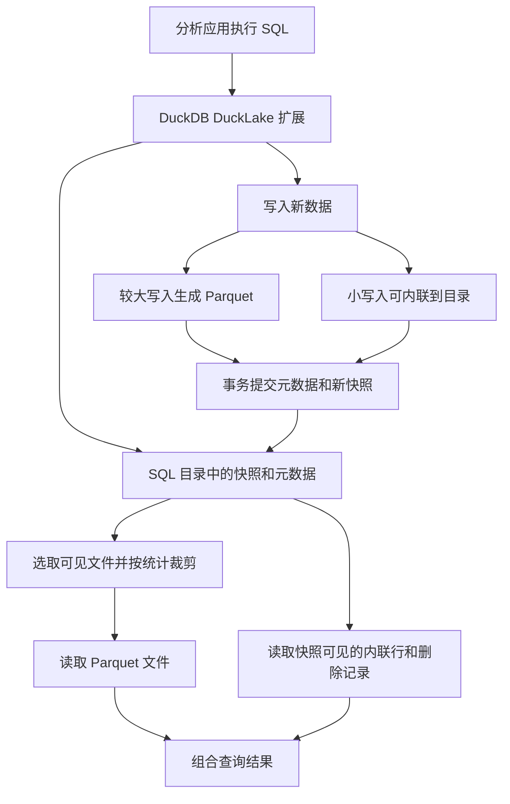

## 导语

把一批数据文件放进云端，像把书放进仓库：东西存下来了，但还需要知道哪些书属于哪个版本、哪些已经撤下，以及两个人同时改目录时怎么办。

DuckLake 是一种开放湖仓格式，本文讨论它在 DuckDB 中的扩展实现。它把这份“目录”交给 SQL 数据库，把大块分析数据保存在 Parquet 文件中。Parquet 是按列组织数据的文件格式，适合分析时只读需要的列。它试图让文件仓库获得表结构、快照和事务，而不是要求所有数据都塞进同一个数据库文件。

2026 年 10 月 9 日 01:00—01:01:40 UTC（北京时间 09:00—09:01:40）采集的 [HN 官方榜单](https://hacker-news.firebaseio.com/v0/topstories.json)前 30 项中，[帖子 49996149](https://news.ycombinator.com/item?id=49996149)《DuckDB Ducklake》排第 21；item 快照为 113 分、descendants 15。帖子发布于 10 月 7 日 17:40:23 UTC（北京时间 10 月 8 日 01:40:23），[原文](https://github.com/duckdb/ducklake)指向项目仓库。排名和分数只是抓取时的热度，不是全天排名或历史走势。

选择它，是因为它有可审查的实现和官方文档，且本博客尚未覆盖这个主题。HN 讨论只是社区关注信号，以下技术说明依据一手材料。

## 背景与核心问题

直接保存 Parquet 很方便，但“文件存在”不等于“事务已经提交”。假设写入者先上传了新文件，却在更新目录前断线，读者应该看到旧版本还是半成品？再比如两个人同时向一张表追加数据，如何避免互相覆盖？

DuckLake 的思路是把数据文件和决定其可见性的元数据分开。SQL 目录记录表结构、文件路径、统计和快照；读取者根据一个快照选取可见的数据。目录因此是事务核心，不只是名字清单。

## 技术原理与架构

以下流程描述 DuckDB 的 DuckLake 扩展，源码固定在 [9f0c2a3](https://github.com/duckdb/ducklake/tree/9f0c2a395ebc232e7a7c5a55a5ee096df9811dfe)。文档和 main 会继续演进，不能把此处说明当作所有版本的保证。

查询先确定快照，找到该版本可见的文件与删除记录，再依据列统计排除不可能匹配的文件，读取剩下的 Parquet，同时纳入该快照可见的内联行与删除记录，形成查询结果。文件数据可以位于本地文件系统或对象存储。

已提交事务会形成快照，结构修改也有事务语义。所谓快照隔离，可以理解为一次事务按照一致的版本看数据，避免读到另一笔尚未完成的修改。

并发写入使用乐观并发控制：先做工作，提交时再检查是否冲突。两位写入者可能争取同一个下一个快照号，目录里的唯一约束会让其中一方失败。如果中途变化是可合并的追加，扩展可以重试元数据提交，无须重写已产生的数据文件；若是不能兼容的改表、删表或删除操作，则中止事务。这并不保证所有并发操作都能成功。

还有一个重要例外：小数据内联（data inlining）。很小的增删可先存入目录的内部表，避免每次产生微型 Parquet，之后再刷成文件。因此准确说法是“大块数据使用 Parquet，少量变更可以内联”，并非目录只存描述信息。

## 适用人群与场景

已有 DuckDB、Parquet 分析流程，希望增加版本管理、结构演进和共享数据的团队，可以研究这种组织方式。目录数据库的选择会直接影响部署：官方建议单客户端本地使用 DuckDB，多本地客户端可用 SQLite，多用户或远程客户端使用 PostgreSQL。选择 DuckDB 文件当目录，仍有单客户端限制。

它不应仅因支持事务，就被视为低延迟业务数据库的替代品。如果应用依赖索引、强制唯一主键、外键或大量逐行更新，要先核对功能限制和实际负载。小文件合并、快照过期、旧文件清理也需要维护；删表不会立刻擦除所有历史数据文件。

## 数据分析

以下是 GitHub 官方 API 的开发活动与仓库组成数据，采集完成于 2026 年 10 月 9 日 01:03:52 UTC（北京时间 09:03:52）。没有运行性能测试，不能从图表推断查询速度、用户规模或可靠性。

### 七个完整自然日的提交变化

| 北京日期 | 提交数（个） |
| --- | ---: |
| 2026-10-02 | 3 |
| 2026-10-03 | 13 |
| 2026-10-04 | 23 |
| 2026-10-05 | 20 |
| 2026-10-06 | 82 |
| 2026-10-07 | 45 |
| 2026-10-08 | 43 |

口径：固定源码提交可达的历史，按 commit.committer.date 分日；窗口为北京时间 10 月 2 日 00:00 至 10 月 9 日 00:00，不含右端点。共 229 个唯一提交，包含合并提交，取完三页后按窗口过滤。[提交 API](https://api.github.com/repos/duckdb/ducklake/commits?sha=9f0c2a395ebc232e7a7c5a55a5ee096df9811dfe&since=2026-10-01T16:00:00Z&until=2026-10-08T15:59:59Z&per_page=100)、[原始记录](/daily-hacker-news/2026-10-09/data/commits.json)及[计数 CSV](/daily-hacker-news/2026-10-09/data/daily-commits.csv)可复算。

文字解读：这个窗口内 10 月 6 日最多，为 82 个，2 日为 3 个。提交时间不是进入 main 的时间，提交个数也不是推送次数、工作量或质量评分；七天分布不能证明长期增长。

### 辅助语言的可比较字节量

| 语言 | 字节数 |
| --- | ---: |
| Python | 23,951 |
| CMake | 6,271 |
| Shell | 4,018 |
| PLpgSQL | 2,577 |
| Makefile | 863 |

口径：[languages API](https://api.github.com/repos/duckdb/ducklake/languages)的同次即时快照，展示五个非 C++ 类别，共 37,680 字节。为看清较小分类，本图明确排除 C++；单位不是代码行数。该接口的统计不能固定到任意源码版本，因此不能与固定提交的完整文件大小画等号。[原始六语言数据](/daily-hacker-news/2026-10-09/data/languages.json)保留了完整响应。

文字解读：Python 是这五类中检测字节最多的一类。文件内容和 GitHub 识别规则都会影响结果，不能由此推导开发工时或功能重要性。

### 同一语言快照的整体组成

| 互斥类别 | 字节数 | 占比 |
| --- | ---: | ---: |
| C++ | 1,492,681 | 97.538% |
| 其余五种语言 | 37,680 | 2.462% |
| 合计 | 1,530,361 | 100.000% |

口径：同一 [languages API](https://api.github.com/repos/duckdb/ducklake/languages)快照，六类归并为两个互斥类别，分母为全部 1,530,361 个检测到的语言字节，非仓库磁盘大小或文件总数。百分比保留三位小数；样本是六种语言类别，不是六名开发者。

文字解读：这个仓库的实现阅读应以 C++ 为主；它不能证明所有功能都用 C++ 编写，更不是运行效率证据。柱状图和饼图是同一数据的两个视角，并非独立样本。[来源与分页](/daily-hacker-news/2026-10-09/data/provenance.json)、[占比 CSV](/daily-hacker-news/2026-10-09/data/pie-language-shares.csv)及[生成脚本](/daily-hacker-news/2026-10-09/generate-charts.py)一并保存。

## 局限与结论

本文核查公开文档、固定源码与官方 API，没有实测并发吞吐、故障恢复、成本或跨引擎兼容性。开发活跃不等于适合生产，仓库字节组成更不能替代真实查询基准。

DuckLake 的核心价值在于：用数据库已经擅长的事务管理，组织大量可独立保存的分析文件。选型时最重要的问题仍是目录如何部署、并发冲突如何处理，以及数据文件由谁维护。先把这些约束说清楚，再讨论它是否能简化自己的数据平台。

## 来源与复核

- [HN 官方 item API](https://hacker-news.firebaseio.com/v0/item/49996149.json)及[榜单与帖子快照](/daily-hacker-news/2026-10-09/hn-snapshot.json)。
- [本次数据与验证说明](/daily-hacker-news/2026-10-09/manifest.json)。
- [官方查询与读写规范](https://ducklake.select/docs/stable/specification/queries)、[事务与快照隔离](https://ducklake.select/docs/stable/duckdb/advanced_features/transactions)。
- [目录数据库选择](https://ducklake.select/docs/stable/duckdb/usage/choosing_a_catalog_database)、[小数据内联](https://ducklake.select/docs/stable/duckdb/advanced_features/data_inlining)、[不支持的功能](https://ducklake.select/docs/stable/duckdb/unsupported_features)。
- [固定源码的提交与重试](https://github.com/duckdb/ducklake/blob/9f0c2a395ebc232e7a7c5a55a5ee096df9811dfe/src/storage/ducklake_transaction_state.cpp#L2128-L2214)、[内联分流实现](https://github.com/duckdb/ducklake/blob/9f0c2a395ebc232e7a7c5a55a5ee096df9811dfe/src/storage/ducklake_inline_data.cpp#L22-L114)。
