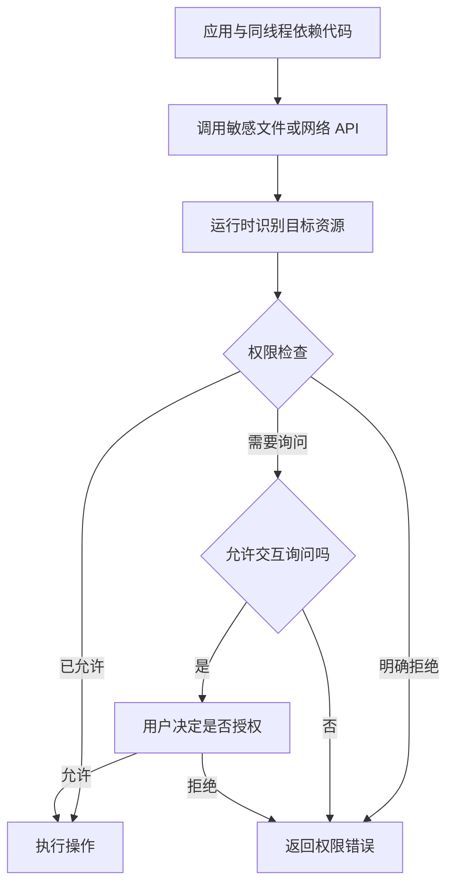

## 导语

让脚本处理一个文件，就像请人整理书桌：你希望它只碰指定文件，而不是顺便打开邮箱、读取其他文件或启动别的程序。Deno 的权限机制试图把这些边界写进运行命令。

2026 年 10 月 10 日 01:05:12—01:05:35 UTC（北京时间 09:05:12—09:05:35）抓取的 [HN 官方榜单](https://hacker-news.firebaseio.com/v0/topstories.json)前 30 项中，[帖子 50019911](https://news.ycombinator.com/item?id=50019911)《Cloudflare acquires Deno》排第 2，item 快照为 1053 分、548 条 descendants。帖子发布于 10 月 9 日 13:03:48 UTC（北京时间 21:03:48）。这些是抓取时的社区信号，不是全天排名或热度走势。

[原文是 Deno 团队公告](https://deno.com/blog/cloudflare)。选择这个热点，是因为它有直接影响技术选型的维护安排，也能借官方文档和源码解释一个常被误解的问题：限制 JavaScript 的权限，是否等于可以放心执行任意代码？现有文章未覆盖这一主题。

## 背景与核心问题

Deno 是执行 JavaScript、TypeScript 的运行时。运行时不仅解释代码，还提供文件、网络等与外部世界交互的能力。业务逻辑看起来只是“处理数据”，依赖包却可能在同一进程中发起额外访问。

Deno 默认限制敏感输入输出操作。例如，命令中的 `--allow-read=./data` 把读权限限定到指定目录，`--allow-net=example.com` 把网络权限限定到一个主机。没有预先授权时，交互环境可以询问用户；非交互环境下则不能靠弹窗替程序作决定。

这里讨论普通 CLI 权限模式。官方文档另有外部 permission broker（权限决策代理）模式，会改变决策来源；不能把下面的命令行流程套到所有配置上。

## 技术原理与架构

依据[官方安全文档](https://docs.deno.com/runtime/fundamentals/security/)和固定在 [a18ce337](https://github.com/denoland/deno/blob/a18ce33715e30cd2b0d99c7e322ef11a65490e4d/runtime/permissions/lib.rs) 的权限实现，应用发起敏感操作时，运行时检查资源对应的许可，而不是给每个依赖包自动建立一个独立保险箱。

源码的 `check_net_url` 会解析 URL 对应的网络描述符，再检查网络权限；`check_net` 处理主机及可选端口。流程图概括普通模式，不表示每一种 API 都走完全相同的函数。



三个边界尤其重要：

- 同一线程中的模块共享权限。你允许应用读取某目录，也就需要考虑其依赖能否使用这项权限；权限不按包名逐个隔离。
- 初始静态模块图的加载存在权限例外。不能把“没有网络访问许可”理解成“启动阶段绝不会获取远程依赖”；加载代码与代码运行后访问资源是不同阶段。
- 子进程和原生库会突破这层约束。获得运行外部程序或加载原生代码的能力后，不能再把 JavaScript 层的限制当作完整防线；`--allow-all` 更是直接放开权限。

因此，“默认限制输入输出”是有价值的设计，但不是虚拟机级隔离，也不是依赖审计结果。

## 适用人群与场景

对开发者的小型自动化脚本、只访问少量路径和固定服务的工具，显式列出权限有助于理解行为边界。对执行用户上传代码或 AI 生成代码的平台，官方文档建议叠加更低权限的 Worker、操作系统隔离和 VM 等防护，而不是只增加一个运行参数。

下面是权限范围的说明性命令，不是本文执行过的实验。脚本需要更多资源时应逐项解释原因，避免为了消除报错直接改成全部允许。

```bash
deno run --no-prompt --allow-read=./data --allow-net=example.com main.ts
```

新选型还必须考虑维护期限。Deno 在 2026 年 10 月 9 日的公告中表示：团队加入 Cloudflare；运行时再提供一年包含修复与安全更新的月度版本，此后结束团队对运行时的开发；Deno Deploy 再运行六个月后关闭，向付费客户提供迁往 Workers 的支持；JSR 继续运营。公告没有给出本文可确认的精确截止日，这里保留原文相对期限。

这些是团队声明，不是本文对未来履约的独立保证。运行时保持开源，也不等于一定有人接续同等维护。已有项目宜盘点运行时版本、部署平台、依赖和权限配置；这则公告本身不能证明应用可以无修改迁到 Workers。

## 数据分析

以下用项目活动与代码组成提供可复核的背景，不评测性能、安全性或迁移难度。数据采集于 2026 年 10 月 10 日 UTC／北京时间，精确时间和逐页端点保存在[数据说明](/daily-hacker-news/2026-10-10/data/provenance.json)，HN 原始信息见[榜单快照](/daily-hacker-news/2026-10-10/hn-snapshot.json)。

### 折线图：七个完整北京时间自然日的提交


| 北京日期 | 提交数（次） |
| --- | ---: |
| 2026-10-03 | 0 |
| 2026-10-04 | 0 |
| 2026-10-05 | 3 |
| 2026-10-06 | 5 |
| 2026-10-07 | 1 |
| 2026-10-08 | 0 |
| 2026-10-09 | 0 |

来源是 [GitHub commits API](https://api.github.com/repos/denoland/deno/commits?sha=a18ce33715e30cd2b0d99c7e322ef11a65490e4d&since=2026-10-02T16:00:00Z&until=2026-10-09T15:59:59Z&per_page=100&page=1)，[原始响应](/daily-hacker-news/2026-10-10/data/commit-pages.json)保留完整一页 9 条记录。样本为固定 main 快照可达、committer 时间落在北京时间 10 月 3 日零点至 10 日零点前的唯一提交，含合并提交；单位是次，零值表示该口径没有记录。它不是 push 时间、工时或开发者人数。仅七天窗口不能证明公告导致开发活动下降。

### 柱状图：同一仓库前四种语言的字节数


| 语言 | 字节数 |
| --- | ---: |
| Rust | 20,602,176 |
| TypeScript | 8,598,944 |
| JavaScript | 3,409,811 |
| C | 408,112 |

来源：[GitHub languages API](https://api.github.com/repos/denoland/deno/languages)，[原始快照](/daily-hacker-news/2026-10-10/data/languages.json)。采集时间见数据说明，属于即时快照，没有历史窗口；样本为返回的 17 类中最大的 4 类，横轴从零开始，MB 按 1,000,000 字节换算。其余 13 类共 32,238 字节未画入柱状图。分类包含仓库中被统计的代码，不能代表生产运行耗时、代码行数或维护成本；端点也不提供固定 revision 参数。

### 饼图：全部语言字节中的 Rust 占比


| 互斥分类 | 字节数 | 占比 |
| --- | ---: | ---: |
| Rust | 20,602,176 | 62.33% |
| 其余 16 类 | 12,449,105 | 37.67% |
| 总计 | 33,051,281 | 100.00% |

来源、采集时间和单位与上图相同，样本覆盖 API 的全部 17 类；分母是全部语言字节之和。两类互斥且穷尽，百分比四舍五入到两位小数。观察是 Rust 占该快照多数，并不能由此推出运行更快或更安全。所有图由[离线脚本](/daily-hacker-news/2026-10-10/generate-charts.py)生成；重新抓取 API 可能得到不同数值，应先用保存的数据复算。

## 局限与结论

本文核查了官方说明与权限检查源码，没有运行攻击实验，也没有测量 Deno 与其他运行时的性能。代码字节统计与短窗口提交数只是不同侧面的背景，不能替代兼容性测试、威胁建模或长期维护判断。

Deno 值得理解的技术点，是把文件、网络等能力变成显式权限边界。实际使用时，还要检查权限由谁共享、哪些能力会跳出边界，以及基础软件未来由谁维护。这三件事比一个“安全默认”的标签更能帮助工程决策。

## 来源链接

- [HN 官方 item API](https://hacker-news.firebaseio.com/v0/item/50019911.json)与[讨论页](https://news.ycombinator.com/item?id=50019911)
- [Deno 团队加入 Cloudflare 的原始公告](https://deno.com/blog/cloudflare)
- [Deno 官方安全与权限说明](https://docs.deno.com/runtime/fundamentals/security/)
- [固定提交的权限实现](https://github.com/denoland/deno/blob/a18ce33715e30cd2b0d99c7e322ef11a65490e4d/runtime/permissions/lib.rs)
- [数据采集口径与端点](/daily-hacker-news/2026-10-10/data/provenance.json)
